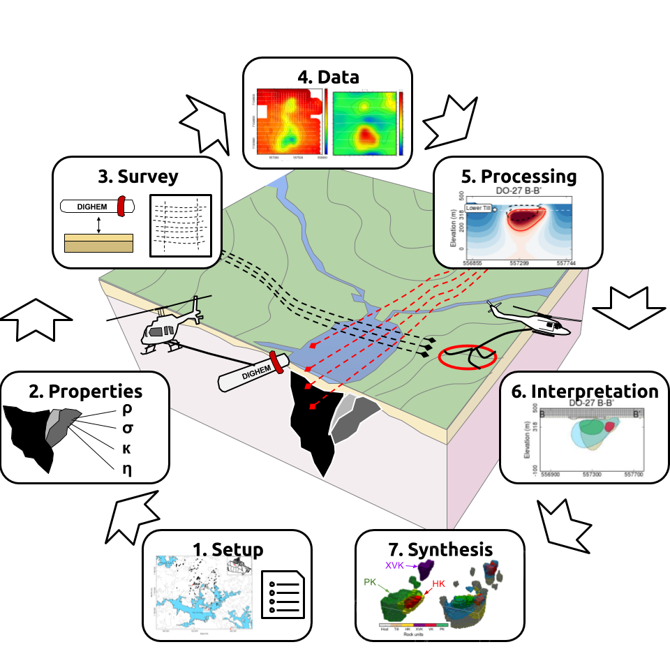

.. _AtoZ_index:

A to Z Examples
===============

**What is this?**

A to Z examples is a collection of step by step tutorials for completing
projects using GIFtools - from forward modeling to inversion, and everything
in between. Each tutorial is broken down into a set of linear steps that make
use of the :ref:`recipes <recipe_index>`. All tutorials and
relevant files are available for download. By completing the tutorials from A
to Z, you will rapidly become proficient users of GIFtools and the
large library of UBC-GIF codes.

Tutorials are organized by geophysical method:

    .. toctree::
        :maxdepth: 1

        Gravity: Forward modeling and constrained inversion <gravity/index>
        Magnetics: Dealing with remanence <magnetic/index>
        EM1DFM: 1D and laterally constrained inversion <em1dfm/index>
        TEM: From 1D to 3D inversion using Python <em1dtm/index>
        DCIP: Simulate and Invert in 2D and 3D <DCIP/index>
        MT/ZTEM: Dealing with natural source EM <NS/index>

.. Frequency-EM: Inverting with tiled codes <FEM/index>
.. Time-EM: Inverting in 1D and 3D <TEM/index>

However, much of the functionality provided within GIFtools is applicable to
multiple methods (e.g. adding geological constraints to inversions).

.. tip:: To alter a step in any of the tutorials (e.g. use an OcTree mesh instead of a tensor
         mesh), search the :ref:`recipes <recipe_index>` section or try the search bar.

    7-step process applied to TKC kimberlite complex

.. _AtoZ_TKCbackground:

**A to Z: Synthetic TKC**

For consistency, A to Z examples for each geophysical method consider the same
geological model; the Tli Kwi Cho (TKC) kimberlite complex in NWT, Canada. The
`UBC-GIF <https://gif.eos.ubc.ca>`_ Team has worked extensively on the TKC area.
For background about the deposits, the geophysical surveys, and the outcome
(including a combined petrophysical model), see the `Case History on EM Geosci
<https://em.geosci.xyz/content/case_histories/do27do18tkc/index.html>`_.

The TKC kimberlite complex has been surveyed with a variety of systems (`see here
<https://em.geosci.xyz/content/case_histories/do27do18tkc/survey.html>`_) and
drilled extensively. As a result, we have a very good understanding of the
geological units which make up the deposit, their margins and their physical
properties. The average density, susceptibility and electrical conductivity
for geological units at TKC is shown in the table below.

+-------------+--------------------+---------------------+-------------+-----------------------+-------------------+
|**Unit**     |:math:`\rho` [g/cc] | :math:`\kappa` [SI] | Remanence   | :math:`\sigma` [mS/m] | :math:`\eta` [ms] |
+=============+====================+=====================+=============+=======================+===================+
|Granitic Host|      0             |         0           |     x       |             x         |           x       |
+-------------+--------------------+---------------------+-------------+-----------------------+-------------------+
|XVK/DO-18    |   -0.24            |     0.002           |      x      |            x          |           x       |
+-------------+--------------------+---------------------+-------------+-----------------------+-------------------+
|Kimberlite/HK|   -0.24            |         0           |       x     |            x          |           x       |
+-------------+--------------------+---------------------+-------------+-----------------------+-------------------+
|HK/DO-27     |   -0.24            |     0.006           |    x        |            x          |          x        |
+-------------+--------------------+---------------------+-------------+-----------------------+-------------------+
|VK/DO-27     |   -0.24            |     0.003           |       x     |            x          |          x        |
+-------------+--------------------+---------------------+-------------+-----------------------+-------------------+
|PK/DO-27     |   -0.24            |     0.003           |       x     |            x          |          x        |
+-------------+--------------------+---------------------+-------------+-----------------------+-------------------+
| Till        |   0                |         0           |      x      |            x          |            x      |
+-------------+--------------------+---------------------+-------------+-----------------------+-------------------+

- PK: pyroclastic kimberlite
- HK: hypabyssal kimberlite
- VK: volcaniclastic kimberlite
- XVK: xenocryst-rich volcaniclastic kimberlite

|
|
|
|
|
|
|
|
|
|

