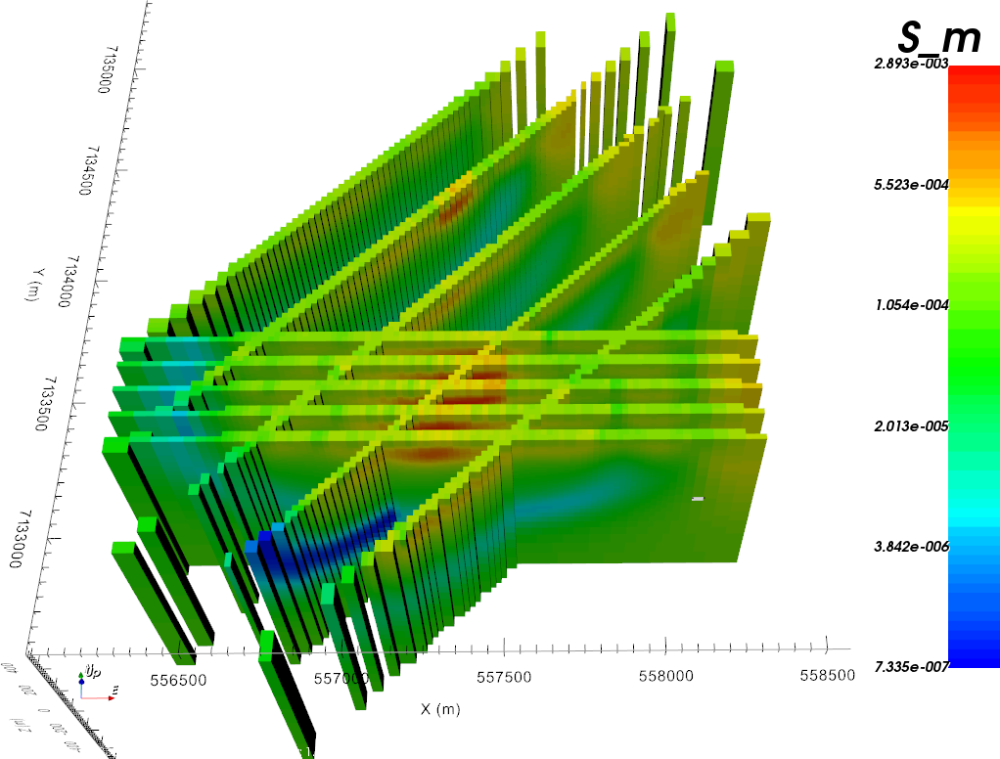
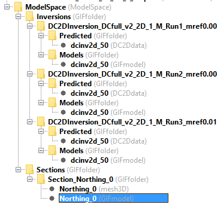
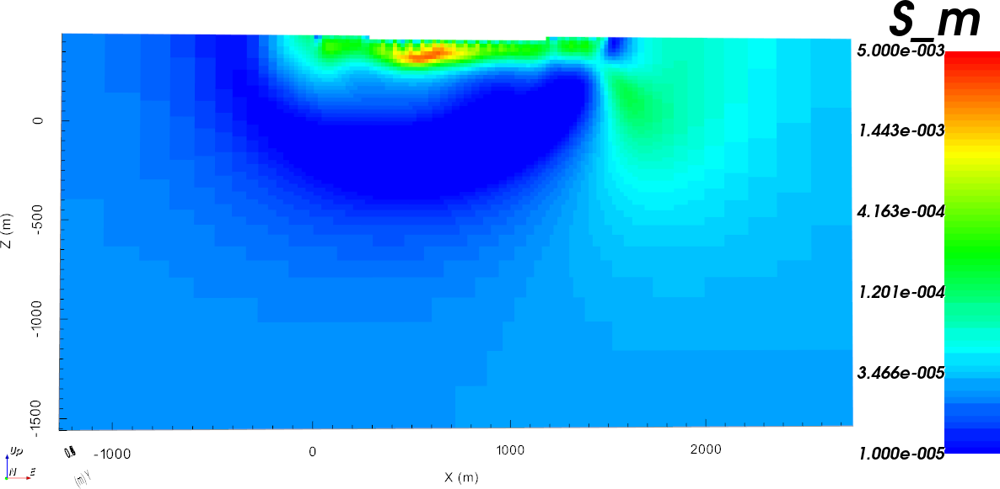
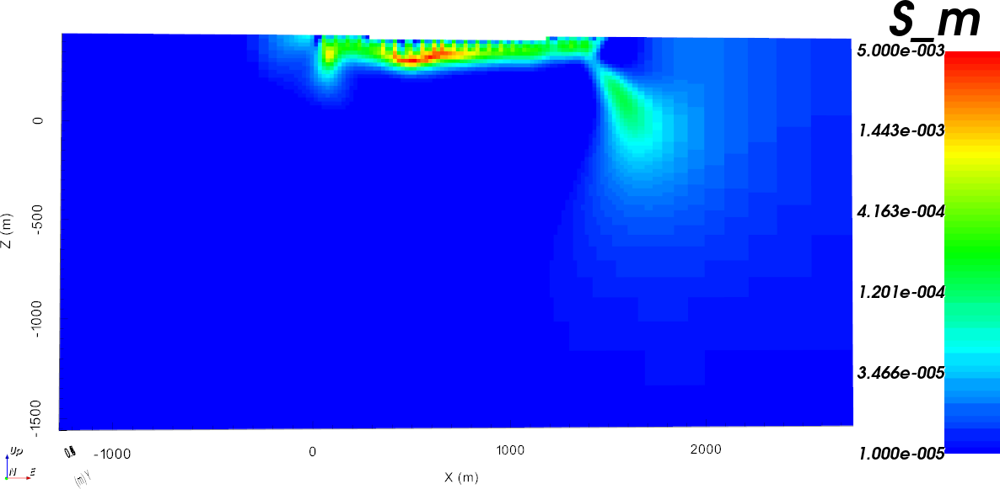
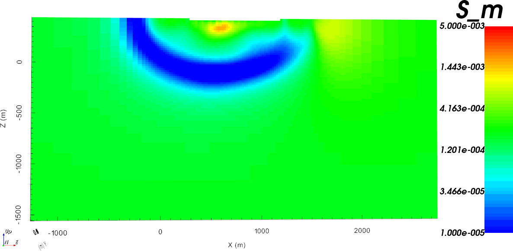
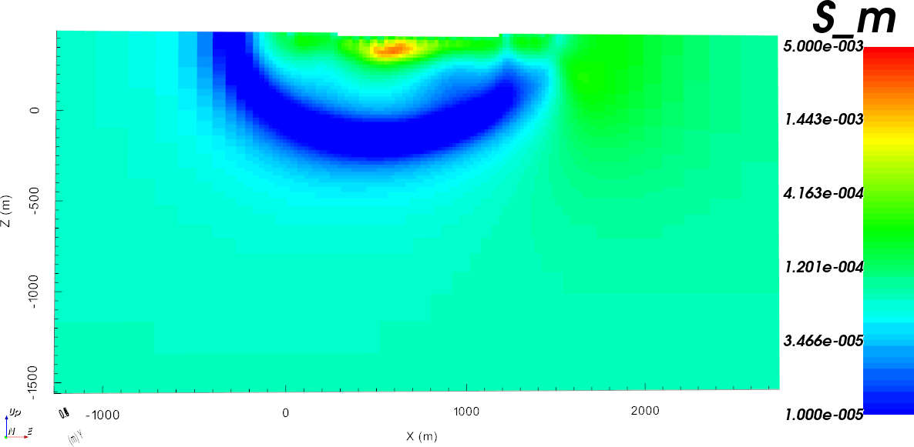
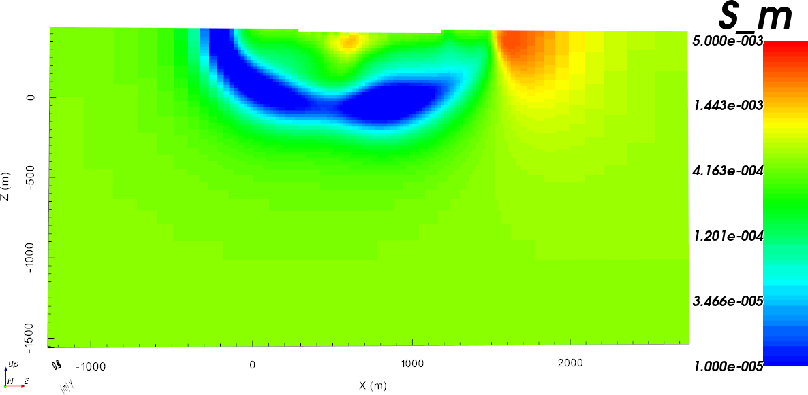
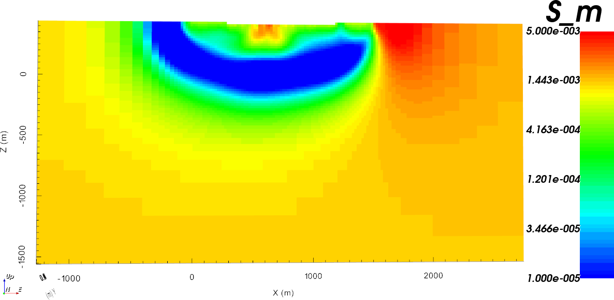

.. _AtoZDCIP_2DInversion:

2D Inversion
============

In this section, we will invert the :ref:`simulated data <AtoZdcip_Forward>`
in 2D as a pre-processing step for the 3D inversion.

Setup for the Exercise
----------------------

    - `Download the demo <https://github.com/ubcgif/GIFtoolsCookbook/raw/master/assets/AtoZ_DCIP_4Download.zip>`_
    - Open GIFtools
    - :ref:`Set the working directory <projSetWorkDir>`

.. tip:: - Requires at least ``GIFtools 2.26`` (login required)

Extract 2D data objects
^^^^^^^^^^^^^^^^^^^^^^^

In the previous :ref:`simulation section <AtoZdcip_Forward>`, we have
generated a ``DC3Ddata`` object, which we first want to invert in 2D:

- :ref:`Assign simple uncertainties <objectAssignUncert>`
    - % = 15
    - floor = :math:`0.05`
- :ref:`Set the data/uncertainties <objectSetioHeaders>`
- :ref:`Copy the LineID <objectCombineData>` from the `DC3Ddata` object
- :ref:`Seperate the survey lines <objectdcip3Dto2D_lineID>`
	- Export the 2D topography at 20 m resolution.

Explore the model space
^^^^^^^^^^^^^^^^^^^^^^^

Before attempting to invert all data, it is good practice to test different
assumptions on a single line. First let's test different reference
conductivity values by running a series of 2D inversions.

- :ref:`Create a DC2Dinversion object <createDCIPInv>` to serve as a template
    - Set :math:`\alpha_s=0.0025, \alpha_x=\alpha_z=1`
    - Select data from `Line 7` (directly above the conductive kimberlite)
- :ref:`Create a Model Space <objectFunctionalityWorkflowModelSpace>` object
- :ref:`Edit the Model Space inversion options <objectFunctionalityWorkflowModelSpaceEdit>` and set ``mref`` over a range :math:`[1e-5,\;1e-2,\;4] in log space`
- :ref:`Write All and Run <objectFunctionalityWorkflowModelSpaceRun>`
- Upon completion, :ref:`Load the results <objectFunctionalityWorkflowModelSpaceLoad>` `First to target` and :ref:`Extract model section <objectMeshExtractSections>`

.. raw:: html
    :file: ./AtoZ_DC2D_ModelSpace.html

[OPTIONAL]

-:ref:`Create a DOI <objectFunctionalityWorkflowDOICalc>` using two of the recovered models

.. note:: Changing the reference conductivity value can drastically change the solution at depth, which can be used to estimate the Depth-of-Investigation (DOI) of a geophysical experiment.

Run a Batch Inversion
^^^^^^^^^^^^^^^^^^^^^

We have a total of 10 ``DC2Ddata`` objects that would like to invert. Rather
than manually inverting each line, we will make use of the ``Batch Inversion``
object to speedup the process.

- :ref:`Create a DC2Dinversion object <createDCIPInv>` to serve as a template
    - Set :math:`\alpha_s=0.0025, \alpha_x=\alpha_z=1`
    - Set the reference conductivity to :math:`1e-4` S/m
- :ref:`Create and edit a Batch Inversion <objectFunctionalityWorkflowBatchInversion>`
- Run all
- Upon completion, load all results ``First to targets``

.. _AtoZDCIP_2DInversion_Merge:

Merge and interpolate models
^^^^^^^^^^^^^^^^^^^^^^^^^^^^

While we can view each inversion result on their respective 2D mesh, in this
section we will bring together the 2D models into our 3D mesh for later use.

- :ref:`Merge results <batchInversionMerge>` using the DCSurveyFull ``lineID`` property as reference
    - Right-click on the ` ``BatchInversion``
    - Click :ref:`Merge all <batchInversionMerge>`
    - Select the 3D original mesh
    - Select the ``DC3Ddata`` object generated in the ``DC3DForward``
    - Check that ``line IDs`` are correct
    - Click ``OK`` to proceed

.. note::
		- We have recovered conductive anomalies consistent across lines.
		- The chosen best-fitting half-space conductivity might be slightly too high due to the thin conductive overburden. The user is invited to repeat the experiment with different background conductivity values.

