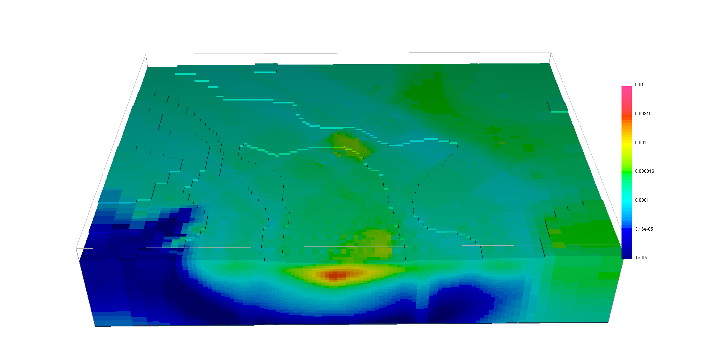
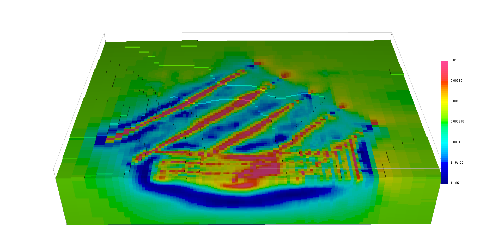
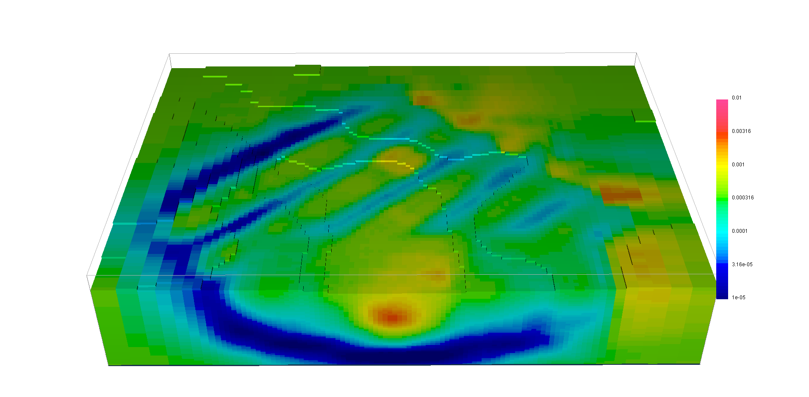

.. _AtoZDCIP_3DInversion:

3D Inversion
============

Purpose
^^^^^^^

In this section, we will invert the :ref:`simulated data <AtoZdcip_Forward>` in 3D with three strategies:

- :ref:`Case 1: Unconstrained inversion <AtoZDCIP_3D_Unconstrained>`
- :ref:`Case 2: Sensitivity weighted inversion <AtoZDCIP_3D_SensWeights>`
- :ref:`Case 3: Inversion with 2D starting model <AtoZDCIP_3D_2DStart>`

.. note:: Link to `DCIP3D documentation <http://mvi.readthedocs.io/en/latest/>`_

Downloads
^^^^^^^^^

.. example::    - `Download the demo <https://github.com/ubcgif/GIFtoolsCookbook/raw/master/assets/AtoZ_DCIP_4Download.zip>`_
                    - Requires at least ``GIFtools 2.26`` (login required)
                    - Requires `DCIP v5 <https://dcip3d.readthedocs.io/en/latest/>`_

Step by step
^^^^^^^^^^^^

.. tip:: If you have already completed either the :ref:`Survey Design and Simulation
         <AtoZDCIP_simulation>` or the :ref:`2D Inversion
         <AtoZDCIP_2DInversion>` demo, you may advance directly to the :ref:`Unconstrained Inversion Section <AtoZDCIP_3D_Unconstrained>`

- **Step 1: Setup**
    - :ref:`Start a GIFtools project <basicFunctionality_index>`
    - :ref:`Set the working directory <projSetWorkDir>`
    - :ref:`Import the topography data <importTopo>`

- **Step 2: Survey and Data**
    - :ref:`Import the DC data in UBC format <importDCIP3Ddata>`

.. _AtoZDCIP_3D_Unconstrained:

Case 1: Unconstrained Inversion
^^^^^^^^^^^^^^^^^^^^^^^^^^^^^^^

As a first step, we invert the :ref:`simulated data <AtoZdcip_Forward>` with a purely unconstrained approach.

- :ref:`Create an inversion object (DC3Dinversion) <createDCIPInv>`
    - :ref:`Edit the options <invEditOptions_dcip3d>`
        - Panel 2: Adjust :math:`\alpha` parameters: :math:`\alpha_s=0.0025, \alpha_x=\alpha_z=1`
        - Click *Apply and write files*
    - :ref:`Run the inversion <invRun>`

.. _AtoZDCIP_3D_SensWeights:

Case 2: Sensitivity weighted inversion
^^^^^^^^^^^^^^^^^^^^^^^^^^^^^^^^^^^^^^

The result obtained with the unconstrained approach appears to be dominated by
the source-receiver position, with most of the conductivity anomalies
recovered near the survey lines. In order to reduce this geometric bias, we
will incorporate sensitivity-based weights.

- :ref:`Copy the inversion object from the previous example <invCopyOptions>`
- :ref:`Load the sensitivity file <importModelCellCentered>` generated by ``DCINV3D``
- :ref:`Create sensitivity weight <invDCIP3DCreateSensWeights>`
- :ref:`Write All <invWriteAll>` and :ref:`Run <invRun>`

.. note:: This solution is an improvement over the purely unconstrained as
            lower conductivity anomalies are recovered at the electrodes, while the
            conductive kimberlites are better recovered

.. _AtoZDCIP_3D_2DStart:

Case 3: Inversion with 2D starting model
^^^^^^^^^^^^^^^^^^^^^^^^^^^^^^^^^^^^^^^^

In the third case, we will incorporate the stiched 2D model in the 3D
inversion through a starting and a reference model.

To create a full 3D model from the merge 2D models created in :ref:`the merging step <AtoZDCIP_2DInversion_Merge>`, the steps are:

- Right-click on the merged model
- Select ``Edit -> Fill/Interpolate no-data-value`` (see :ref:`the documentation <objectFunctionalityFillNDValue>`)
- Keep the default parameters and enter ``1e-8`` as ``no-data-value`` and choose the ``Log`` interpolation

Then you can use that model as starting and reference model:

- :ref:`Copy the inversion object from Case 2 <invCopyOptions>`
- :ref:`Set the reference and starting model <invEditOptions_dcip3d>`
- :ref:`Write All <invWriteAll>` and :ref:`Run <invRun>`

.. note:: We have once again improved the solution, and the iteration process
            is a lot quicker since we are starting with a model closer to the final solution.
