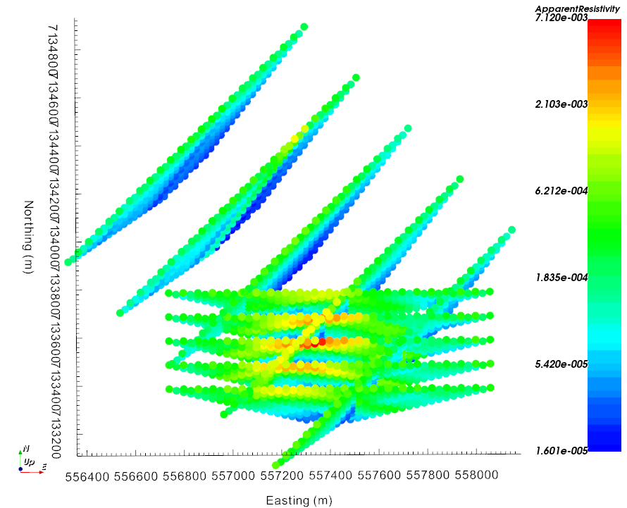
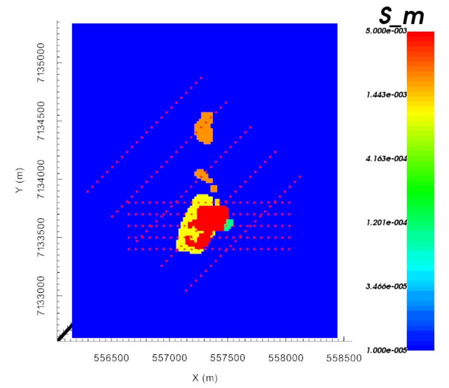

.. _AtoZDCIP_simulation:

.. include:: <isonum.txt>

Survey Design and Forward Simulation
====================================

Here, we show how to create a simple dipole-dipole DC Resistivity survey over
a conductivity model and run the forward simulation.

.. _AtoZdcip_setup:

Setup for the Exercise
----------------------

    - `Download the demo <https://github.com/ubcgif/GIFtoolsCookbook/raw/master/assets/AtoZ_DCIP_4Download.zip>`_
    - Open GIFtools
    - :ref:`Set the working directory <projSetWorkDir>`

.. tip:: - Requires at least ``GIFtools 2.26`` (login required)

Create Overlapping surveys
^^^^^^^^^^^^^^^^^^^^^^^^^^

In order to compare the resolving capabilities of different survey
configurations, we will generate two sets of line data with the following specifications:

Use the :ref:`DCIP Survey Designer<createSurveyDCIP>`

+------------------------+-----------------------+-----------------------+
|                        | Block 1               | Block 2               |
+------------------------+-----------------------+-----------------------+
| Survey Type            | DC                    | DC                    |
+------------------------+-----------------------+-----------------------+
| Transmitters/Receivers |   pole-dipole         |   pole-dipole         |
+------------------------+-----------------------+-----------------------+
| IP Type                |Apparent Chargeability | Apparent Chargeability|
+------------------------+-----------------------+-----------------------+
| Dimension              |   3D                  | 3D                    |
+------------------------+-----------------------+-----------------------+
| Centroid               | 557250 E, 7134000 N   | 557400 E, 7133600 N   |
+------------------------+-----------------------+-----------------------+
| Bearing                | :math:`45^\circ`      | :math:`90^\circ`      |
+------------------------+-----------------------+-----------------------+
| Line Length   (m)      | 1500                  | 1500                  |
+------------------------+-----------------------+-----------------------+
| Line Spacing  (m)      | 300                   | 100                   |
+------------------------+-----------------------+-----------------------+
| Nb. lines              | 5                     | 5                     |
+------------------------+-----------------------+-----------------------+
| Electrode Spacing  (m) | 60                    | 60                    |
+------------------------+-----------------------+-----------------------+
| Nb. Receivers          | 20                    | 20                    |
+------------------------+-----------------------+-----------------------+

.. note:: The survey do not contain elevation information. We will let the code set the vertical position based on the discretized topography.

Merge the surveys
^^^^^^^^^^^^^^^^^

- Since we are creating two separate surveys, the ``lineID`` assigned to Block 1 and 2 will be repeated. We will add a constant to the line ID so that they are all unique identifiers.
    - :ref:`Add constant value <objectCalculator>` to Block 2 ``lineID`` property (+ 5)

- Select Block 1 and :ref:`combine block 2 <objectCombineData>` to form one large survey.
    - **Data Manipulation** |rarr| **Add Data** |rarr| **Merge other DCIP3D data**
    - Rename the combine object ``DCSurveyFull``

.. _AtoZdcip_Forward:

Forward model DC data
^^^^^^^^^^^^^^^^^^^^^

- :ref:`Create a DC Forward <createDCIPFwd>` object
- :ref:`Edit input options <fwdEditOptions_dcip3d>`
    - Set ``Locations`` to ``DCSurveyFull``
    - Set ``Topography`` to ``TOPOdata`` and select ``TKCtopo``
    - Set ``Conductivity`` to ``TKC_condModel``
- :ref:`Write files <fwdWriteAll>`
    - Select ``Surface Data Format``
- :ref:`Run the forward simulation <fwdRun>`
- After completion, :ref:`Load the predicted data <fwdLoadResults>`

Forward model IP data
^^^^^^^^^^^^^^^^^^^^^

- :ref:`Convert the DC3Ddata to an IP3Ddata object <objectdc3Dtoip3D>` object
- :ref:`Create a IP Forward <createDCIPFwd>` object
- :ref:`Edit input options <fwdEditOptions_dcip3d>`
    - Set ``Locations`` to ``DCSurveyFull``
    - Set ``Topography`` to ``TOPOdata`` and select ``TKCtopo``
    - Set ``Conductivity`` to ``TKC_condModel``
- :ref:`Write files <fwdWriteAll>`
    - Select ``Surface Data Format``
- :ref:`Run the forward simulation <fwdRun>`
- After completion, :ref:`Load the predicted data <fwdLoadResults>`

