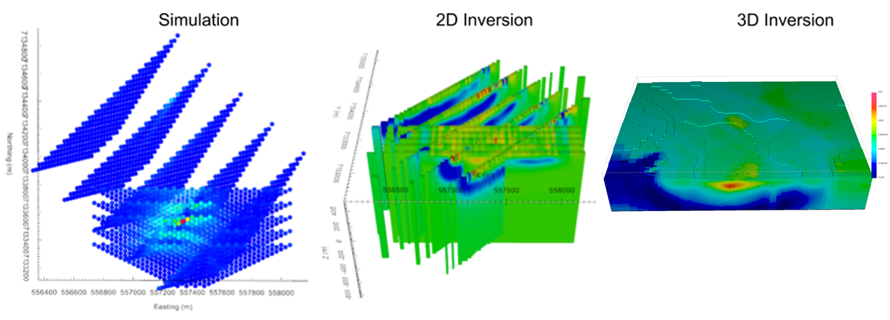

.. _AtoZDCIP_index:

.. include:: <isonum.txt>

A to Z Examples for DCIP 2D/3D
==============================

In this activity, we will simulate and invert DC Resistivity data over the synthetic TKC
conductivity model. We demonstrate how to batch 2D inversions and use the result in a subsequent 3D
inversion.

.. toctree::
    :maxdepth: 1

    Survey Design and Forward Simulation <DCSimulation>
    2D Inversion <DC2D>
    3D Inversion <DC3D>

