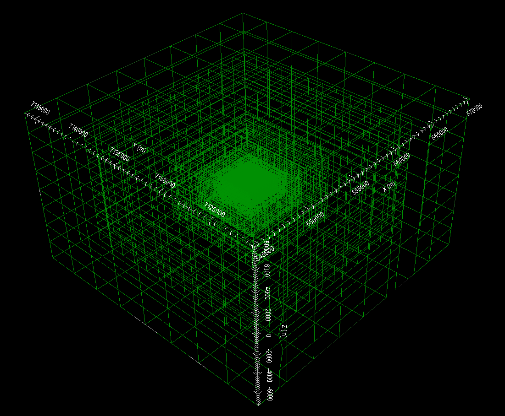

.. _AtoZNS_data:

.. include:: <isonum.txt>

Importing, Interpreting and Preparing NSEM Data
===============================================

For this exercise, we:

    - Import impedance tensor data in EMAP standard format from a set of EDI files
    - Import ZTEM data from a Geosoft XYZ formatted file
    - Convert impedance tensor data to apparent resistivities for interpretation
    - Apply uncertainties to impedance tensor and ZTEM data

Setup for the Exercise
----------------------

    - `Download the demo <https://github.com/ubcgif/GIFtoolsCookbook/raw/master/assets/AtoZ_e3dmt_4Download.zip>`_
    - Open GIFtools
    - :ref:`Set the working directory <projSetWorkDir>`

.. important:: Requires GIFtools v2.29 or later.

Import Files
------------

    - :ref:`Import MT data from EDI files <importNSEMData_edi>`. EDI files are in the folder *assets/MTdata_EDI*. Data are in standard EDI format (Northing-Easting-Down), which is also used by GIF codes.

    - :ref:`Import ZTEM data from Geosoft XYZ <importXYZemData>`. The data file is named *ZTEMdata_XYZ.dat* and is in the *assets* folder. Data are in the GIF data format (Northing-Easting-Down).

        - There are two frequencies (60 Hz and 360 Hz)
        - There are 4 data groups (TZXR, TZXI, TZYR, TZYI)

    - Once loaded, make sure to :ref:`set IO headers <objectSetioHeaders>` for all MT and ZTEM data.

    - **Pro tip:** To avoid confusion between location and data coordinate systems, use the :ref:`set data headers <objectDataHeaders>` tool to define location columns as *Easting, Northing* and *Elevation*.

.. important:: In this case, MT and ZTEM data are in a widely used coordinate system which matches that of the GIF codes; see :ref:`GIF data format conventions <signConvention>`. If a non-standard coordinate system is being used in the EDI files, it is imperative the user transform the data to GIF within GIFtools before inverting. This can be done by :ref:`changing data headers <objectDataHeaders>`, :ref:`multiplying certain columns by -1 <objectCalculator>` and/or :ref:`re-setting io Headers <objectSetioHeaders>`. To get addition background information on the coordinate systems used by the E3DMT codes, see the theory sections of the `version 1 <https://e3dmt.readthedocs.io/en/e3dmt/content/theory.html#>`_ and `version 2 <https://e3dmt.readthedocs.io/en/e3dmt_v2/content/theory.html#>`_ manuals.

MT data
-------

Interpretation through apparent resistivity
^^^^^^^^^^^^^^^^^^^^^^^^^^^^^^^^^^^^^^^^^^^

By examining the impedances, apparent resistivities and phases, we can determine if the units of the data are correct and whether the data are in GIF format.

    - Use VTK to image the off-axis impedance tensor elements :math:`Z_{xy}` and :math:`Z_{yx}`. Notice that when looking at the background response:

        - :math:`Z_{xy}` data are in the lower-right-hand corner of the complex plane :math:`Z_{yx}` data are in the upper-left-hand corner of the complex plane
        - This is consistent with data that is in :ref:`GIFtools format <sign_mt_conv>`

    - :ref:`Convert impedances to apparent resistivity and phase <objectDataManipulationMT_IMP2APP>`

    - Use VTK to image the apparent resistivities derived from the off-axis impedance tensor elements (image on log-scale). When looking at :math:`Z_{xy}` and :math:`Z_{yx}` for all frequencies we found that:

        - the near surface resistivity of the background (:math:`\sim 200 \; \Omega m`) is less than the resistivity of the background at depth (:math:`\sim 1000 \; \Omega m`).
        - the MT anomaly is caused by a conductor (:math:`\rho_a \sim 10^2 \, \Omega m`) and that the conductor does not extend to the surface.

.. figure:: ../../../images/AtoZ_E3DMT/data_impedance.png
    :align: center
    :width: 700

    Real (left) and imaginary (right) components of impedance tensor elements :math:`Z_{xy}` and :math:`Z_{yx}` at 60 Hz in V/A.

.. figure:: ../../../images/AtoZ_E3DMT/data_appres.png
    :align: center
    :width: 700

    Apparent resistivities for :math:`Z_{xy}` at frequencies 60 Hz (left), 360 Hz (middle) and 1500 Hz (right). Apparent resistivity data shows the anomaly as being cause by a conductor.

Assigning uncertainties
^^^^^^^^^^^^^^^^^^^^^^^

Assigning appropriate uncertainties to the data is necessary for running stable and successful inversions with GIFtools. For this exercise, we will apply simple uncertainties.

    - Use :ref:`assign simple uncertainties <objectAssignUncert>` to generate uncertainties for the data. For all data apply uncertainties of 0.0025 V/A + 5%.
    - Ensure that :ref:`IO headers are set <objectSetioHeaders>` for all uncertainties.

.. important:: To demonstrate the E3DMT codes, we have chosen to apply simple uncertainties. In practice, we must ensure that we do not overfit certain frequencies and locations at the expense of others.

Creating an OcTree mesh
^^^^^^^^^^^^^^^^^^^^^^^

With OcTree utilities, we can create an OcTree mesh based on the survey geometry. Here we create an OcTree mesh from MT data.

    - :ref:`Create an E3DMT mesh utility <createE3DMToctreeMesh>` and create a directory for any output files.
    - Select the newly created object (E3DMT mesh utility) and :ref:`set data <utilSetData>` as the MT data you loaded
    - :ref:`Edit options <utilEditOptions_E3DMT>`. Use the following parameters:

        - Background resistivity: 1,000 :math:`\Omega m`
        - Topography: set as 400 m and select *Approximate topography* button
        - East width = 50 m, North width = 50 m, Thickness = 30 m
        - RX cells 1 = 8, RX cells 2 = 4 and RX cells 3 = 2
        - DOI 1 = 600, DOI 2 = 480, DOI 3 = 480
        - East padding = 6000 m, North padding = 6000 m, Down padding = 4000 m, Air padding = 6000 m

    - :ref:`Run the utility <utilRun>`
    - :ref:`Load results <utilLoadResults>`

    OcTree mesh. 103,391 total cells.

.. note:: To generate the OcTree mesh with E3DMT version 2 utilities, we would need to first :ref:`define receivers from data locations <objectDataTypeMT_snid>`.

.. important:: For this example, mesh parameters were set such that we had flat topography which did not intersect any padding cells. In practice, we must ensure the topography is sufficiently discretized. Otherwise, source terms computed in the code are not accurate. This will lead to artifacts in the inversion even if the padding distance is sufficient. A good way check is to look at the active cells model.

.. important:: By choosing flat topography, we have ensure all measurements are exactly on the surface of the discretized topography. If topography is used, the data locations must be projected onto the discretized topography. Failure to do so may result in electric field measurements being collected in the air.

ZTEM data
---------

Interpretation and Setting Base Station
^^^^^^^^^^^^^^^^^^^^^^^^^^^^^^^^^^^^^^^

By examining the data, we can determine if they are in GIF format.

    - Use VTK to image the ZTEM data. Notice that proximal to a compact body:

        - The anomalous values in :math:`T_{zx}` lie to the North and South of the pipe; whereas the anomalous values in :math:`T_{zy}` lie to the East and West of the pipe. For a base station which lies away from any lateral conductivity changes, this is consistent with the GIF codes.
        - When comparing real and imaginary data, the sign of the anomalies of opposite, indicating a Fourier convention of :math:`e^{-i \omega t}`. This is consistent with GIF codes.

    - Geosoft XYZ data files do not contain the base station location so we must define it. Thus:

        - :ref:`Set base station <objectDataTypeZTEM_basestn>` at Easting = 556,600 m, Northing = 7,132,800 m and Elevation = 400 m.
        - :ref:`Set ZTEM data type <objectDataTypeZTEM_datatype>` to *MTT*. If this is not done, horizontal fields are measured at the observation locations and not at the base station.

.. figure:: ../../../images/AtoZ_E3DMT/data_ztem.png
    :align: center
    :width: 700

    Z-axis tipper measurements at 60 Hz. It is important to note that the 'X' in TZXR data refers to the Northing direction! 'R' refers to real component and 'I' refers to imaginary component.

.. _AtoZNS_data_ztem_unc:

Assigning uncertainties
^^^^^^^^^^^^^^^^^^^^^^^

Assigning appropriate uncertainties to the data is necessary for running stable and successful inversions with GIFtools. For this exercise, we will apply simple uncertainties.

    - Use the :ref:`GUI <objectAssignUncertGUI>` to assign uncertainties to each component and frequency of the data seperately. Assign a floor equal to 5% the maximum value in amplitude for each component and for each frequency. The uncertainties we chose are tabulated below.
    - Ensure that :ref:`IO headers are set <objectSetioHeaders>` for all uncertainties.

+---------------+--------------------------+---------------------------+
| **Component** | :math:`\epsilon` at 60 Hz| :math:`\epsilon` at 360 Hz|
+===============+==========================+===========================+
| TZXR          | 0.0025                   | 0.0038                    |
+---------------+--------------------------+---------------------------+
| TZXI          | 0.001                    | 0.0006                    |
+---------------+--------------------------+---------------------------+
| TZYR          | 0.0037                   | 0.0049                    |
+---------------+--------------------------+---------------------------+
| TZYI          | 0.0015                   | 0.0012                    |
+---------------+--------------------------+---------------------------+

.. important:: To demonstrate the E3DMT codes, we have chosen to apply simple uncertainties. In practice, we must ensure that we do not overfit certain frequencies and locations at the expense of others.

Creating an OcTree mesh
^^^^^^^^^^^^^^^^^^^^^^^

Here we generate an OcTree mesh from the ZTEM survey geometry.

    - :ref:`Create an E3DMT mesh utility <createE3DMToctreeMesh>` and create a directory for any output files.
    - Select the newly created object (E3DMT mesh utility) and :ref:`set data <utilSetData>` as the ZTEM data you loaded
    - :ref:`Edit options <utilEditOptions_E3DMT>`. Use the following parameters:

        - Background resistivity: 1,000 :math:`\Omega m`
        - Topography: set as 400 m and select *Approximate topography* button
        - East width = 50 m, North width = 50 m, Thickness = 30 m
        - RX cells 1 = 8, RX cells 2 = 4 and RX cells 3 = 2
        - DOI 1 = 600, DOI 2 = 480, DOI 3 = 480
        - East padding = 6000 m, North padding = 6000 m, Down padding = 4000 m, Air padding = 6000 m

    - :ref:`Run the utility <utilRun>`
    - :ref:`Load results <utilLoadResults>`

    OcTree mesh. 110,307 total cells.

.. important:: For this example, mesh parameters were set such that we had flat topography which did not intersect any padding cells. In practice, we must ensure the topography is sufficiently discretized. Otherwise, source terms computed in the code are not accurate. This will lead to artifacts in the inversion even if the padding distance is sufficient. A good way check is to look at the active cells model.

.. note:: To generate the OcTree mesh with E3DMT version 2 utilities, we would need to first :ref:`define receivers from data locations <objectDataTypeMT_snid>`.

