.. _AtoZNS_e3dmt_joint_inversion:

.. include:: <isonum.txt>

Joint MT/ZTEM Inversion
=======================

Here, we jointly invert synthetic MT and ZTEM data using E3DMT versions 1 and 2.
When inverting impedances and Tipper data, the E3DMT codes have a tendency to place conductive artifacts proximal to the receivers.
To overcome this obstacle, we demonstrate a basic approach for limiting artifacts through the use of interface weights.

.. important:: The MT and ZTEM data are in GIF format; see :ref:`GIF data conventions page <signConvention>`. This means the locations are Easting-Northing-Elevation. The data convention is defined X = Northing, Y = Easting and Z = Down. Failure to recognize this will cause incorrect interpretation of the data. To get addition background information on the coordinate systems used by the E3DMT codes, see the theory sections of the `version 1 <https://e3dmt.readthedocs.io/en/e3dmt/content/theory.html#>`_ and `version 2 <https://e3dmt.readthedocs.io/en/e3dmt_v2/content/theory.html#>`_ manuals.

.. _AtoZNS_e3dmt_joint_inversionsetup:

Setup for the Exercise
----------------------

**If you have completed the tutorial** :ref:`"Importing, Interpreting and Preparing NSEM Data"<AtoZNS_data>`:

    - Open your pre-existing GIFtools project
    - :ref:`Set the working directory <projSetWorkDir>` (if you would like to change it)

**If you have NOT completed the previous tutorial and would like to start here, complete the following steps:**

    - `Download the demo <https://github.com/ubcgif/GIFtoolsCookbook/raw/master/assets/AtoZ_e3dmt_4Download.zip>`_
    - Open GIFtools
    - :ref:`Set the working directory <projSetWorkDir>`
    - :ref:`Import the observed data in E3DMT version 1 format <importNSEMData_e3dmt1>`. The MT data file (*MTdata_v1.obs*) and the ZTEM data file (*ZTEMdata_v1.obs*) are found in the *assets* sub-folder. MT data are in units V/A and ZTEM data are unitless.
    - :ref:`Load OcTree mesh <importMeshOctree>`. Load the one found in the folder *assets/octree_model_ztem*.
    - :ref:`Load active cells model <importActiveModel>`. Load the one found in the folder *assets/octree_model_ztem*.
    - :ref:`Load true model <importModel>`. Load the one found in the folder *assets/octree_model_ztem*.

**Pro tip:** To avoid confusion between location and data coordinate systems, use the :ref:`set data headers <objectDataHeaders>` tool to define location columns as *Easting, Northing* and *Elevation*.

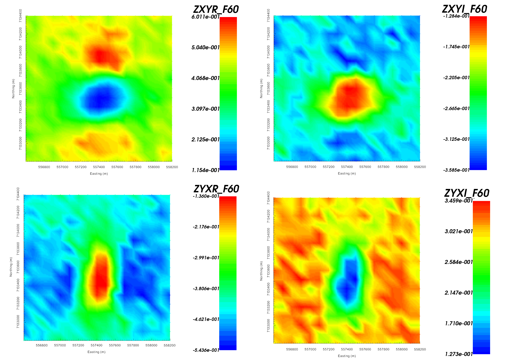

    Real (left) and imaginary (right) components of impedance tensor element :math:`Z_{xy}` at 60 Hz in V/A. Data shows that :math:`Z_{xy}` lies in the lower-righthand quadrant of the complext plane. This is consistent with the desired format in GIFtools.

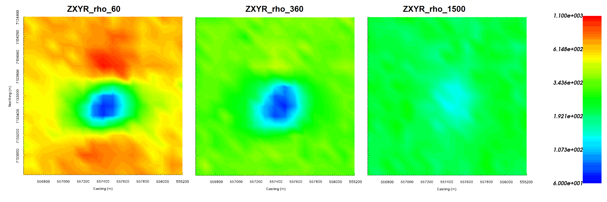

    Impedence data converted to apparent resistivities for :math:`Z_{xy}` at frequencies 60 Hz (left), 360 Hz (middle) and 1500 Hz (right). Apparent resistivity data shows the anomaly as being cause by a conductor.

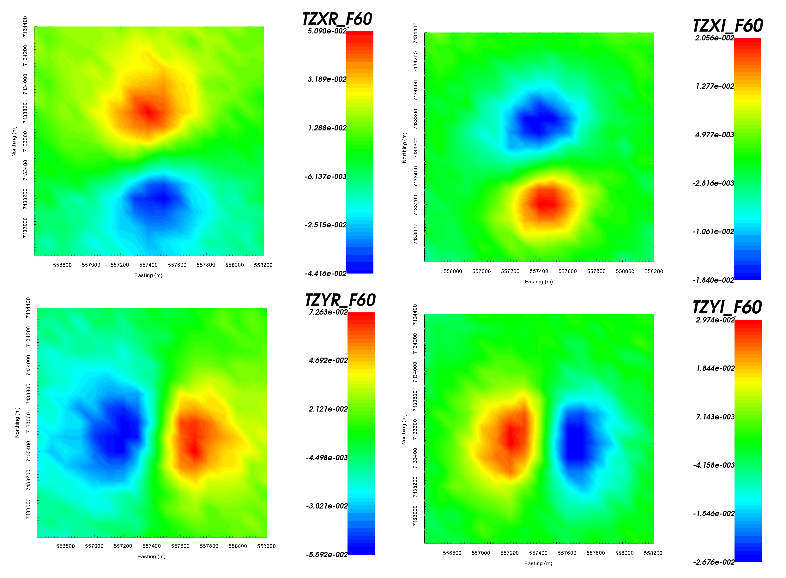

    Z-axis tipper measurements at 60 Hz. It is important to note that the 'X' in TZXR data refers to the Northing direction! 'R' refers to real component and 'I' refers to imaginary component.

.. important:: Data were generated using E3DMT version 2 and a block model approximating TKC. Uncertainties of 0.0025 :math:`\pm` 5% were added to all impedance tensor measurements. A table containing the uncertainties added to the ZTEM data can be found :ref:`here <AtoZNS_data_ztem_unc>` .

E3DMT Version 1
---------------

Let us now invert the MT and ZTEM data using E3DMT version 1. 

    - :ref:`Create E3DMT ver 1 inversion object <createMTZTEMInv>`
    - :ref:`Use edit options <invEditOptions_e3dmt_ver1>` to set the inversion parameters

        - Basic Tab:
            - Hold *ctrl* and select the MT and ZTEM data
            - Set mesh
            - Set topography to active cells model
            - No background susceptibility
            - 1D conductivity of 0.001 S/m
            - Use *Iterative* solver unless you have sufficient RAM to use *Direct* solver.

        - Model Options Tab:
            - Set *Beta cooling schedule* to 'custom by clicking button'. Use *beta max = 0.8*, *beta min = 1e-8* and *reduction factor = 0.25*
            - Set *Chi Factor* = 0.5 since E3DMT version 1 uses a non-standard measure of data misfit; `see manual <https://e3dmt.readthedocs.io/en/e3dmt/content/theory.html#data-misfit>`__
            - *alpha S* = 1e-10, *alpha E* = 1, *alpha N* = 1 and *alpha Z* = 2.56 (to recover smoothest model and balance gradient terms based on cell dimensions)
            - Set the *active cells topo* as the active model cells
            - Set initial model as 0.001 S/m
            - Set reference model as 0.001 S/m
            - Set role in model objective function to *SMOOTH_MOD_DIF*

    - Click *Apply and write files*
    - :ref:`Run the inversion <invRun>`
    - :ref:`Load results <invLoadResults>`
    - :ref:`View convergence <convergence_curve>`

The results of the inversion are shown below. We are able to recover the moderately conductive overburden from MT information as well as the conductive pipe from both the MT and ZTEM. The maximum conductivity of the recovered structure is notably higher than the true conductivity of the pipe.

The inversion reaches target misfit after 4 iterations but we have chosen the model recovered at iteration 3 (chi factor = 0.58). The model norm is discontinuous because the current model is set to be the reference model for the next beta value.
The recovered model is able to reproduce the observed anomaly but underestimates its amplitude. Misfit maps show that we are fitting both datasets relatively evenly.

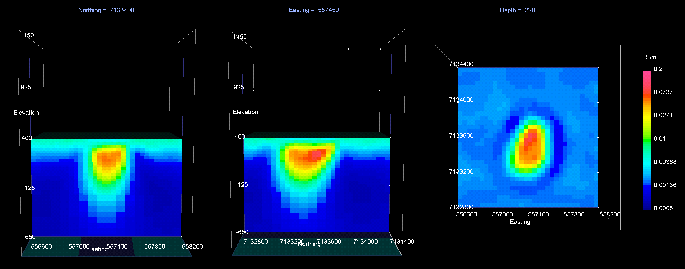

    Recovered model at iteration 3. EW cross-section (left), NS cross-section (centre), horizontal slice (right).

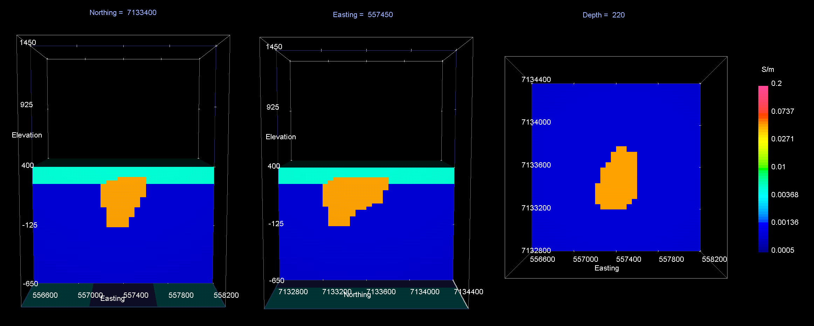

    True model. EW cross-section (left), NS cross-section (centre), horizontal slice (right).

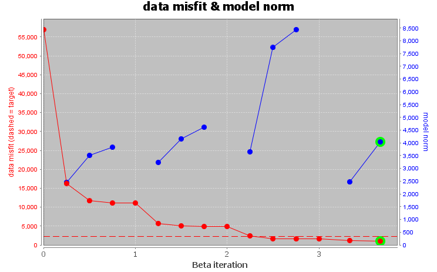

    Convergence curve shows that inversion reaches target misfit. The model norm is discontinuous because the reference modeled is updated at each iteration.

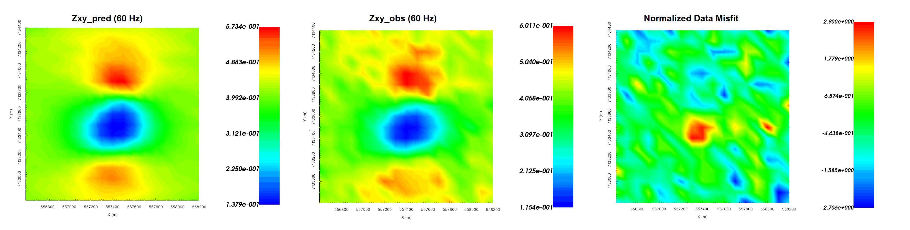

    Predicted data (left), observed data (centre) and normalized misfit (right) for the real component of :math:`Z_{xy}` at 60 Hz.

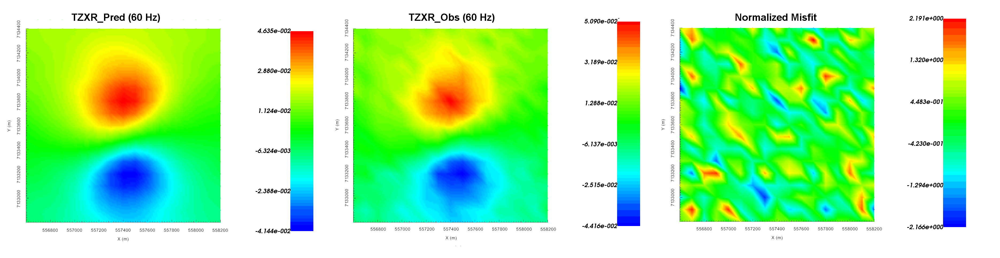

    Predicted data (left), observed data (centre) and normalized misfit (right) for the real component of :math:`T_{zx}` at 60 Hz.

E3DMT Version 2
---------------

Let us now invert the ZTEM data using E3DMT version 2. Unlike version 1, version 2 requires that user define the receiver which measure the fields.

    - Click the impedance data object and :ref:`set receivers from locations <objectDataTypeMT_snid>`. Use the following values:

        - Easting width = 2 m
        - Northing width = 2 m
        - Vertical width = 2 m

    - :ref:`Create E3DMT ver 2 inversion object <createMTZTEMInv>`
    - :ref:`Use edit options <invEditOptions_e3dmt_ver1>` to set the inversion parameters

        - Basic Tab:
            - Hold *ctrl* and select the MT and ZTEM data
            - Set mesh
            - Set topography to active cells model
            - No background susceptibility
            - 1D conductivity of 0.001 S/m (which we inferred from apparent resistivity maps)
            - Use *Iterative* solver unless you have sufficient RAM to use *Direct* solver.

        - Model Options Tab:
            - Set *Beta cooling schedule* to 'custom by clicking button'. Use *beta max = 0.8*, *beta min = 1e-8* and *reduction factor = 0.25*
            - Set *Chi Factor* = 1
            - *alpha S* = 1e-10, *alpha E* = 1, *alpha N* = 1 and *alpha Z* = 2.56 (to recover smoothest model and balance gradient terms based on cell dimensions)
            - Set the *active cells topo* as the active model cells
            - Set initial model as 0.001 S/m
            - Set reference model as 0.001 S/m
            - Set role in model objective function to *SMOOTH_MOD_DIF*

    - Click *Apply and write files*
    - :ref:`Run the inversion <invRun>`
    - :ref:`Load results <invLoadResults>`
    - :ref:`View convergence <convergence_curve>`

The results of the inversion are shown below. We are able to recover the moderately conductive overburden from MT information as well as the conductive pipe from both the MT and ZTEM. The maximum conductivity of the recovered structure is notably higher than the true conductivity of the pipe. Despite inverting for the smoothest model, the inversion need to place more sparse structures nearer to the Earth's surface to fit both the MT and ZTEM data. It is possible that our mesh is too coarse to recover a smooth model that explains both datasets.

The inversion reaches target misfit after 6 iterations but we have chosen the model recovered at iteration 3 (chi factor = 1.06). The model norm is discontinuous because the current model is set to be the reference model for the next beta value.
The recovered model is able to reproduce the observed anomaly but underestimates its amplitude. Misfit maps show that we are fitting both datasets relatively evenly.

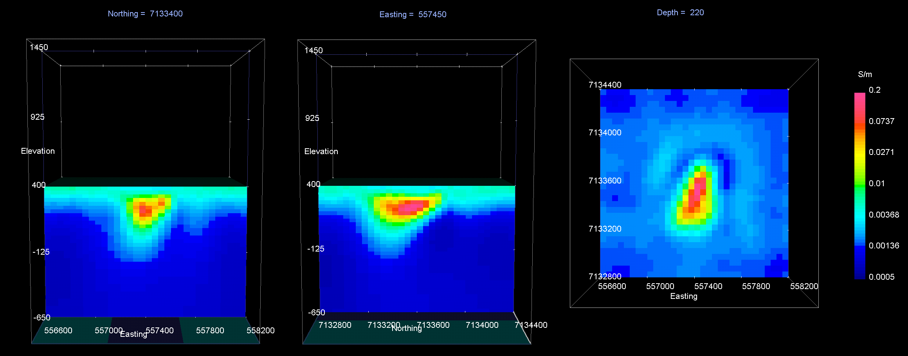

    Recovered model at iteration 3. EW cross-section (left), NS cross-section (centre), horizontal slice (right).

    True model. EW cross-section (left), NS cross-section (centre), horizontal slice (right).

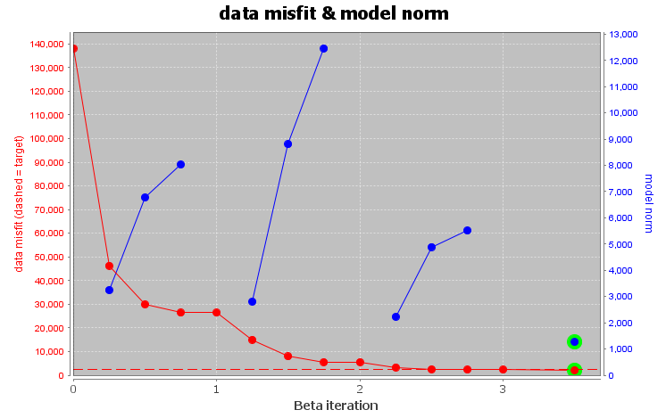

    Convergence curve shows that inversion reaches target misfit. The model norm is discontinuous because the reference modeled is updated at each iteration.

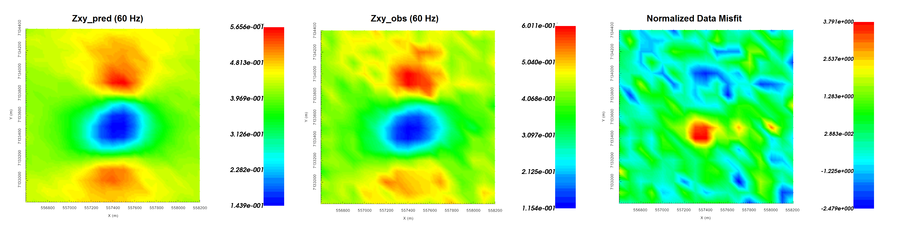

    Predicted data (left), observed data (centre) and normalized misfit (right) for the real component of :math:`Z_{xy}` at 60 Hz.

.. figure:: ../../../images/AtoZ_E3DMT/inv_joint_ztem_v2_misfit.png
    :align: center
    :width: 700

    Predicted data (left), observed data (centre) and normalized misfit (right) for the real component of :math:`T_{zx}` at 60 Hz.

