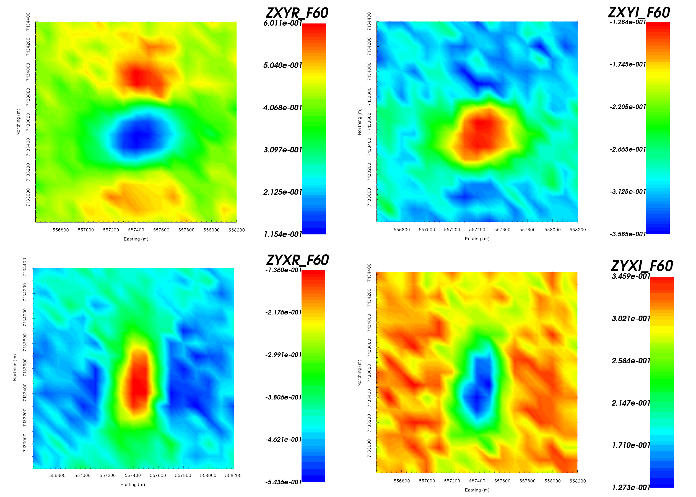
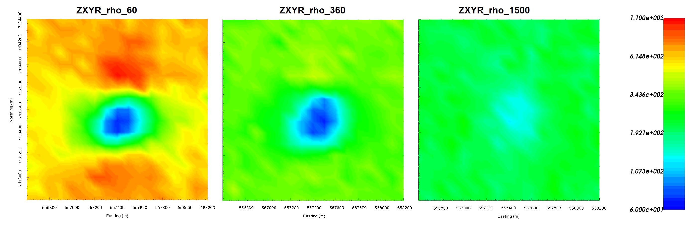
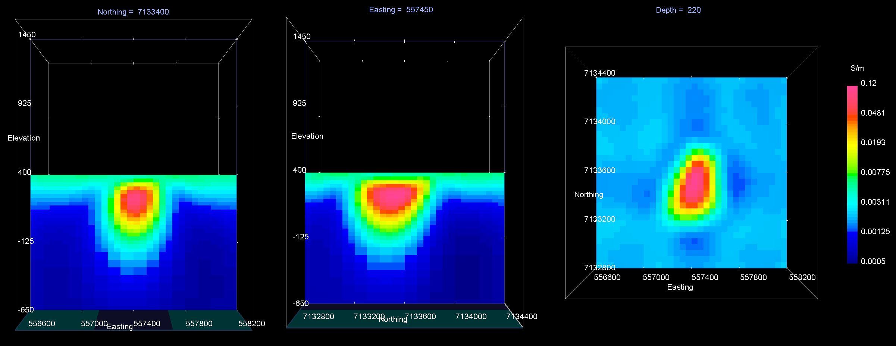
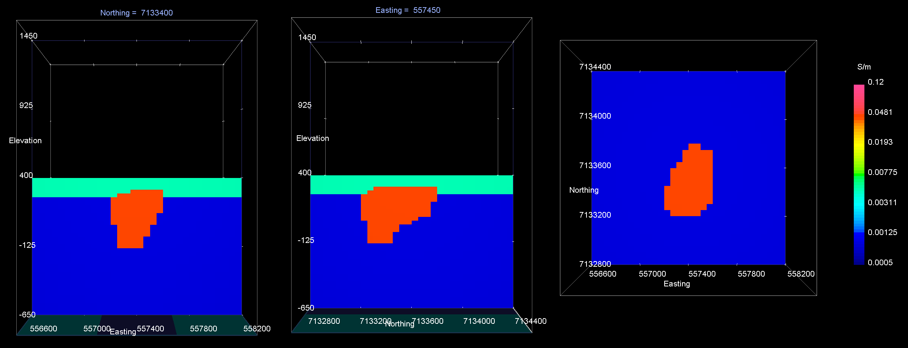
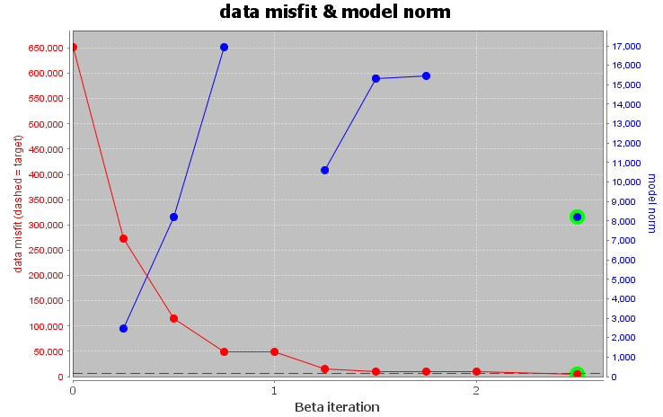
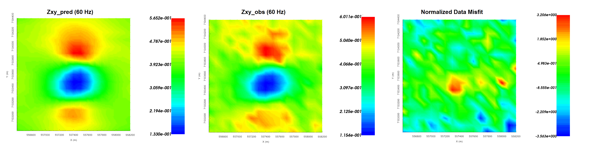
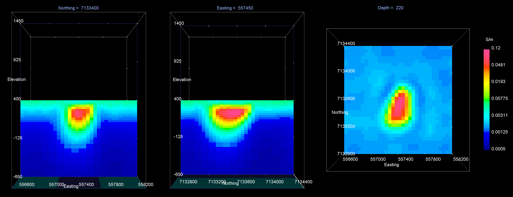
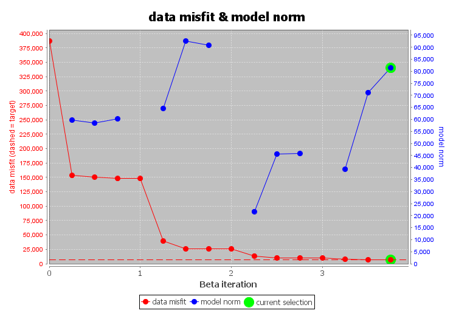
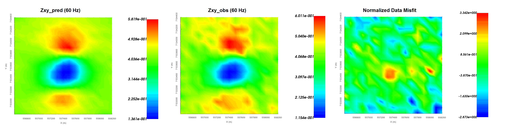

.. _AtoZNS_mt_inversion:

.. include:: <isonum.txt>

Inverting MT Data
=================

Here, we invert synthetic impedance tensor data using E3DMT versions 1 and 2.
When inverting impedances, the E3DMT codes have a tendency to place conductive artifacts proximal to the receivers.
To overcome this obstacle, we demonstrate a basic approach for limiting artifacts through the use of interface weights.

.. important:: The MT data are in GIF format; see :ref:`GIF data conventions page <signConvention>`. This means the locations are Easting-Northing-Elevation. The data convention however is defined X = Northing, Y = Easting and Z = Down. Failure to recognize this will cause incorrect interpretation of the data. To get addition background information on the coordinate systems used by the E3DMT codes, see the theory sections of the `version 1 <https://e3dmt.readthedocs.io/en/e3dmt/content/theory.html#>`_ and `version 2 <https://e3dmt.readthedocs.io/en/e3dmt_v2/content/theory.html#>`_ manuals.

.. _AtoZNS_mt_inversion_setup:

Setup for the Exercise
----------------------

**If you have completed the tutorial** :ref:`"Importing, Interpreting and Preparing NSEM Data"<AtoZNS_data>`:

    - Open your pre-existing GIFtools project
    - :ref:`Set the working directory <projSetWorkDir>` (if you would like to change it)

**If you have NOT completed the previous tutorial and would like to start here, complete the following steps:**

    - `Download the demo <https://github.com/ubcgif/GIFtoolsCookbook/raw/master/assets/AtoZ_e3dmt_4Download.zip>`_
    - Open GIFtools
    - :ref:`Set the working directory <projSetWorkDir>`
    - :ref:`Import the observed data in E3DMT version 1 format <importNSEMData_e3dmt1>`. The data file is *MTdata_v1.obs* and is found in the *assets* folder (Impedance tensor data in V/A)
    - :ref:`Load OcTree mesh <importMeshOctree>`. Found in the folder *assets/octree_model_mt*.
    - :ref:`Load active cells model <importActiveModel>`. Found in the folder *assets/octree_model_mt*.
    - :ref:`Load true model <importModel>`. Found in the folder *assets/octree_model_mt*.

**Pro tip:** To avoid confusion between location and data coordinate systems, use the :ref:`set data headers <objectDataHeaders>` tool to define location columns as *Easting, Northing* and *Elevation*.

    Real (left) and imaginary (right) components of impedance tensor element :math:`Z_{xy}` at 60 Hz in V/A. Data shows that :math:`Z_{xy}` lies in the lower-righthand quadrant of the complext plane. This is consistent with the desired format in GIFtools.

    Apparent resistivities for :math:`Z_{xy}` at frequencies 60 Hz (left), 360 Hz (middle) and 1500 Hz (right). Apparent resistivity data shows the anomaly as being cause by a conductor.

.. important:: Data were generated using E3DMT version 2 and a block model approximating TKC. To keep things simple, a constant topography of 400 m. Uncertainties of 0.0025 :math:`\pm` 5% were added to all impedance tensor measurements.

Reducing Artifacts through Interface Weighting
----------------------------------------------

When inverting MT data, the E3DMT codes have a tendency to place conductive structures near receiver locations due to the sensitivity of the data to those cells. Here, we generate interface weights to counteract this problem. By forcing lateral smoothness within the top few layers of cells, we can limit the artifacts and force the inversion to place conductive structures at the appropriate depths.

    - :ref:`Create and interface weights utility <createinterfWeights>`
    - Use :ref:`edit options <utilEditOptions>` and set the following parameters:

        - set the OcTree mesh
        - set as *log model*
        - set topography as the active cells model
        - set 3 layers of surface weights with values 10, 5, and 2.5 in decreasing order
        - Face value = 0.01
        - Face tolerance = 0.01

    - :ref:`Run the utility <utilRun>`
    - :ref:`Load results <utilLoadResults>`

E3DMT Version 1
---------------

Let us now invert the impedance tensor data using E3DMT version 1. 

    - :ref:`Create E3DMT version 1 inversion object <createMTZTEMInv>`
    - :ref:`Use edit options <invEditOptions_e3dmt_ver1>` to set the inversion parameters

        - Basic Tab:
            - Select the impedance data
            - Set mesh
            - Set topography to active cells model
            - No background susceptibility
            - 1D conductivity of 0.001 S/m (which we inferred from apparent resistivity maps)
            - Use *Iterative* solver unless you have sufficient RAM to use *Direct* solver.

        - Model Options Tab:
            - Set *Beta cooling schedule* to 'custom by clicking button'. Use *beta max = 1*, *beta min = 1e-8* and *reduction factor = 0.25*
            - Set *Chi Factor* = 0.8 since E3DMT version 1 uses a non-standard measure of data misfit; `see manual <https://e3dmt.readthedocs.io/en/e3dmt/content/theory.html#data-misfit>`
            - *alpha S* = 1e-10, *alpha E* = 1, *alpha N* = 1 and *alpha Z* = 2.56 (to recover smoothest model and balance gradient terms based on cell dimensions)
            - Use the weights object to add additional weights
            - Set the *active cells topo* as the active model cells
            - Set initial model as 0.001 S/m
            - Set reference model as 0.001 S/m
            - Set role in model objective function to *SMOOTH_MOD_DIF*

    - Click *Apply and write files*
    - :ref:`Run the inversion <invRun>`
    - :ref:`Load results <invLoadResults>`
    - :ref:`View convergence <convergence_curve>`

The results of the inversion are shown below. We are able to recover conductive pipe and the moderately conductive overburden. The conductivty of the overburden is also recovered (:math:`\sigma \approx 0.005` S/m). We are also able to recover the approximate depth to the pipe (~100 m) and the pipe's general shape.

The inversion reaches target misfit after 3 iterations. The model norm is discontinuous because the current model is set to be the reference model for the next beta value.
The recovered model is able to reproduce the observed anomaly quite well. And misfit map indicated we are fitting each component of the data evenly.

    Recovered model at iteration 3. EW cross-section (left), NS cross-section (centre), horizontal slice (right).

    True model. EW cross-section (left), NS cross-section (centre), horizontal slice (right).

    Convergence curve shows that inversion reaches target misfit. The model norm is discontinuous because the reference modeled is updated at each iteration.

    Predicted data (left), observed data (centre) and normalized misfit (right) for the real component of :math:`Z_{xy}` at 60 Hz.

E3DMT Version 2
---------------

Let us now invert the impedance tensor data using E3DMT version 2. Unlike version 1, version 2 requires that user define the receiver which measure the fields.

    - Click the impedance data object and :ref:`set receivers from locations <objectDataTypeMT_snid>`. Use the following values:

        - Easting width = 2 m
        - Northing width = 2 m
        - Vertical width = 2 m
        - Dipole length = 10 m

    - :ref:`Create E3DMT version 2 inversion object <createMTZTEMInv>`
    - :ref:`Use edit options <invEditOptions_e3dmt_ver1>` to set the inversion parameters

        - Basic Tab:
            - Select the impedance data
            - Set mesh
            - Set topography to active cells model
            - No background susceptibility
            - 1D conductivity of 0.001 S/m (which we inferred from apparent resistivity maps)
            - Use *Iterative* solver unless you have sufficient RAM to use *Direct* solver.

        - Model Options Tab:
            - Set *Beta cooling schedule* to 'custom by clicking button'. Use *beta max = 1*, *beta min = 1e-8* and *reduction factor = 0.25*
            - Set *Chi Factor* = 1
            - *alpha S* = 1e-10, *alpha E* = 1, *alpha N* = 1 and *alpha Z* = 2.56 (to recover smoothest model and balance gradient terms based on cell dimensions)
            - Use the weights object to add additional weights
            - Set the *active cells topo* as the active model cells
            - Set initial model as 0.001 S/m
            - Set reference model as 0.001 S/m
            - Set role in model objective function to *SMOOTH_MOD_DIF*

    - Click *Apply and write files*
    - :ref:`Run the inversion <invRun>`
    - :ref:`Load results <invLoadResults>`
    - :ref:`View convergence <convergence_curve>`

The results of the inversion are shown below. We are able to recover conductive pipe and the moderately conductive overburden. The conductivty of the overburden is also recovered (:math:`\sigma \approx 0.005` S/m). We are also able to recover the approximate depth to the pipe (~100 m) and the pipe's general shape.

The inversion reaches target misfit after 3 iterations. The model norm is discontinuous because the current model is set to be the reference model for the next beta value.
The recovered model is able to reproduce the observed anomaly quite well. And misfit map indicated we are fitting each component of the data evenly.

    Recovered model at iteration 3. EW cross-section (left), NS cross-section (centre), horizontal slice (right).

    True model. EW cross-section (left), NS cross-section (centre), horizontal slice (right).

    Convergence curve shows that inversion reaches target misfit. The model norm is discontinuous because the reference modeled is updated at each iteration.

    Predicted data (left), observed data (centre) and normalized misfit (right) for the real component of :math:`Z_{xy}` at 60 Hz.