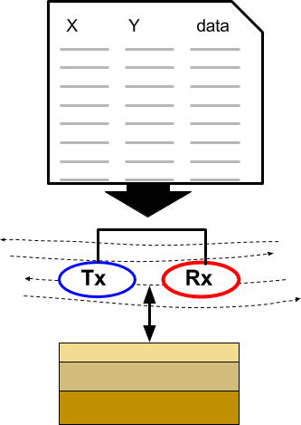
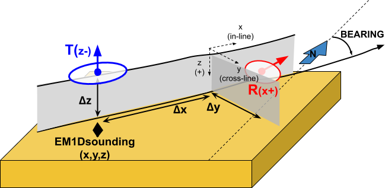
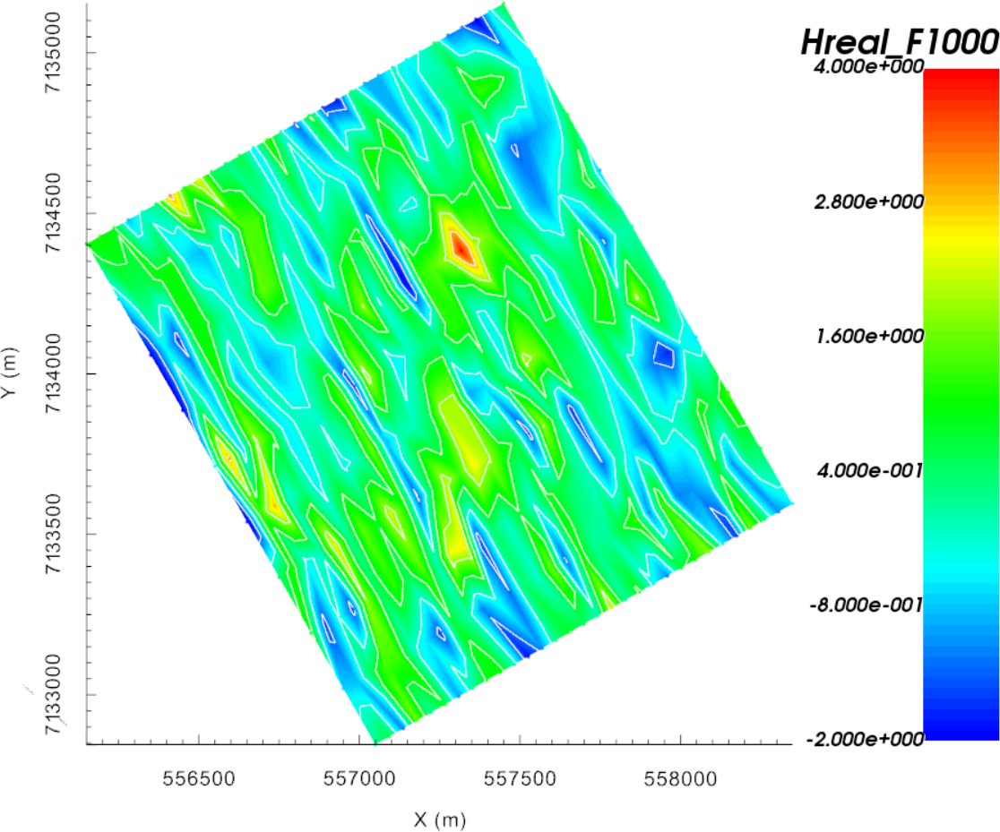

.. _AtoZem1dfm_uncertainties:

.. include:: <isonum.txt>

Specifying Parameters for FEM Sounding Inversion
================================================

Here, we detail the process of defining the survey parameters used in EM1DFM inversions. For `GIF formatted 1D FEM data
<https://em1dfm.readthedocs.io/en/latest/content/files/supporting.html>`__ , the
survey parameters are automatically read into GIFtools. For :ref:`XYZ<XYZfile>` and :ref:`CSV<CSVfile>` files however, the survey information
must be specified by the user. In this exercise, we:

    - Define the data columns being imported from a XYZ data file
    - Set transmitter, receiver and elevation information
    - Assign uncertainties to the data

.. _AtoZem1dfm_setup:

Setup for the Exercise
----------------------

    - `Download the demo <https://github.com/ubcgif/GIFtoolsCookbook/raw/master/assets/AtoZ_FEM1D_4Download.zip>`_
    - Open GIFtools
    - :ref:`Set the working directory <projSetWorkDir>`

.. tip:: - Steps (without links) are also included with the download
         - Requires at least `GIFtools version 2.2 <https://gif.eos.ubc.ca/GIFtools/downloads2>`_ (login required)

.. _AtoZem1dfm_import:

Import files
------------

In addition to raw geophysical data, you may have access to topographical information. If this information is available, it can be imported into GIFtools.

    - :ref:`Import raw FEM data <importFemData>` (XYZ format as an FEMsounding).
    - :ref:`Import topography data <importTopo>` (3D GIF format)
    - :ref:`Import 1D mesh<importMesh>` (layers file)
    - :ref:`Import surface layer<importSurface>` (3D GIF format)

.. tip:: - Use **Edit** |rarr| **Rename** to change what objects in GIFtools are called
         - For any data object, :ref:`edit the data headers <objectDataHeaders>`.
         - Raw data were generated synthetically using the best-available conductivity model for TKC and the E3Doctree code.
         - The standard deviation of Gaussian noise added was determined from the uncertainties used to invert real FEM data collected over TKC.

Add Transmitter, Receiver and Elevation Information
---------------------------------------------------

Since the raw data were formatted according to the XYZ format, the transmitter and receiver information for the airborne survey must be set manually. Additionally, only an altitude column was provided in the raw data. Therefore, we must use the topography and altitude information to determine the elevation of each data point.

    - :ref:`Create elevation from surface topography<objectElevFromSurface>`

        - Click **at surface** and use the altitude data column from the FEMsounding object
        - :ref:`Set i/o header<objectSetioHeaders>` for Z to the elevation column you just created

    - :ref:`Add transmitters<objectEMdtype_addTx>` to set the locations of the transmitters **relative to the current xyz data locations**. Use the following parameters:

        - Dipole moment = 1 Am :math:`\! ^2`
        - Set Rotation angle as "Relative to bearing" and set bearing to calculate
        - Along-line offset = 0 m
        - Cross-line offset = 0 m
        - Set vertical offset as altitude column from data object

    - :ref:`Add receivers<objectEMdtype_addRx>` to set the locations of the receivers **relative to the transmitter locations**. Use the following parameters:

        - Dipole moment = 1 Am :math:`\! ^2`
        - Set Rotation angle as "Relative to bearing" and use the bearing column that was calculated when adding transmitters
        - Along-line offset = 15 m
        - Cross-line offset = 0 m
        - Set vertical offset as altitude column from data object

    - :ref:`Set data normalization to ppm<objectEMsetDataNorm>`

.. raw:: html
    :file: ./AtoZ_Data_Real.html

.. raw:: html
    :file: ./AtoZ_Data_Imag.html

.. _AtoZem1dfm_uncert_assign:

Assign Uncertainties
--------------------

Before inverting the data, we must assign uncertainties. The role of uncertainties in the inversion process is described in the :ref:`inversion fundamentals section<Fundamentals_Uncertainties>`. Because real and imaginary components of the observed response each span different magnitudes, and the errors on the data may vary as such, distinct floor and percent uncertainties will be computed for each frequency.

    - Use :ref:`assign frequency-dependent uncertainties<objectAssignUncert>` to create data columns containing the data uncertainties. Use the following floor and percent values for both the real and imaginary data:

        - 1000 Hz = 2 ppm floor + 0\%
        - 5000 Hz = 5 ppm floor + 0\%
        - 25000 Hz = 15 ppm floor + 0\%

    - Set :ref:`i/o headers<objectSetioHeaders>` for all fields. Files used in the inversion cannot be written until this is performed.

.. note::
    The uncertainties for this exercise are the same as the uncertainties used to invert real FEM data collected over TKC. If the applied uncertainties are correct:
        - The recovered model will not fit the data too heavily in certain regions at the expense of others
        - The recovered model will not fit the data too heavily at certain frequencies at the expense of others
        - the recovered model will fit the real and imaginary components of the data equally

.. figure:: ./../../../images/AtoZ_fem1d/FEMdata_25000R.png
    :align: right
    :figwidth: 0%
