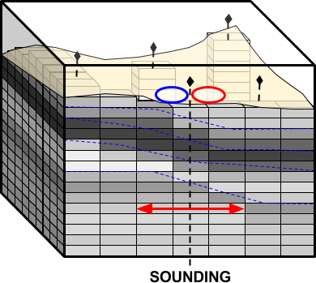
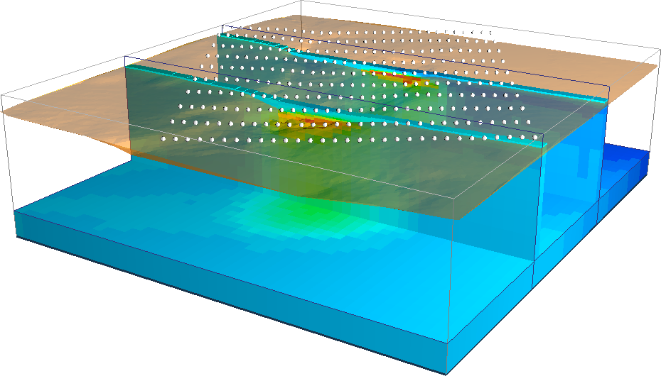

.. _AtoZem1dfm_index:

.. include:: <isonum.txt>

A to Z Examples for EM1DFM
==========================

Here, we demonstrate the interpretation of FEM data through both independent
1D inversions and with a laterally constrained pseudo-3D inversion approach.
Although full 3D FEM inversion algorithms have been developed, computing
resources and processing time are often limiting factors. Meanwhile 1D and
laterally constrained pseudo-3D inversion approaches are computationally fast
algorithms and capable of recovering bulk information about 3D conductivity
and susceptibility structures. The tutorial for the EM1DFM inversion code is
split into three parts:

    .. toctree::
       :maxdepth: 1

       Importing raw frequency-domain data <assignUncertainties>
       Static and Adaptive 1D Inversion <staticInversion>
       Laterally Constrained 3D Inversion <lateralInversion>

