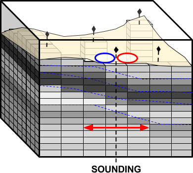
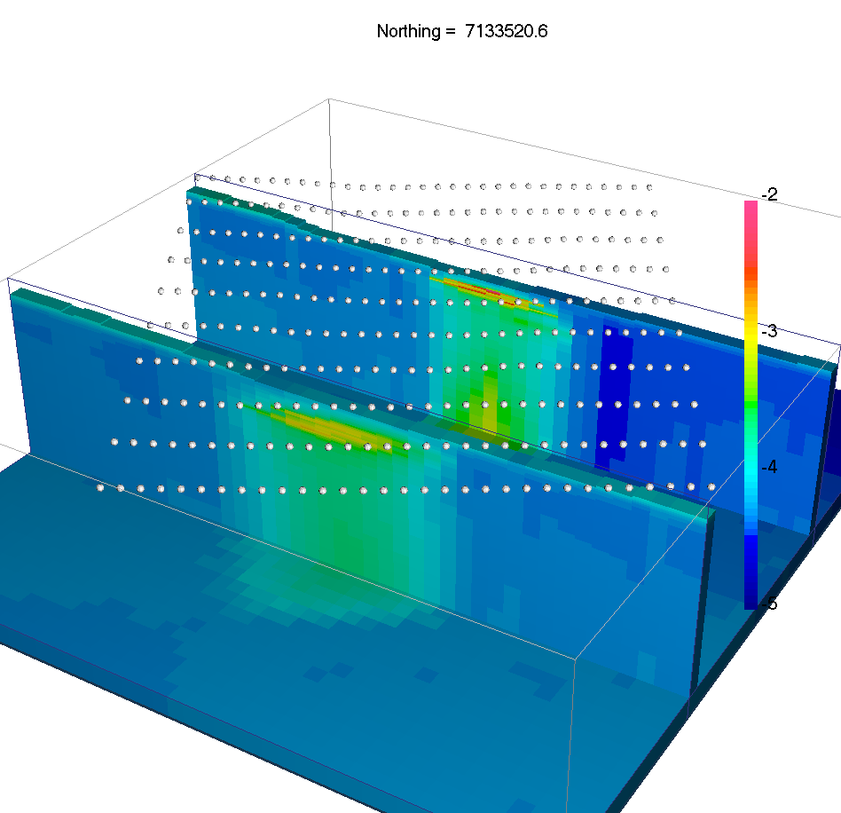
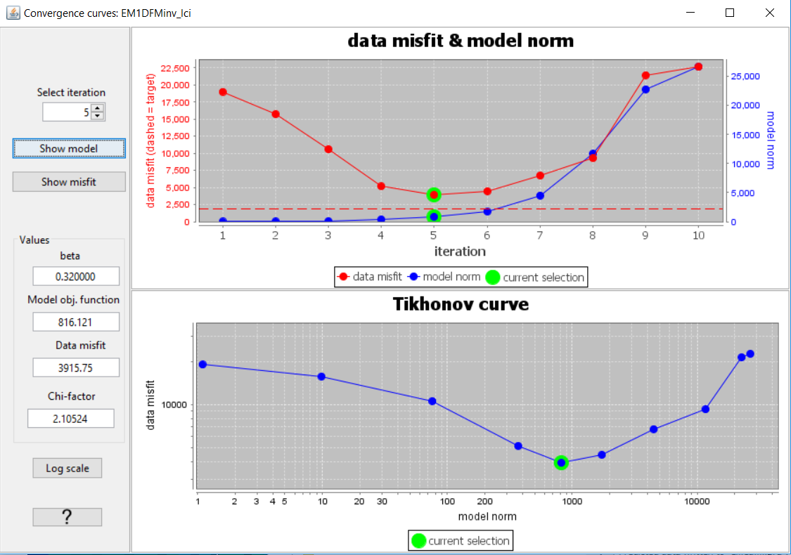
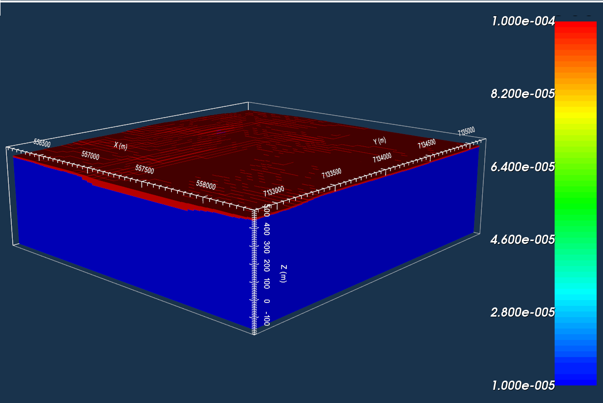
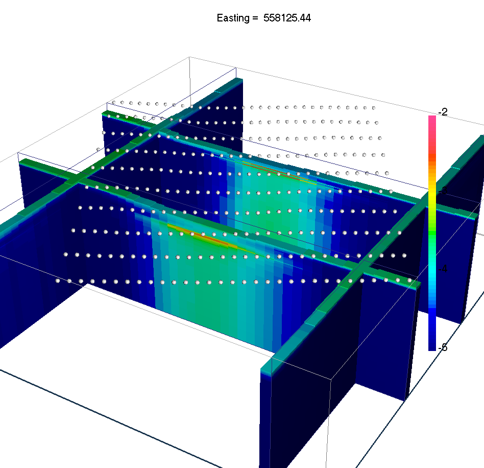
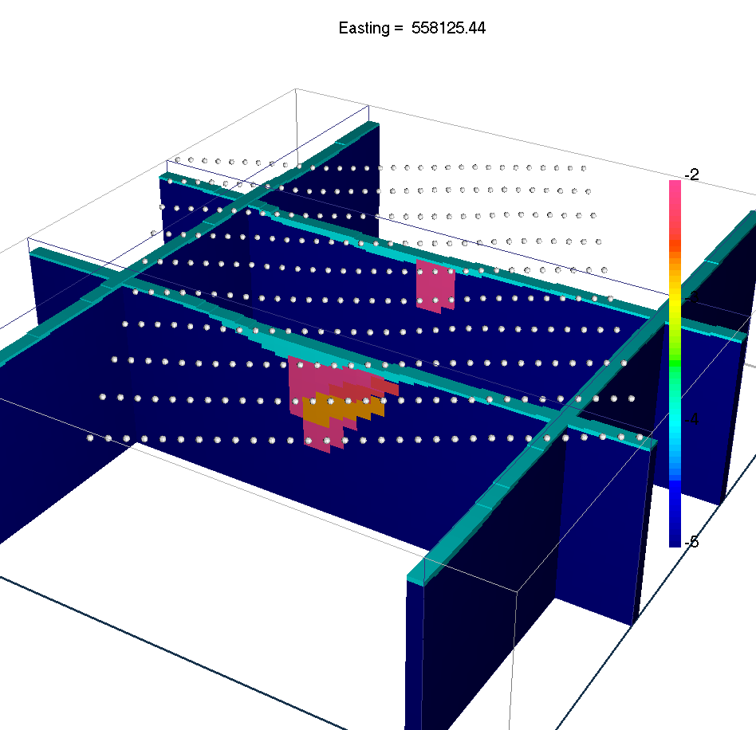

.. _AtoZem1dfm_lateral:

.. include:: <isonum.txt>

Laterally Constrained 3D Inversion
==================================

Here, frequency-domain data are inverted using the laterally constrained 3D
inversion approach. Just like in the previous exercise, every 1D model is
associated with a distinct sounding location (see `EM1DFM package overview
<http://em1dfm.readthedocs.io/en/latest/content/overview.html>`__). However
lateral constraints are added such that the set of recovered 1D models are
smooth horizontally and can ultimately be constrained and interpreted in 3D.
The laterally constrained 3D inversion algorithm is a computationally fast way
to invert FEM data while taking into account both vertical and horizontal
variability of the Earth. The final model recovered by this algorithm is fully
3-dimensional.

.. figure:: ../../../images/AtoZ_fem1d/AtoZ_EM1DFM_landing_LC.png
    :align: center
    :figwidth: 75%

As part of this exercise, the user will:

    - :ref:`Set<AtoZem1dfm_lateral_setup>` relevant inversion parameters
    - :ref:`Invert<AtoZem1dfm_lateral_inversion>` the field observations using a set of laterally constrained 1D conductivity models (susceptibility models can be included)
    - :ref:`Interpret<AtoZem1dfm_lateral_discussion>` the inversion results generated by the algorithm

.. _AtoZem1dfm_lateral_setup:

Setup for the Exercise
----------------------

**If you have completed the tutorial** :ref:`"Static and Adaptive 1D Inversion"<AtoZem1dfm_static>`:

    - Open your preexisting GIFtools project
    - :ref:`Set the working directory <projSetWorkDir>` (if you would like to change it)

**If you have NOT completed the previous tutorial and would like to start here, complete the following steps:**

    - `Download the demo <https://github.com/ubcgif/GIFtoolsCookbook/raw/master/assets/AtoZ_FEM1D_4Download.zip>`_
    - Open GIFtools
    - :ref:`Set the working directory <projSetWorkDir>`
    - :ref:`Import em1dfm data file: Assets//FEM1D.obs <importFemData>` (1D FEM GIF format data in ppm)
    - :ref:`Import 1D mesh<importMesh>` (layers file)
    - :ref:`Import the topography data <importTopo>` (3D GIF format)
    - :ref:`Create elevation from surface topography<objectElevFromSurface>`
        - Set elevation at 40 m above topography
        - :ref:`Set i/o header<objectSetioHeaders>` for Z to the elevation column you just created.

.. note:: The uncertainties for this exercise are the same as the uncertainties used to invert real FEM data collected over TKC.

.. raw:: html
    :file: ./AtoZ_Data_Real.html

.. raw:: html
    :file: ./AtoZ_Data_Imag.html

*Real (left) and quadrature (right) components of synthetic FEM data collected over TKC*

.. _AtoZem1dfm_lateral_inversion:

Laterally Constrained 3D FEM Inversion
--------------------------------------

Here, the set of FEM data are inverted using the laterally constrained 3D
approach.

Setup the inversion
^^^^^^^^^^^^^^^^^^^

**If you have completed the tutorial** :ref:`"Static and Adaptive 1D Inversion"<AtoZem1dfm_static>`:

    - Click on a preexisting EM1DFM inversion object and :ref:`copy options<invCopyOptions>`
    - Click on the newly created EM1DFM inversion object to set the output directory
    - Set any necessary EM1DFM inversion parameters under :ref:`edit options<invEditOptions>`:
        - Make sure the mesh, observed data and topography are properly set!
        - Mode: Laterally constrained 3D
            - *Max distance* = 1000 m
            - *Number of stations* = 10
            - *Smoothing parameter* = 200
            - Other parameters left as default values
        - Use the *Fix Trade-off* mode
            - *Initial beta* = 1000
            - *Cooling factor* = 5
            - *Global Iterations* = 5
            - Other parameters left as default values
    - Click *Apply*

**If you have NOT completed the previous tutorial and are starting here:**

    - :ref:`Create an EM1DFM inversion object <createFEMInv>` and set the output directory
    - Set the EM1DFM inversion parameters under :ref:`edit options<invEditOptions>` using the parameters specified in the bullet list above
    - Click *Apply*

.. note:: If you chose not to write the files from the edit options menu, you may do so through :ref:`write inversion files <invWriteAll>`

Run Inversion and Load Results
^^^^^^^^^^^^^^^^^^^^^^^^^^^^^^

    - :ref:`Run inversion <invRun>`
    - Results are loaded automatically for this algorithm
    - :reF:`View the misfit map <viewData>`

.. _AtoZem1dfm_lateral_discussion:

Discussion
^^^^^^^^^^

    Recovered 1D models with topography and lateral constraints

The lateral constraints strategy comes with many advantages:

    - Neighboring 1D conductivity models are more consistent
    - Conductivity structures are interpolated in 3D, possibly highlighting trends in the model and easing the interpretation.
    - Possible to employ a :math:`\beta`-cooling strategy similar to the 3D inversion code.

The use of a global measure of data fit allows us to assess the convergence of
the algorithm through the usual :ref:`convergence curve<convergence_curve>` window.

Ideally we would like to test the hypothesis of a conductive overburden in 3D, as well as to impose bounds on the conductivity values.
which we covered in the :ref:`next section<AtoZem1dfm_lateral>`.

    Convergence curves

.. note:: After the fifth iteration, the global misfit begins to increase due
          to the 3D smoothing of the recovered conductivity model. The user should consider re-running the inversion with
          different smoothing parameters in order to test the stability of the solution.

.. _AtoZem1dfm_lateral_constr:

Geological Constraints: Hypothesis Testing
------------------------------------------

It is well known that at TKC, there is a till overburden covering a portion of the survey area.
As a final example we will impose 3D geological constraints on the laterally constrained 1D inversions.
The geological constraints assume we have some a-priori information about the distribution and thickness of the overlying till.
To apply geological constraints, we first need to create the reference conductivity model from a surface:

Creating a Reference Model
^^^^^^^^^^^^^^^^^^^^^^^^^^

Here, we use surface topography and a surface object to define the upper and lower surfaces of the till layer, respectively.
We then assign reasonable physical property values for the till and background.
To accomplish this task, we use the model builder module.

    - :ref:`Import the surface<importSurface>` file provided (TillLayer.topo)
    - Select one of the 3D mesh objects created from a previous inversion and :ref:`create active model from topography<createActiveCellsModel>`. Use *from tops of cells*.
    - Select the active cells model and :ref:`create a model builder module<createModelBuilder>`

    - :ref:`Create model using surfaces<objectFunctionalityMBbuild_surf1>` with the following parameters to create an initial physical property model:
        - *Top surface* as *topography*
        - *Bottom surface* as *surface object*
        - *Value* as *physical property value* (set as :math:`10^{-4}` S/m)
        - *Destination model* as *New Model* and provide a name (RefMod)

    - Setting physical property values for the active background cells in the newly created model can with the same functionality. Open the :ref:`Create model using surfaces<objectFunctionalityMBbuild_surf1>` window and use the following parameters
        - *Top surface* as *surface object*
        - *Bottom surface* as *Value* (:math:`-1000` m)
        - *Value* as *physical property value* (set as :math:`10^{-5}` S/m)
        - *Destination model* as the physical property model you just created

This model can be used as a reference model and constrain the final recover conductivity model.

    Till layer defined within the reference model.

Setup the inversion
^^^^^^^^^^^^^^^^^^^

    - Click on the last EM1DFM inversion object and :ref:`copy options<invCopyOptions>`
    - Click on the newly created EM1DFM inversion object and set the output directory
    - Use :ref:`edit options<invEditOptions>` to verify and apply the current set of inversion parameters
        - Make sure the mesh and observed data are properly set
        - Set the topography from the drop-down menu
        - Notice that the inversion parameters are identical to the previous inversion that was run
    - Within :ref:`edit options<invEditOptions>` *Conductivity* tab, set:
        - *Initial model* as best-fitting halfspace
        - *Reference model* as the model created in the previous subsection and choose "SMOOTH_MOD_DIF"

    - Upper and lower bounds for the recovered model can be set if desired
    - Apply and write all files

Run Inversion and Load Results
^^^^^^^^^^^^^^^^^^^^^^^^^^^^^^

    - :ref:`Run inversion <invRun>`
    - Results are loaded automatically for this algorithm
    - :reF:`View the misfit map <viewData>`

Discussion
^^^^^^^^^^

This final solution differs from the previous inversion in that:
    - A sharp gradient is preserved along the base of the till layer
    - The upper conductivities are more consistent :math:`\approx 10^4 \Omega \cdot m`
    - The top of the kimberlite pipes is at the right depth

The reader is invited to run multiple inversions with various smoothing
parameters and data uncertainties to explore the range of solutions. It is important
to keep in mind that the true model is 3D and cannot be characterized
by the 1D assumption. We did however manage to recover a first order estimate
for the horizontal positions of the kimberlite pipes and background
conductivity structures.

.. .. figure:: ./../../../images/AtoZ_fem1d/Inv_LC_constrained_EW.png
..     :align: left
..     :figwidth: 45%

..     EW section through the constrained 1D inversion

    Recovered 1D models with geological constraints

    Sections through the true 3D conductivity model

