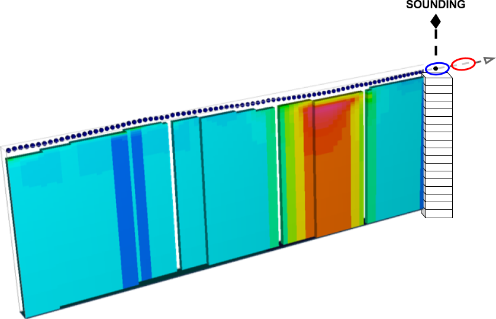
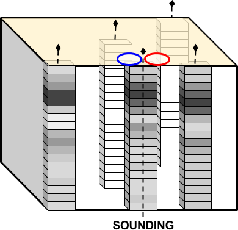
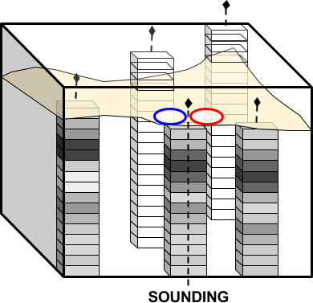
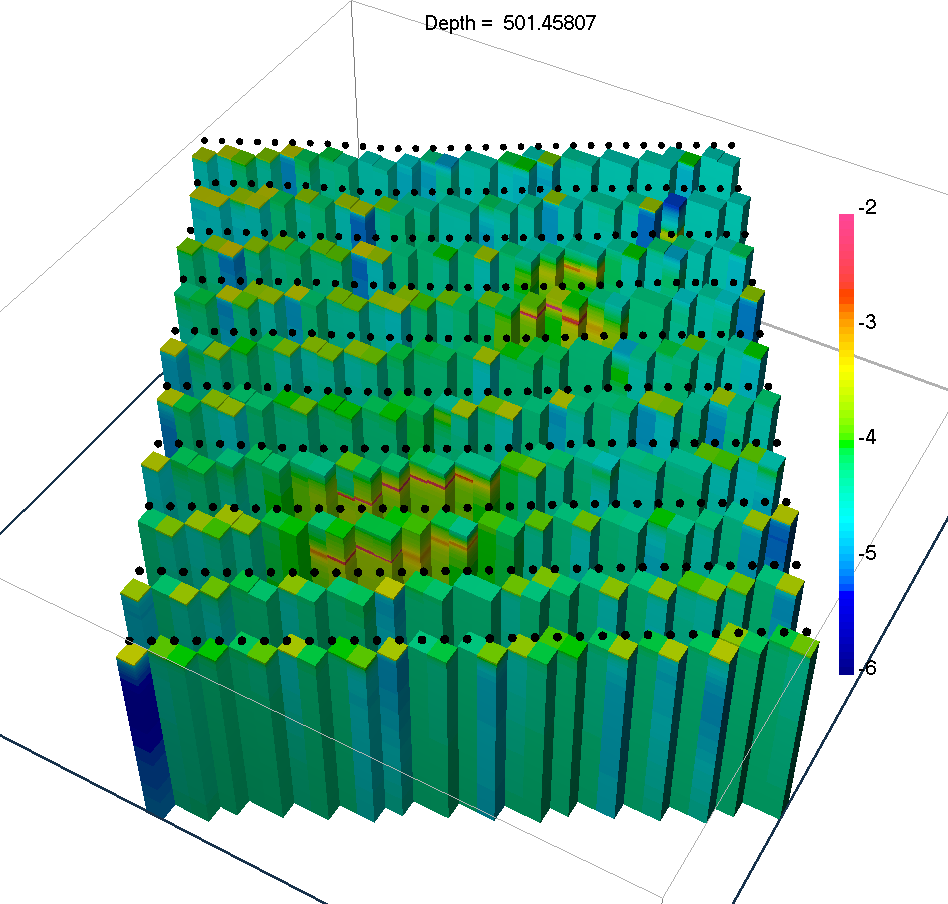
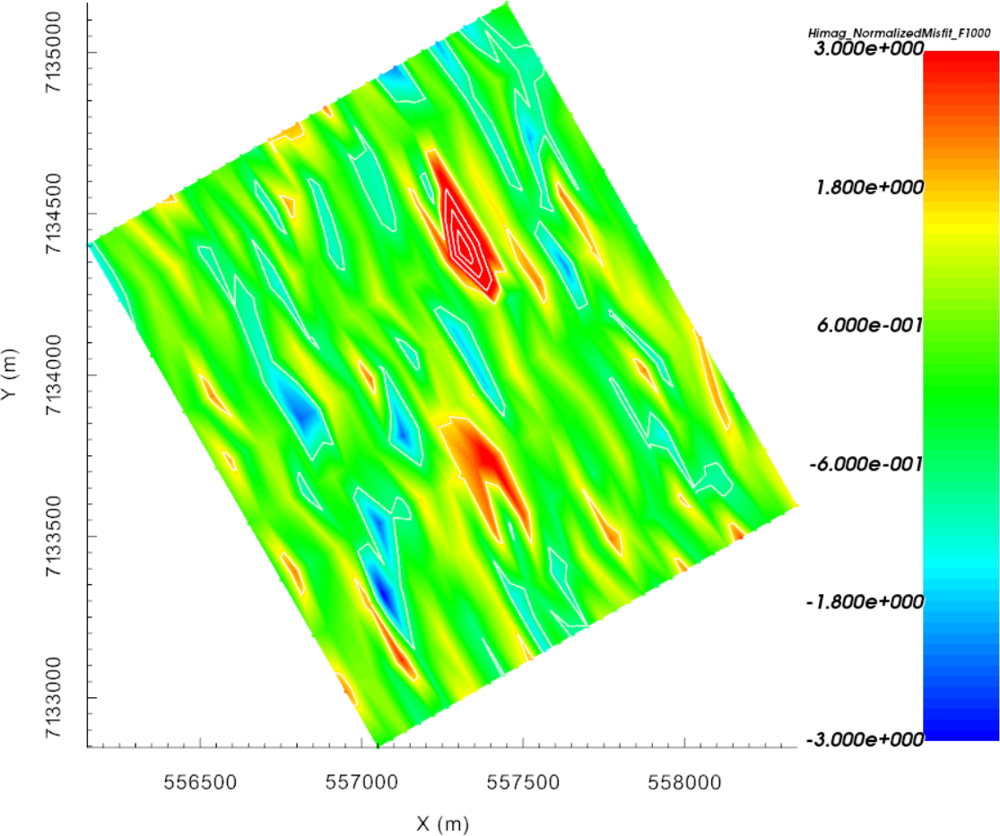
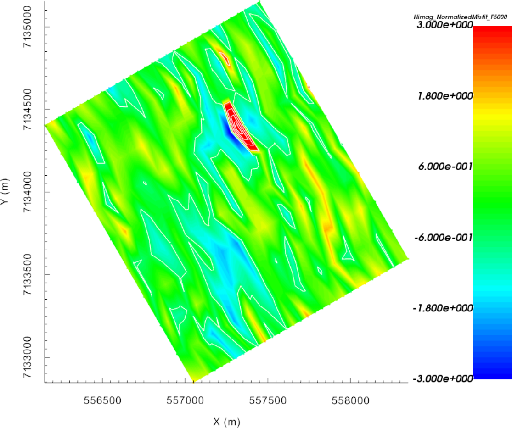
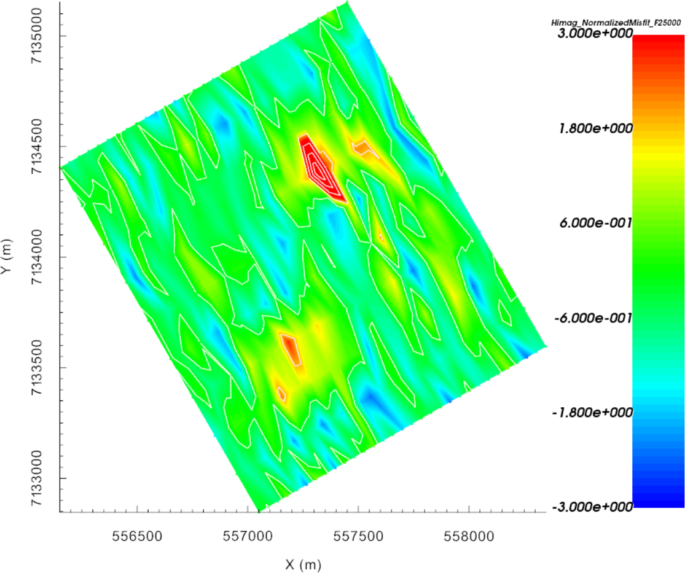
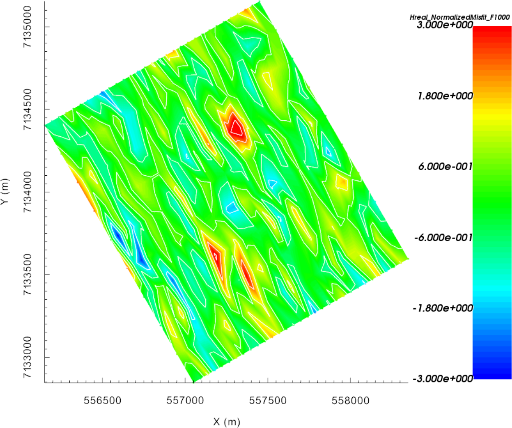
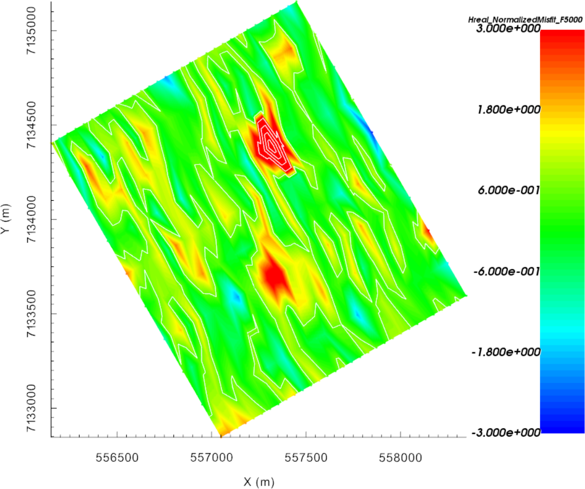
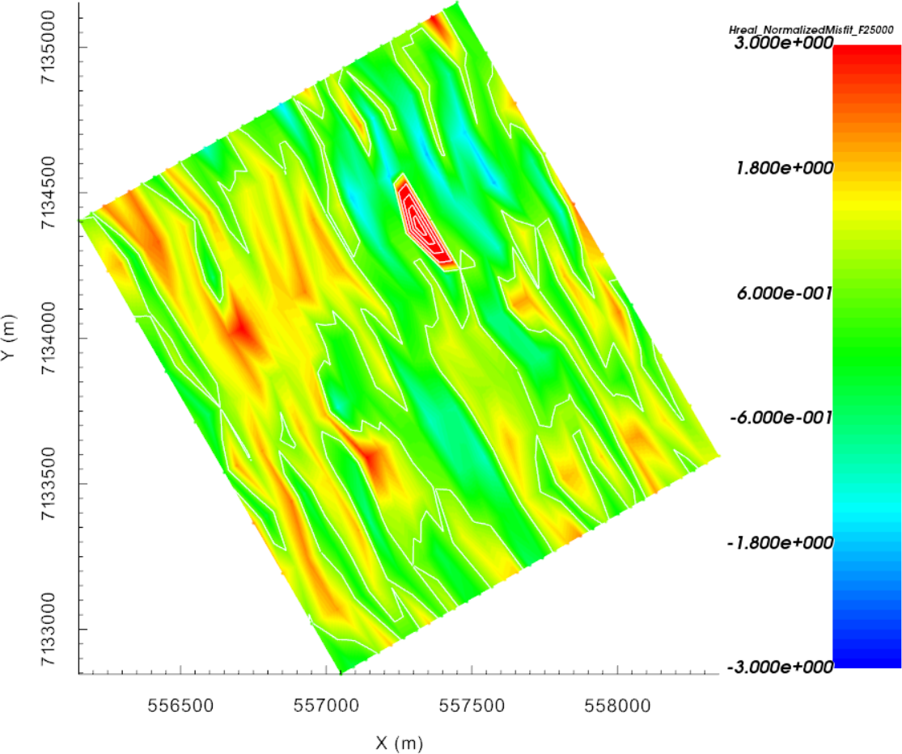

.. _AtoZem1dfm_static:

.. include:: <isonum.txt>

Static and Adaptive 1D Inversion
================================

Here, FEM data are inverted using both static and adaptive 1D inversion
approaches. The adaptive approach takes into account surface topography
whereas the static approach does not. In either case, every transmitter is
associated with a distinct sounding location. A 1D model is then recovered
independently for each sounding location; see the `EM1DFM package overview
<http://em1dfm.readthedocs.io/en/latest/content/overview.html>`__ for further
explanation. The set of recovered 1D models are visualized on a 3D mesh.
Static and adaptive 1D inversion algorithms are a computationally fast way to
obtain depth and horizontal location information about conductive/resistive
and magnetically susceptible targets.

As part of this exercise, the user will:

    - :ref:`Set<AtoZem1dfm_static_setup>` relevant inversion parameters
    - :ref:`Invert<AtoZem1dfm_static_inversion>` the field observations using a set of 1D conductivity models (susceptibility models can be included)
    - :ref:`Interpret<AtoZem1dfm_static_discussion>` inversion results generated from 1D inversions

.. _AtoZem1dfm_static_setup:

Setup for the Exercise
----------------------

**If you have completed the tutorial** :ref:`"Specifying Parameters for FEM Sounding Inversion"<AtoZem1dfm_uncertainties>`:

    - Open your preexisting GIFtools project
    - :ref:`Set the working directory <projSetWorkDir>` (if you would like to change it)

**If you have NOT completed the previous tutorial and would like to start here, complete the following steps:**

    - `Download the demo <https://github.com/ubcgif/GIFtoolsCookbook/raw/master/assets/AtoZ_FEM1D_4Download.zip>`_
    - Open GIFtools
    - :ref:`Set the working directory <projSetWorkDir>`
    - :ref:`Import em1dfm data file: Assets\\FEM1D.obs <importFemData>` (1D FEM GIF format data in ppm)
    - :ref:`Import the topography data <importTopo>` (3D GIF format)
    - :ref:`Create elevation from surface topography<objectElevFromSurface>`
        - Set elevation at 40 m above topography
        - :ref:`Set i/o header<objectSetioHeaders>` for Z to the elevation column you just created.
        - :ref:`Import 1D mesh<importMesh>` (layers file)

.. note:: The uncertainties for this exercise are the same as the uncertainties used to invert real FEM data collected over TKC.

.. raw:: html
    :file: ./AtoZ_Data_Real.html

.. raw:: html
    :file: ./AtoZ_Data_Imag.html

*Real (left) and quadrature (right) components of synthetic FEM data collected over TKC*

.. _AtoZem1dfm_static_inversion:

Static 1D FEM Inversion
-----------------------

    Conventional 1D inversion

Here, the set of FEM data are inverted using the static 1D approach. This
approach does not consider surface topography.

Setup the inversion
^^^^^^^^^^^^^^^^^^^

    - :ref:`Create an EM1DFM inversion object <createFEMInv>` and set the output directory
    - Set the EM1DFM inversion parameters under :ref:`edit options<invEditOptions>`:
        - **Global tab**:
            - **Set mesh from drop-down menu**
            - **Set observed data from drop-down menu**
            - **Mode:** static 1D
            - **Model options:** for this example, data are inverted strictly for a conductivity model
            - **Solver options:** leave as default
            - **Trade-off Mode:** select discrepancy principle (computes :math:`\beta` using a line search)
        - **Conductivity tab:**
            - Set alpha_s = 0.04 and alpha_z = 1 (since layer thickness is 5 m)
        - **Susceptibility tab:**
            - Leave as default or customize (if being used)
        - Click apply and write all files

.. note:: - GIFtools will immediately convert the 1D layers to a 3D mesh
            using the smallest data separation to define the x-y cell size.

          - If you chose not to write the files from the edit options menu, you may do so through :ref:`write inversion files <invWriteAll>`

Run Inversion and Load Results
^^^^^^^^^^^^^^^^^^^^^^^^^^^^^^

    - :ref:`Run inversion <invRun>`
    - :ref:`Load results <invLoadResults>`
    - :reF:`View the results <viewData>`

Discussion
^^^^^^^^^^

.. figure:: ./../../../images/AtoZ_fem1d/Inv_Static_model.png
    :align: right
    :figwidth: 40%

    Recovered 1D conductivity models

The inverted 1D conductivity models are automatically geo-referenced in 3D for
visualization and interpretation. Interpolated data misfit
maps for each data components are show below.
We note the following features

 - Two regions of higher conductivity showing as arc conductors.
 - Mostly uncorrelated residual misfit map.

Note that all 1D models extend vertically to the top of the mesh, even though
the observation stations were acquired at different heights. It is therefore
expected that the relative depth of the anomalies may not be representative of
true 3D variations.

.. raw:: html
    :file: ./AtoZ_DataFit_Static_Real.html

.. raw:: html
    :file: ./AtoZ_DataFit_Static_Imag.html

*Normalized data misfits for the real (left) and quadrature (right) components of the magnetic field*

Adaptive 1D FEM Inversion
-------------------------

    Adaptive 1D inversion

Here, the set of FEM data are inverted using the adaptive 1D approach. In this
case, surface topography is used to position the vertical locations of
recovered 1D models relative to one another; i.e. the surface of each 1D model
should correspond with the surface location.

Setup the inversion
^^^^^^^^^^^^^^^^^^^

    - Create another EM1DFM inversion using :ref:`copy options<invCopyOptions>`
    - Click on the newly created EM1DFM inversion object and set the output directory
    - Use :ref:`edit options<invEditOptions>` to verify and apply the current set of inversion parameters:
        - Make sure the mesh and observed data are properly set
        - Make sure alpha_s = 0.04 and alpha_z = 1
        - Set the topography from the drop-down menu
        - Notice that the inversion parameters are identical to the previous inversion that was run
        - Apply and write all files

Run Inversion and Load Results
^^^^^^^^^^^^^^^^^^^^^^^^^^^^^^

    - :ref:`Write inversion files <invWriteAll>`
    - :ref:`Run inversion <invRun>` (select desired input file)
    - Results for this algorithm are automatically loaded into GIFtools
    - :reF:`View the results <viewData>`

.. note:: Since the inversion mesh changes as a function of sounding location,
          each inversions are started in series. The overall inverse process will
          take more time than with the static case.

.. _AtoZem1dfm_static_discussion:

Discussion
^^^^^^^^^^

    Recovered 1D models with topography

While the recovered conductivity values are nearly identical to those in the static case,
we have recovered a pseudo-3D model that honours topography. Individual 1D
models can be interpreted as a group while also considering geological information
that may be available. From the set of recovered models, we see that:

    - compact targets are recovered as arc-shaped conductors due to the 1D assumption
    - the inversion recovered a thin layer over the entire area of investigation, which appears to be slightly more conductive than the background.

