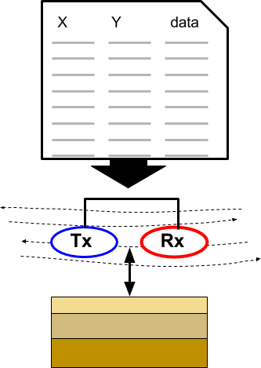
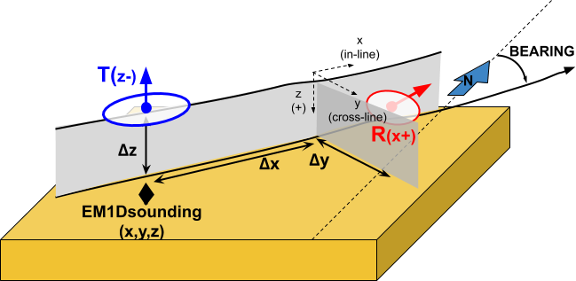
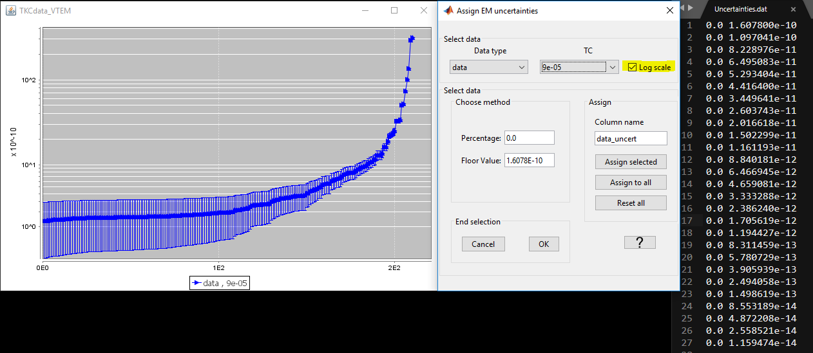
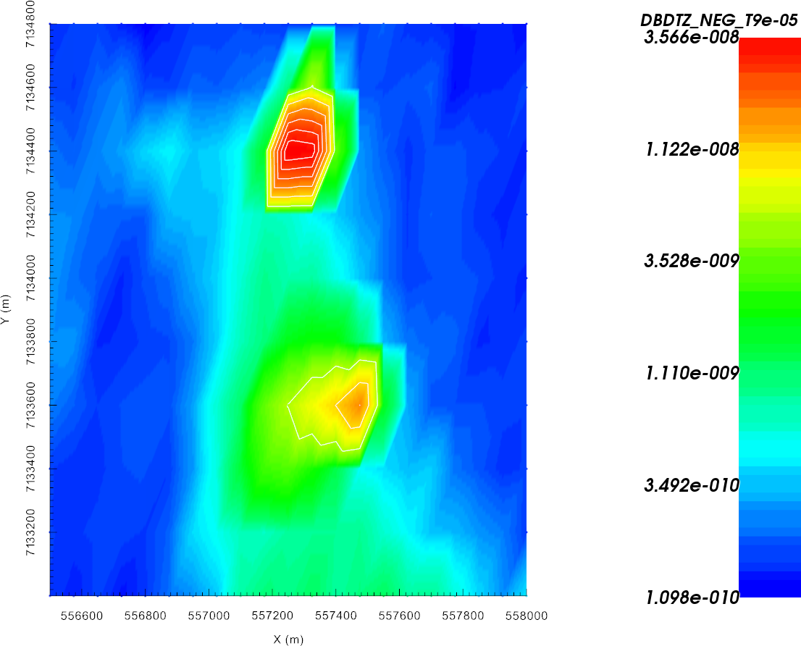
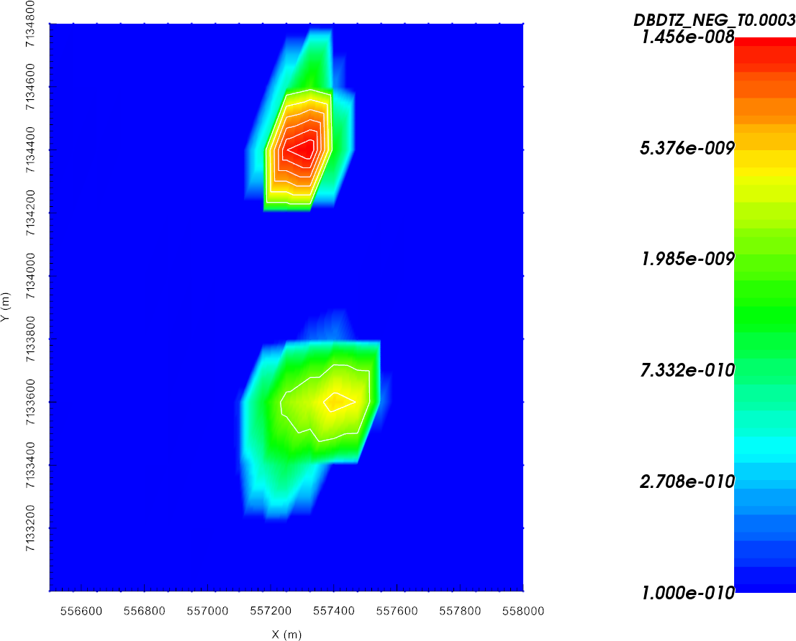
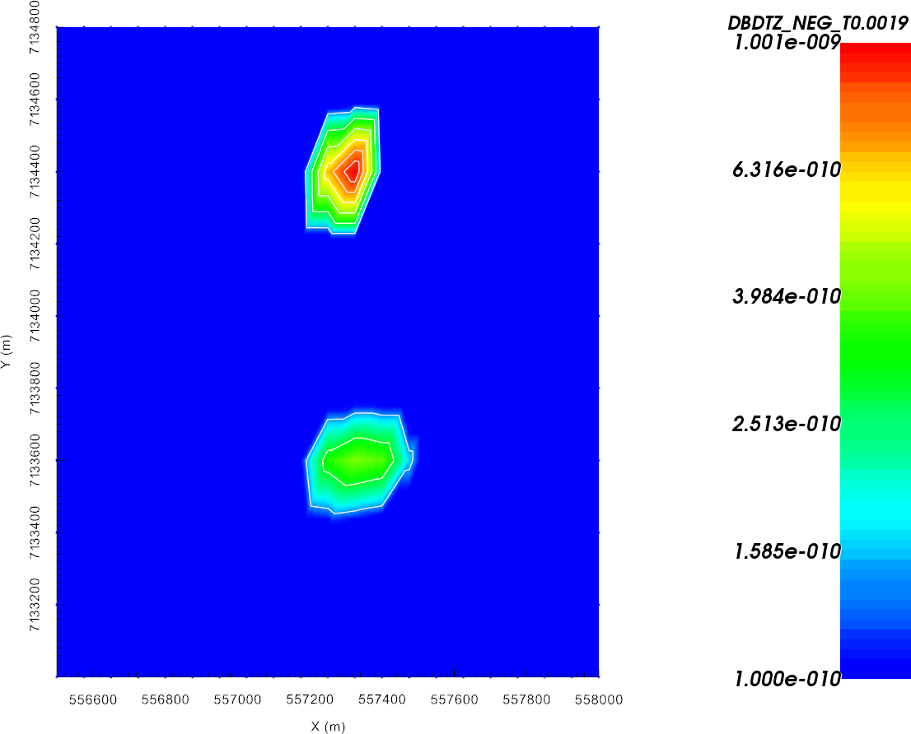
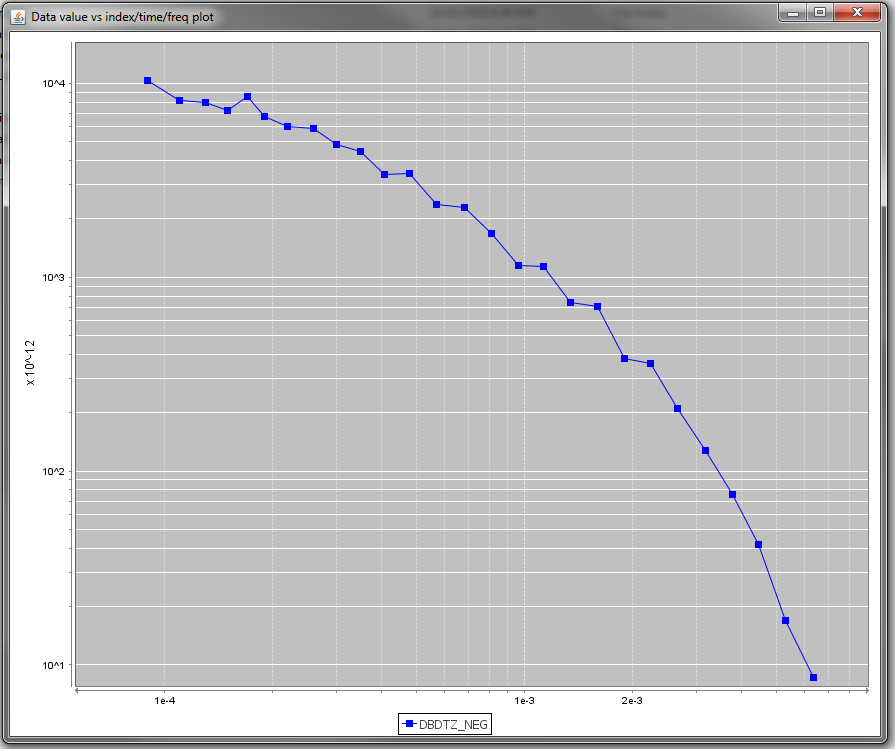
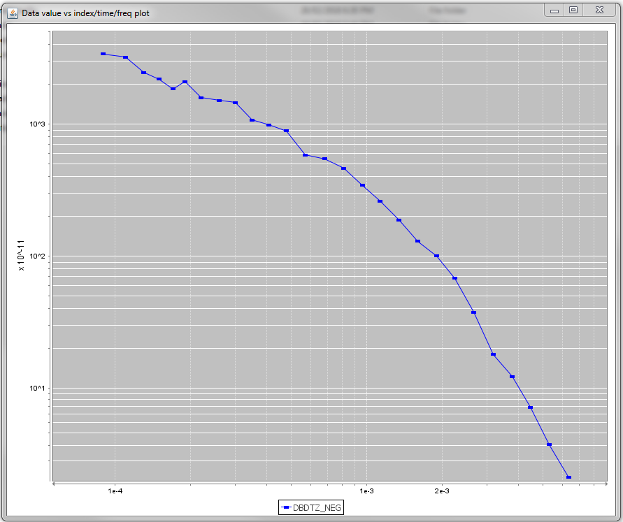
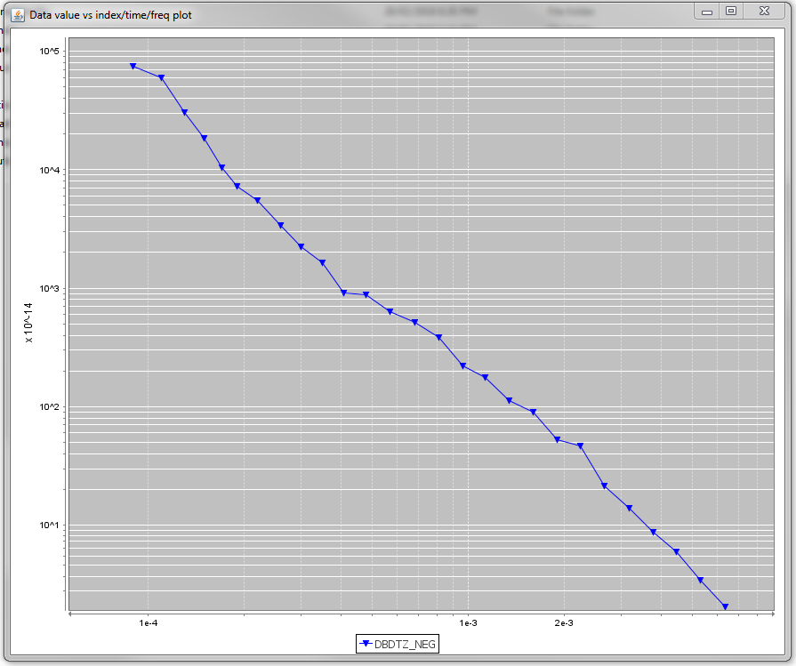

.. _AtoZem1dtm_uncertainties:

.. include:: <isonum.txt>

Specifying Parameters for TEM Sounding Inversion
================================================

Here, we detail the process of defining the survey parameters used in EM1DTM
inversions. For `GIF formatted 1D TEM data
<http://em1dtm.readthedocs.io/en/latest/content/files/supporting.html>`__, the
survey parameters are automatically read into GIFtools. For :ref:`Geosoft
XYZ<XYZfile>` and :ref:`CSV<CSVfile>` files however, the survey information
must be specified by the user. In this exercise, we:

    - Define the data columns being imported from a column data file
    - Set transmitter, receiver and elevation information
    - Assign uncertainties to the data

.. _AtoZem1dtm_setup:

Setup for the Exercise
----------------------

    - `Download the demo <https://github.com/ubcgif/GIFtoolsCookbook/raw/master/assets/AtoZ_TEM1D_4Download.zip>`_
    - Open GIFtools
    - :ref:`Set the working directory <projSetWorkDir>`

.. attention:: - Requires at least ``GIFtools version 2.26`` (login required)

.. _AtoZem1dtm_import:

Import files
------------

We will begin by importing all the necessary information:

    - :ref:`Import raw TEM data <importTemData>` from the file ``TKCdata_VTEM.xyz``. Import data as *Time-Domain EM* |rarr| *XYZ* |rarr| *TEM sounding* (:ref:`recipe <importVTEMdata>`)

        - Under *channel information*, import the time channels from the file ``VTEMtimes.dat``. Only 1 data groups so this does not need to be specified.
        - When specifying headers, choose load file and use ``VTEMheader.txt``. Don't forget to specify header name.

    - :ref:`Set IO header <objectSetioHeaders>` for the data column as the newly created dB/dt column
    - :ref:`Import topography data <importTopo>` from the file ``TKCtopo.dat`` (3D GIF format)
    - :ref:`Import 1D mesh<importMesh>` from the file ``layer.msh`` (layers file)

.. tip:: - Use **Edit** |rarr| **Rename** to change what objects in GIFtools are called
         - For any data object, :ref:`edit the data headers <objectDataHeaders>`.
         - Raw data were generated synthetically using the best-available conductivity model for TKC and the TDoctree code.

Set Survey Information
----------------------

Since the raw data were formatted in CSV format, the transmitter and receiver
information for the airborne survey must be set manually. Additionally, only
an altitude column was provided in the raw data. Therefore, we must use the
topography and altitude information to determine the elevation of each data
point.

    - :ref:`Create elevation from surface topography<objectElevFromSurface>`

        - From the ``TKCdata_VTEM`` data object use the ``ralt`` data column to shift the location vertically.
        - :ref:`Set i/o header<objectSetioHeaders>` for Z to the elevation column you just created

    - :ref:`Add transmitters<objectEMdtype_addTx>` to set the locations of the transmitters **relative to the current xyz data locations**. For the coincident loop system used for the survey we set the following parameters:

        - Loop transmitter with radius of 10 m
        - Along-line offset = 0 m
        - Cross-line offset = 0 m
        - Set vertical offset as altitude column (``ralt``) from TEMsounding object

    - :ref:`Add receivers<objectEMdtype_addRx>` to set the locations of the receivers **relative to the transmitter locations**. Use the following parameters:

        - Dipole moment = 1 Am :math:`\! ^2`
        - Along-line offset = 0 m
        - Cross-line offset = 0 m
        - Set vertical offset as altitude column (``ralt``) from data object

    - :ref:`Set data normalization to Volts<objectEMsetDataNorm_TEM>`. This determines the data units written to the observations file and interpreted by the EM1DTM code.
    - :ref:`Set time normalization to seconds<objectEMsetTimeNorm>`
    - :ref:`Import and set waveform<objectEMdtype_waveform_import>` using the file **VTEM.wave** (3D format)

.. important:: In keeping with a commonly used convention, we have chosen to plot -dBz/dt to show a positive decaying response; thus dBz/dt for a coincident loop system is negative and decaying in the universal coordinate system used by GIFtools. When loading TEM which are not already in GIF format, it is important that the sign of the vertical response is correct.

.. raw:: html
    :file: ./AtoZ_Data_Obs.html

.. raw:: html
    :file: ./AtoZ_Data_Decay.html

.. _AtoZem1dtm_uncert_assign:

Assign Uncertainties
--------------------

Before inverting the data, we must assign uncertainties. The role of
uncertainties in the inversion process is described in the :ref:`inversion
fundamentals section<Fundamentals_Uncertainties>`. Because the observed
response spans multiple orders of magnitudes of all time channels, and the
errors on the data may vary as such, distinct floor and percent uncertainties
will be computed for each time channel.

    - :ref:`Assign uncertainties from file <objectAssignUncertFile>` ``Uncertainties.data``
    - You can review the uncertainty with the :ref:`GUI <objectAssignUncertGUI>` to verify your work.

.. note::   The uncertainties for this exercise are based on the response
            over the gackground model so that the recovered model will not fit the dat too heavily in certain regions at the expense of others

