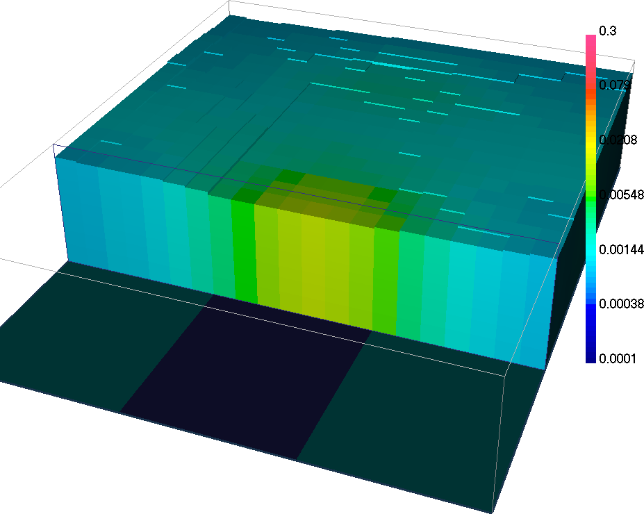

.. _AtoZem1dtm_lateral:

.. include:: <isonum.txt>

.. .. raw:: html
..     :file: ../../../underconstruction.html

Laterally Constrained 1D Inversion
==================================

Here, time-domain data are inverted using the laterally constrained 3D
inversion code developed by the open-source community in Python. Just like the
:ref:`AtoZ Frequency EM1D<AtoZem1dfm_lateral>` example, individual 1D
inversions are constrained laterally such that the set of recovered 1D models
are smooth horizontally and can ultimately be constrained and interpreted in
3D. The collaborative work invested in `SimPEG
<https://github.com/simpeg/simpegEM1D>`_ and `empymod <https://empymod.github.io>`_ has improved the
lateral 1D inversion in many ways:

- Avoids the slow read/write of the legacy `EM1DTM file format <https://em1dtm.readthedocs.io/en/latest/content/files/supporting.html#observation-file>`_
- Parallelized forward modeling
- Efficient digital filtering scheme (`empymod <https://empymod.github.io>`_)

.. figure:: ../../../images/AtoZ_tem1d/logo-empymod-plain.png
    :align: right
    :figwidth: 30%

.. figure:: ../../../images/AtoZ_tem1d/simpeg.png
    :align: left
    :figwidth: 40%

.. figure:: ../../../images/AtoZ_fem1d/AtoZ_EM1DFM_landing_LC.png
    :align: center
    :figwidth: 75%

As part of this exercise, the user will:

    - :ref:`Set<AtoZem1dtm_lateral_setup>` relevant inversion parameters
    - :ref:`Invert<AtoZem1dtm_lateral_inversion>` the field observations using a set of laterally constrained 1D conductivity models (susceptibility models can be included)

.. _AtoZem1dtm_lateral_setup:

Setup for the Exercise
----------------------

**If you have NOT completed the previous tutorial and would like to start here, complete the following steps:**

    - `Download the demo <https://github.com/ubcgif/GIFtoolsCookbook/raw/master/assets/AtoZ_TEM1D_4Download.zip>`_
    - Open GIFtools
    - :ref:`Set the working directory <projSetWorkDir>`
    - :ref:`Import EM1DTM formatted data <importTemData>` from the file **Assets/TKCdata_VTEM_EM1DTM.dat**
    - :ref:`Import 1D mesh<importMesh>` (layers file)
    - :ref:`Import the topography data <importTopo>` (3D GIF format)
    - :ref:`Create elevation from surface topography<objectElevFromSurface>`
        - Set elevation at 40 m above topography
        - :ref:`Set i/o header<objectSetioHeaders>` for Z to the elevation column you just created.
    - :ref:`Import and set waveform<objectEMdtype_waveform_import>`
    - Assign :ref:`uncertainties from file <objectAssignUncertFile>` ``Uncertainties.dat``

.. raw:: html
    :file: ./AtoZ_Data_Obs.html

.. raw:: html
    :file: ./AtoZ_Data_Decay.html

.. _AtoZem1dtm_lateral_inversion:

1D TEM Inversion
----------------

.. figure:: ../../../images/AtoZ_fem1d/LC_fem1D.png
    :align: right
    :scale: 75%

Here, the set of TEM data are inverted using the laterally constrained 1D
approach.

Setup the inversion
^^^^^^^^^^^^^^^^^^^
    - :ref:`Create an em1dtm inversion object <createTEMInv>` and set the output directory
    - Click on the newly created em1dtm inversion object to set the output directory
    - Set any necessary em1dtm inversion parameters under :ref:`edit options<invEditOptions>`:

        - **Global tab:**
            - *Mode panel:* set to laterally constrained 3D
            - Make sure the mesh, observed data and topography are properly set!
            - *Trade-off mode panel:* Use 'discrepancy' mode
            - Other parameters left as default values

        - **Conductivity tab:**
            - Leave the initial and reference conductivity to best-fitting halfspace

        - Click *Apply* (NOT *Apply and write*)

.. note:: You do NOT need to write all files, as the data and inversion parameters
          will be passed on to Python as ``HDF5`` file. This will save
          time by avoiding to read/write the legacy `EM1DTM file format <https://em1dtm.readthedocs.io/en/latest/content/files/supporting.html#observation-file>`_

Run Inversion and Load Results
^^^^^^^^^^^^^^^^^^^^^^^^^^^^^^

    .. figure:: ./../../../images/AtoZ_tem1d/SimpegEM1DRun.png
        :align: right
        :scale: 45%

    - :ref:`Run inversion <invRun>` (SimPEG)
        - Inversion progress will be displayed in a command prompt
        - Results will be loaded automatically at the end of the inversion

    - :ref:`View the model <objectModelView>`

    - :reF:`View the misfit map <viewData>`

The lateral constraints strategy comes with many advantages:

    - Neighboring 1D conductivity models are more consistent
    - Conductivity structures are interpolated in 3D, possibly highlighting trends in the model and easing the interpretation.
    - Possible to employ a :math:`\beta`-cooling strategy similar to the 3D inversion code.

Congratulation, you have recovered two pipe-like bodies by inverting Time-Domain EM data in 1D with the open-source inversion routines `SimPEG
<https://github.com/simpeg/simpegEM1D>`_ + `empymod <https://empymod.github.io>`_! You are invited to try the Python algorithm on the :ref:`AtoZ FEM1D example <AtoZem1dfm_lateral>`

.. figure:: ./../../../images/AtoZ_tem1d/NormRes_Inv2_00009.png
    :align: right
    :figwidth: 0%

.. figure:: ./../../../images/AtoZ_tem1d/NormRes_Inv2_00190.png
    :align: right
    :figwidth: 0%

