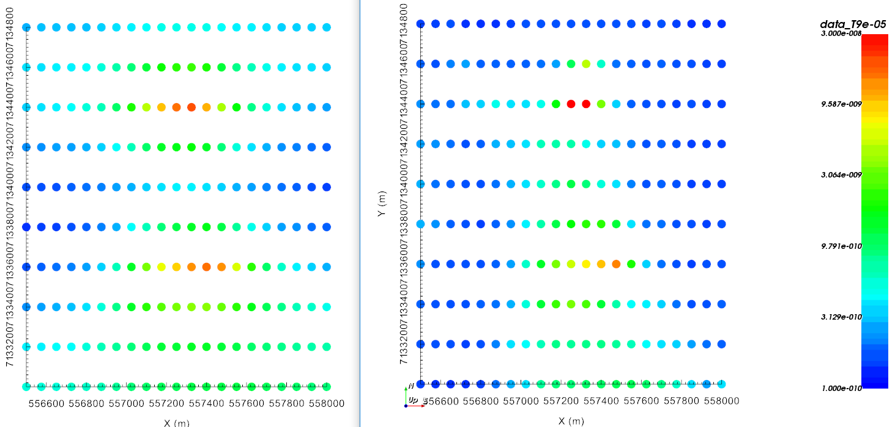

.. _AtoZem1dtm_meshValidation:

.. include:: <isonum.txt>

.. raw:: html
    :file: ../../../underconstruction.html

Mesh Validation for TDoctree v2
===============================

Here, the model obtained in the previous exercise
:ref:`AtoZ Time-Domain 1D<AtoZem1dtm_lateral>` is used to assess the validity of an octree mesh
used by the `TDoctree v2 <https://tdoctree.readthedocs.io/en/tdoctree_v2/>`_ inversion code.

.. As part of this exercise, the user will:

..     - :ref:`Set<AtoZem1dtm_lateral_setup>` create an octree mesh
..     - :ref:`Invert<AtoZem1dtm_lateral_inversion>`
..     - :ref:`Interpret<AtoZem1dtm_lateral_discussion>` the inversion results generated by the algorithm

.. .. _AtoZem1dtm_lateral_setup:

.. Setup for the Exercise
.. ----------------------

.. **If you have NOT completed the previous tutorial and would like to start here, complete the following steps:**

..     - `Download the demo <https://github.com/ubcgif/GIFtoolsCookbook/raw/master/assets/AtoZ_TEM1D_4Download.zip>`_
..     - Open GIFtools
..     - :ref:`Set the working directory <projSetWorkDir>`
..     - :ref:`Import EM1DTM formatted data <importTemData>` from the file **Assets/TKCdata_VTEM_EM1DTM.dat**
..     - :ref:`Import 1D mesh<importMesh>` (layers file)
..     - :ref:`Import the topography data <importTopo>` (3D GIF format)
..     - :ref:`Create elevation from surface topography<objectElevFromSurface>`
..         - Set elevation at 40 m above topography
..         - :ref:`Set i/o header<objectSetioHeaders>` for Z to the elevation column you just created.
..     - :ref:`Import and set waveform<objectEMwaveform_import>`
..     - Assign :ref:`uncertainties from file <objectAssignUncertFile>` ``Uncertainties.dat``
