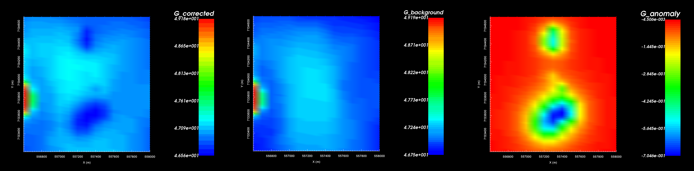
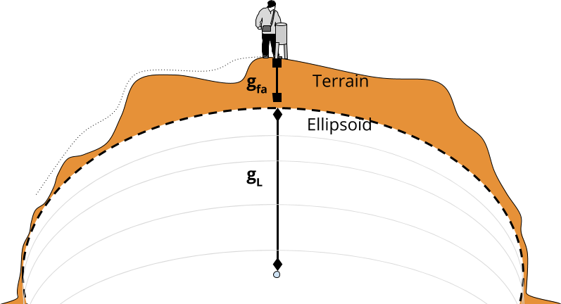
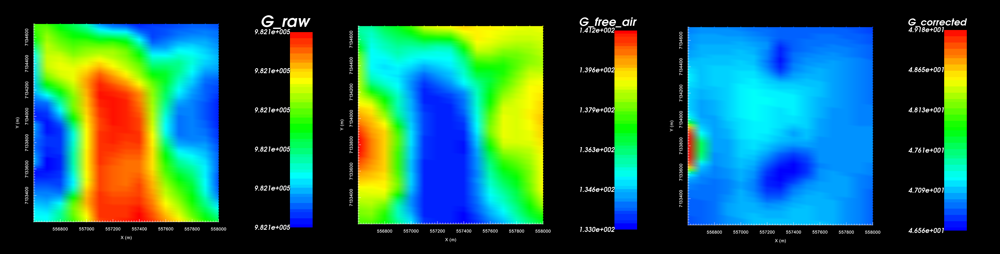
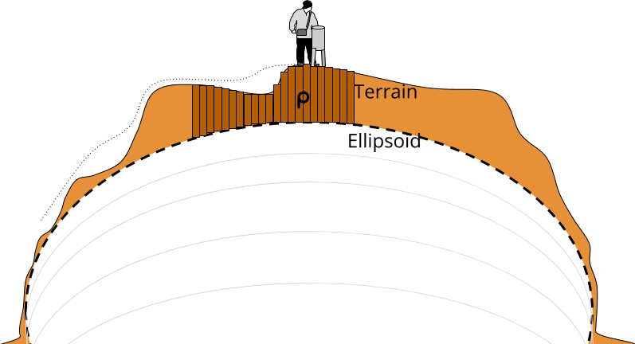
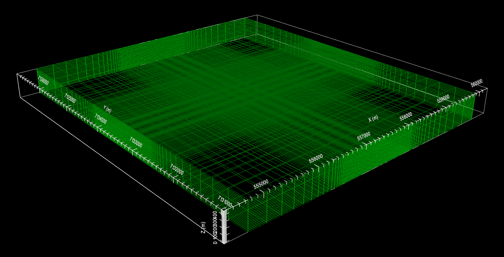
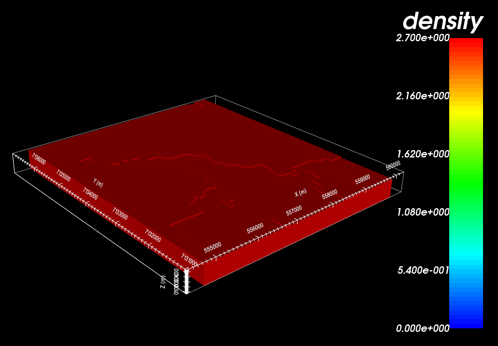

.. _AtoZGrav_Corrections:

.. include:: <isonum.txt>

Processing Gravity Data
=======================

Here, we show how GIFtools can be used to carry out processing steps relevant to gravity data such as:

 - :ref:`Free-air correction <AtoZ_Grav_FreeAir>`
 - :ref:`Simple terrain correction <AtoZ_Grav_TerrainCorr>`

    Gravity data after latitude and free-air correction (left). Background gravity (middle). Final gravity anomaly data (right).

.. Raw gravity data must be processed before it can be interpreted. When receiving gravity data from a client, the data may have already undergone 1 or more processing steps. The goal of this exercise is to show GIFtools can be used to carry out any remaining processing steps. For latitude and free-air corrections, we will demonstrate a simple approach; this is meant to show some basic functionality within GIFtools and is not meant to replace more rigorous methods. We will also show how GIFtools can be used to remove the background gravity and simultaneously apply a terrain correction. The end result is gravity anomaly data, which can be interpreted and inverted.

.. _AtoZGrav_Corrections_Setup:

Setup for the Processing Exercise
---------------------------------

    - `Download the demo <https://github.com/ubcgif/GIFtoolsCookbook/raw/master/assets/AtoZ_Gravity_4Download.zip>`_
    - Open GIFtools
    - :ref:`Set the working directory <projSetWorkDir>`

.. tip:: - Steps (without links) are also included with the download
         - Requires at least ``GIFtools version 2.1.3 (Oct 2017)`` (login required)

.. _AtoZGrav_Corrections_Import:

Import files
------------

In addition to raw geophysical data, you may have access to topographical information. If this information is available to you, it can be imported into GIFtools.

    - :ref:`Import the topography data <importTopo>` (3D GIF format)
    - :ref:`Import raw gravity data <importGravData>` (GIF format with data in mGal)

.. tip:: - Use **Edit** |rarr| **Rename** to change what objects in GIFtools are called
         - For any data object, :ref:`edit the data headers <objectDataHeaders>`. We set the raw gravity data to "G_raw"
         - Raw data were generated synthetically using the best-available density model for TKC and "un-processing" the data.

.. _AtoZ_Grav_FreeAir:

Latitude and Free-Air Correction
--------------------------------

Generally, this processing step has been done by the client. However to
demonstrate some basic functionality within GIFtools, we will perform simple
latitude (:math:`g_l`) and free-air (:math:`g_{fa}`) corrections on the raw gravity data (:math:`g_{raw}`) such that.

.. math::
    g_{corr} = g_{raw} - g_l + g_{fa} \;.

The latitude correction accounts for all of the mass contained within the
reference ellipsoid approximation of the Earth. Generally a distinct latitude
correction is applied for every survey location. However we will only be
applying a constant value correction to the data; wherein we assume all survey
locations are at a latitude of 64 :math:`\! ^o` N.

The `latitude correction (Int'l grav. formula 1967) <https://en.wikipedia.org/wiki/Normal_gravity_formula>`_ in mGal is given by

.. math::
    \begin{align}
    \Delta g_l &= 978 \, 031.8 \times \big [ 1 + 0.0053024 \, sin^2 \phi - 0.0000059 \, sin^2 (2\phi) \big ] \\
    &= 982217.559014 \textrm{ mGal at TKC}
    \end{align}

The free-air correction accounts for the fact that the latitude correction is
weaker the further you are from the Earth. GIFtools will be used to apply a
specific free-air correction to each observation. The following expressions
can be use to compute the latitude and free-air corrections. The `free air
correction: <https://en.wikipedia.org/wiki/Free-air_gravity_anomaly>`__ in
mGal is given by:

.. math::
    \Delta g_{fa} = 0.3086 \times Elevation(m)

To apply these corrections to the raw data, carry out the following steps using the :ref:`constant calculator <objectCalculator>`:

    - With the latitude correction provided (982217.559014 mGal) remove this value from the raw data and create a new column. **Carry all decimal places!**
    - Compute the free-air correction that must be added to each survey location.
    - Apply the free-air correction.

.. tip:: To keep track of data columns, remember to :ref:`edit data headers <objectDataHeaders>`.

    Raw gravity data (left). Free-air correction based on elevation (middle). Gravity data after latitude and free-air correction (right).

.. _AtoZ_Grav_TerrainCorr:

Topography and Regional Geology Correction
------------------------------------------

At this point, we have accounted for all gravity contributions from matter
that lies below a surface elevation of 0 m; e.g. the latitude and free-air
corrections. We must now remove the background gravity contribution from all
regional mass that lies above 0 m elevation. If the topography is flat, you
may choose to use a `slab correction
<https://en.wikipedia.org/wiki/Bouguer_anomaly>`__. Here, we show how GIFtools
can remove the background contribution while taking into account the regional
topography.

Create a Mesh
^^^^^^^^^^^^^

Here, we create a mesh which defines the regional geology. The mesh should extend vertically downward to an elevation of 0 m. We do not want to pad below this depth because we have already accounted for the mass lying below 0 m. The mesh should extend as far as possible horizontally so that gravity contributions outside the survey area are accounted for.

    - :ref:`Create a mesh using gravity data <objectDataCreateMesh>` with the following parameters:
        - Don't forget to apply topography when creating the mesh!
        - Core cell widths = 25 m
        - Extent above = 0 m
        - Depth of investigation = 425 m
        - Padding = 2000 m on each side, 0 m in depth
        - Padding factor = 1.2

.. tip:: Here, the mesh does not extend *exactly* to an elevation of 0 m. For the purposes of the exercise, this is fine. In practice however, it would be wise to extend the mesh to exactly 0 m because you have accounted for all mass below that elevation already.

    Mesh for use in background gravity removal.

Create Active Cells from Topography
^^^^^^^^^^^^^^^^^^^^^^^^^^^^^^^^^^^

Here, we account for the local topography. Since air cells contribute negligibly towards the observe data, we do not need to include them when modeling the background gravity.

    - Using your gravity data, :ref:`create an active cells model from topography <createActiveCellsModel>`. Choose 'from tops of cells'

Create a Constant Density Model
^^^^^^^^^^^^^^^^^^^^^^^^^^^^^^^

At TKC, we know that the kimberlite pipes are within a granitoid host. We will assume a background density of 2.7 g/cc and create a background physical property model.

    - Using the active cells model, :ref:`create a constant geological model <objectFunctionalityActiveGeoModel>`
    - Assign a value of 2.7 g/cc for the background cells through :ref:`edit geology definitions <objectFunctionalityGeoModelEdit>`. You may also want to :ref:`set I/0 headers <objectFunctionalityGeoModelIO>` and/or :ref:`rename headers <objectFunctionalityGeoModelRename>`
    - :ref:`Create a physical property model (GIF model) <objectFunctionalityGeoModelPhysProp>` from the geological model

    Constant density model for removing background gravity.

Predict Background Gravity and Load to GIFtools
^^^^^^^^^^^^^^^^^^^^^^^^^^^^^^^^^^^^^^^^^^^^^^^

We now have all the items necessary to forward model the background gravity contribution.

    - Create Grav3D forward model through :ref:`create forward modeling <createForward>`
    - Select the forward modeling object and :ref:`edit options <fwdEditOptions_gravity>` to link
        - GIF Model
        - Data locations
        - Topography
    - :ref:`Write files <fwdWriteAll>`
    - :ref:`Run GZFOR3D <fwdRun>`
    - :ref:`Load predicted data <fwdLoadResults>`

Remove the Background Gravity
^^^^^^^^^^^^^^^^^^^^^^^^^^^^^

To remove the background gravity from your data:

    - Use :ref:`add data from another GRAVdata object <objectCombineData>` to add the background gravity to the gravity data object where you are doing your processing
    - Use the :ref:`Calculator <objectCalculator>` to subtract the background data; which should result in just the gravity anomaly remaining

    Gravity data after latitude and free-air correction (left). Background gravity (middle). Final gravity anomaly data (right).

