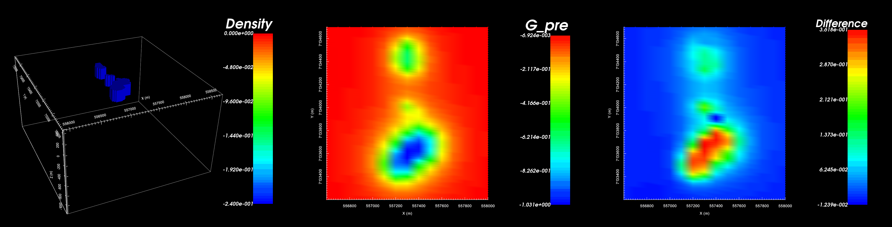
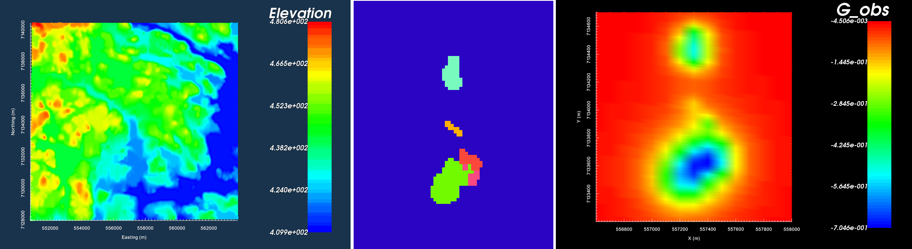
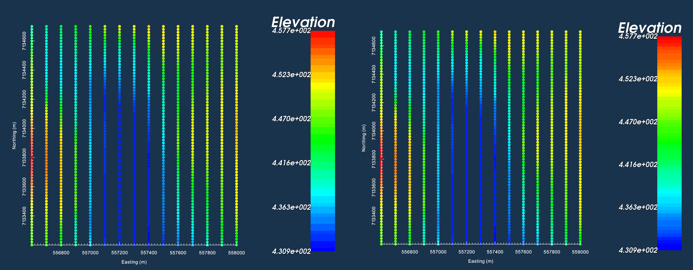
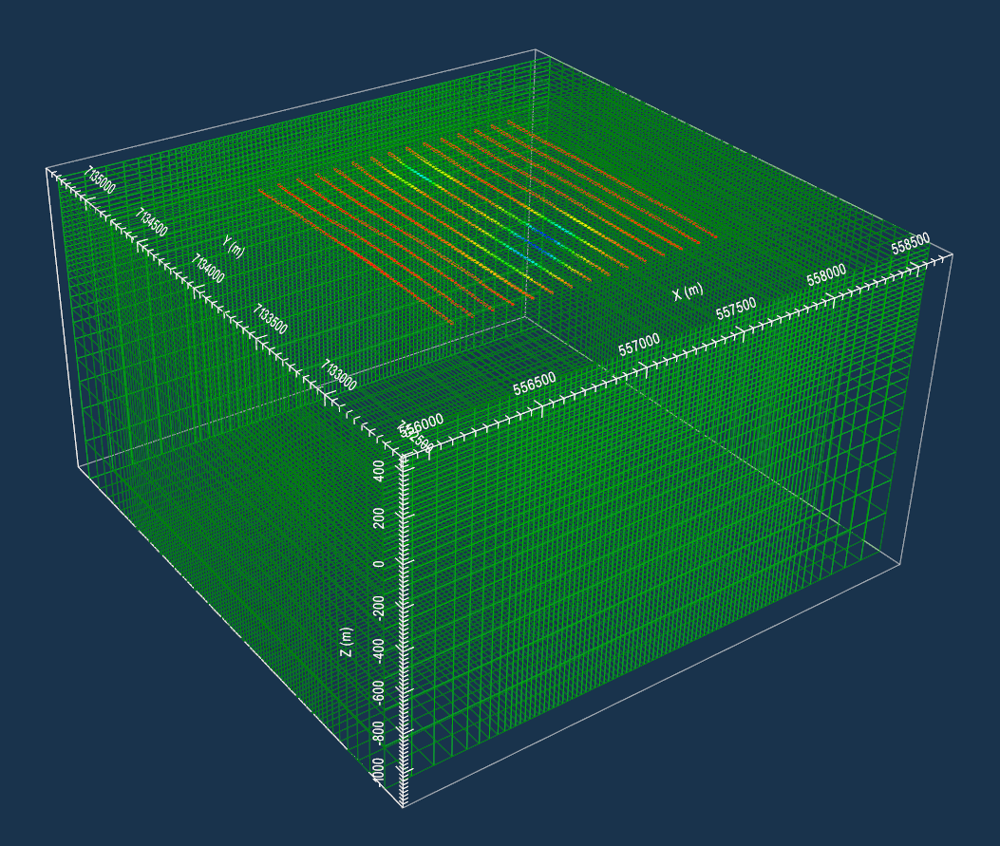
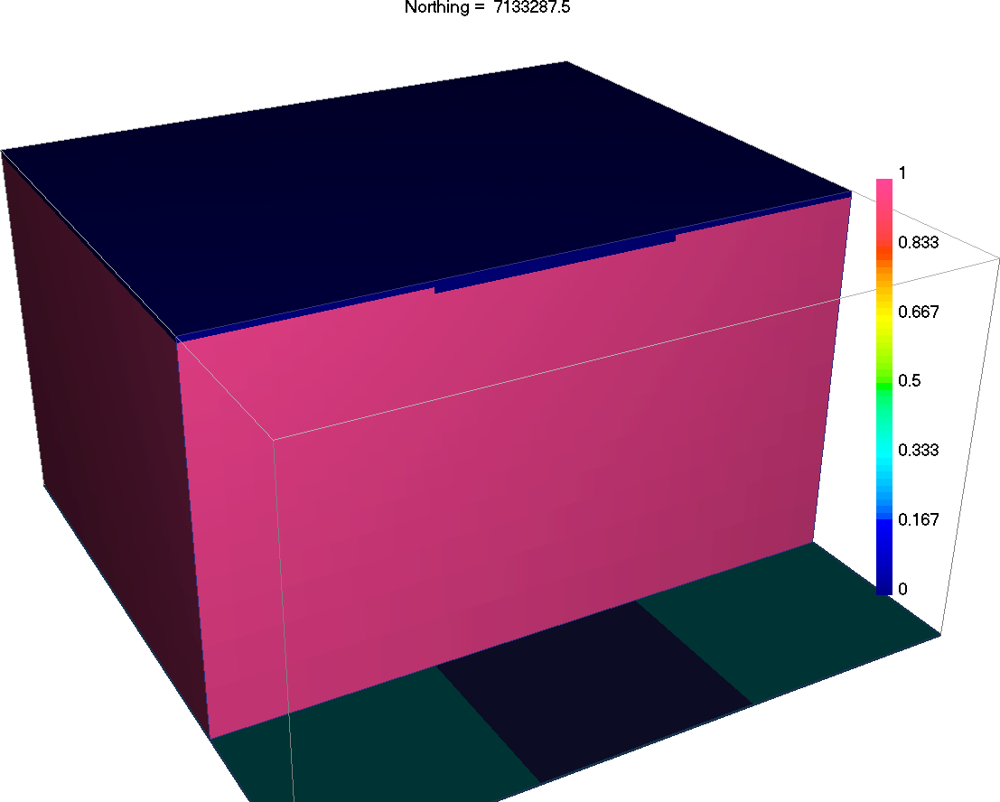
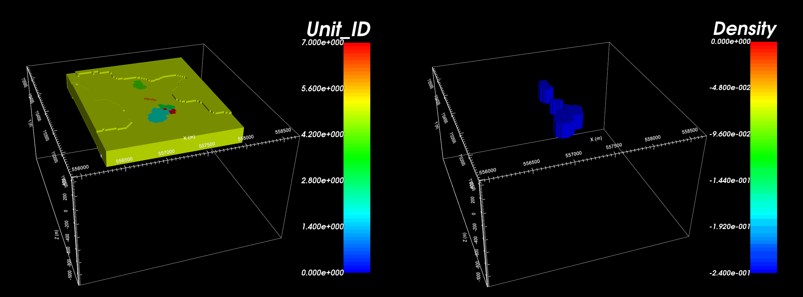
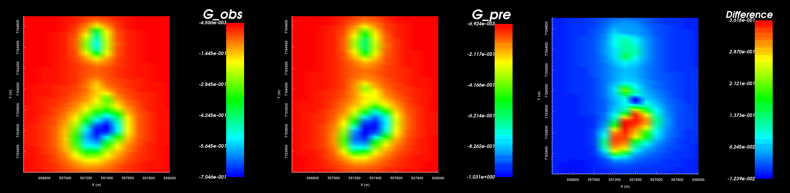

.. _AtoZGrav_Forward:

.. include:: <isonum.txt>

Forward Modeling and Hypothesis Testing
=======================================

Here, we simulate synthetic data based on a surface geology map and
compare it to the observed gravity data. A reasonable match ensures that our
current geological understanding is able to explain the cause of the anomaly.

.. Here, we show how GIFtools can be used to forward model gravity data for an
.. arbitrary density model. We consider the case where we have a set of field
.. observations and some a priori knowledge of the local geology; for this
.. example, we know the anomaly is produced by the :ref:`TKC kimberlites
.. <AtoZ_TKCbackground>`. The goal of this exercise is to forward model the
.. survey data for a plausible density model, and see if the predicted gravity
.. anomaly sufficiently matches the observed gravity anomaly.

.. tip:: The same workflow can be used to predict magnetic data for an arbitrary susceptibility or magnetic vector model.

    A synthetic density model (left). Predicted data from the model (middle). Difference between predicted and observed (right).

Setup for the Forward Modeling Exercise
---------------------------------------

**If you have completed the tutorial** :ref:`"Processing Gravity Data" <AtoZGrav_Corrections>`:

    - Open your final GIFtools project
    - :ref:`Set the working directory <projSetWorkDir>` (if you want to change it)

**If you have NOT completed the previous tutorial, you must complete the following steps:**

    - `Download the demo <https://github.com/ubcgif/GIFtoolsCookbook/raw/master/assets/AtoZ_Gravity_4Download.zip>`_
    - Open GIFtools
    - :ref:`Set the working directory <projSetWorkDir>`

.. tip:: - Steps (without links) are also included with the download
         - Requires at least ``GIFtools version 2.1.3 (Oct 2017)`` (login required)

.. _AtoZGrav_Forward_Import:

Import files
------------

In addition to geophysical data, you may have access to topographical
information and/or geological surface maps/cross-sections. If this information
is available to you, it can be imported to GIFtools. Here, we have surface
topography and files which define several geological units through surface
mapping.

    - :ref:`Import the topography data <importTopo>` (3D GIF format). *This was imported in the previous exercise*
    - :ref:`Import field observed gravity anomaly data <importGravData>` (GIF format with data in mGal). *This was the final result of the previous exercise*
    - :ref:`Import the geology image and link to topography <importImage>` (Image is plane view)
    - :ref:`Create a legend for the geological units in the image <objectGeneralImageCreateLegend>`

.. tip:: - Use **Edit** |rarr| **Rename** to change what objects in GIFtools are called
         - For any data object, :ref:`edit the data headers <objectDataHeaders>`. We set the gravity anomaly data to "Gravity (mGal)"
         - Observed gravity anomaly data were generated synthetically using the best-available density model for TKC.

    Topography imaged in VTK (left). Plan-view image for surface geological mapping (middle). Gravity anomaly data in mGal (right).

Create a Survey
---------------

Ultimately, we would like to predict gravity anomaly data for a model of our choosing and compare it against a set of field observations. To accomplish this, we must first create a survey; which has the same properties as the actual survey that was performed. To create the survey, there are two approaches:

Approach 1: Survey at exact locations
^^^^^^^^^^^^^^^^^^^^^^^^^^^^^^^^^^^^^

Using this approach, we will be able to predict gravity data at the EXACT same locations as the field observations. Later on, this will allow us to compute the difference between the predicted and observed data. Steps are as follows:

    - Make a :ref:`copy <editcopy>` of the gravity data
    - Through :ref:`Set I/O headers <objectSetioHeaders>`, remove the I/O header for gravity anomaly data column by setting it to blank
    - :ref:`Delete the data columns <objectDataDeleteDataColumns>` for any preexisting gravity data (data cannot be deleted if it has an assigned I/O header)

Approach 2: Custom locations
^^^^^^^^^^^^^^^^^^^^^^^^^^^^

    - :ref:`Create simple survey <createSurveySimple>`
        - Set the survey type as 'Gravity'
        - Link the survey to the known topography at TKC
        - Set the height above topography to 10 m
        - Set the following parameters:
            - Easting origin = 556,600
            - Northing origin = 7,133,200
            - Bearing = 0
            - Line length = 1,500
            - Number of survey lines = 15
            - Data spacing = 20
            - Line spacing = 100

.. tip:: - Since the survey parameters are exactly known, approach 1 and approach 2 produce the same thing.
         - Both the observed gravity and survey are 'gravity data' objects. Thus they have the same properties and undergo identical actions.
         - :ref:`Edit data headers <objectDataHeaders>` was used to make the colourbar titles the same in the plot below.

    Data location from observed data file (left). Data locations for synthetic survey (right).

.. _AtoZGrav_Forward_Mesh:

Create Mesh from Gravity Survey
-------------------------------

To predict field data, we must define the domain by creating a mesh. GIFtools can create meshes based on the data locations and the local topography.

    - :ref:`Create mesh from gravity data <objectDataCreateMesh>`
        - Don't forget to apply topography when creating the mesh!
        - Core cell widths = 25 m
        - Extent above = 0 m
        - Depth of investigation = 400 m
        - Padding = 500 m on each side, 1000 m in depth
        - Padding factor = 1.2

    Mesh created from survey and viewed in VTK. Gravity anomaly data from the survey have been imported at their locations.

.. tip:: There are other ways to make meshes. If available, you could :ref:`import <importMesh>` a pre-existing mesh or :ref:`create and OcTree mesh <createOctreeMesh>`.

.. _AtoZGrav_Forward_Model:

Create Models
-------------

In this step, we design a density model for the geological structure we think will explain the data. We will show that test models can be made quickly using a priori geological information, as opposed to creating a model comprised of uniform blocks. At TKC, we know:

    1. The surface topography
    2. The gravity anomaly is likely caused by the presence of kimberlite pipes
    3. The surface distribution of geological units obtained from geological mapping
    4. The approximate density of kimberlites relative to the host

However, we don't know:

    1. How far down the kimberlites extend
    2. The thickness of any of the kimberlite pipes as a function of depth
    3. The thickness of the overlying till

Create Active Cells Model from Topography
^^^^^^^^^^^^^^^^^^^^^^^^^^^^^^^^^^^^^^^^^

Regions above the topography have an effective density of 0 and do not
contribute towards the gravitational pull experienced at observation
locations. For potential field problems, we MUST ensure that data locations
lie outside the region of active cells (e.g. within the air cells). Here, we
will use the topography data to create an active cells model.

    - :ref:`Creating active cell model from topography <createActiveCellsModel>`. Choose 'from tops of cells'

.. _AtoZGrav_Forward_Model_Geo:

Create Density Model through Model Builder
^^^^^^^^^^^^^^^^^^^^^^^^^^^^^^^^^^^^^^^^^^

Now that we have topography, a mesh, and an active cells model, we can create a geological model. To approximate pipe-like structures, we will use the horizontal distributions of each geological unit (obtained from the plan-view image), and project these units down to a desired depth. We will then assign density contrast values to all geological units. Once the geological model has been created, we will output a physical property model which can be used in the forward model. To accomplish this, apply the following steps:

    - :ref:`Start modelBuilder <createModelBuilder>`
    - :ref:`Create geology model from plan-view image <createGeoModelImage>` (Use a thickness of 200 m)
    - :ref:`Set physical propert values <propModelFromGeoModel>` for units in the newly created GEO model (The approximate density contrast values for the kimberlites and till relative to the host is found :ref:`here <AtoZ_TKCbackground>`). **Units should be g/cc.** You may also want to :ref:`set I/0 headers <objectFunctionalityGeoModelIO>` and/or :ref:`rename headers <objectFunctionalityGeoModelRename>`
    - :ref:`Create GIF model <objectFunctionalityGeoModelPhysProp>` from the physical properties in the GEO model

    Geological model created with each colour representing a different units (left). Density contrast in g/cc relative to host (right).

Forward Model the Data
----------------------

We now have all the objects we need to create the files for the forward model and run the fortran code. This is accomplished by carrying out the following steps:

    - Create Grav3D forward model through :ref:`create forward modeling <createForward>`
    - Select the forward modeling object and :ref:`edit options <fwdEditOptions_Grav3D>` to link
        - GIF Model
        - Data locations
        - Topography
    - :ref:`Write files <fwdWriteAll>`
    - :ref:`Run GZFOR3D <fwdRun>`

Load Predicted Data and Compare Against Observed Data
-----------------------------------------------------

Here, we compare the observed data to the predicted data from our forward model. We will also show how the difference between both datasets can be computed and plotted.

    - :ref:`Load predicted data <fwdLoadResults>`
    - Using :ref:`add data from another object <objectCombineData>`, add the observed data to the predicted gravity data
    - Using :ref:`Calculator <objectCalculator>`, subtract the predicted data from the observed data
    - :ref:`View the data <viewData>` (observed, predicted and difference) from the final data object you created

    Observed data (left). Predicted data (middle). Observed - predicted (right).

.. tip:: :ref:`Edit data headers <objectDataHeaders>` to avoid confusion between predicted and observed data.

Results
-------

    - Our synthetic model produces gravity anomalies of similar size and character.
    - The northern portion of the largest anomaly does not match between predicted and observed gravity data
    - The predicted data over-estimates the maximum anomaly amplitude
    - Our synthetic model explains the data, but the margins of various kimberlite facies and their density distributions remain unresolved.

