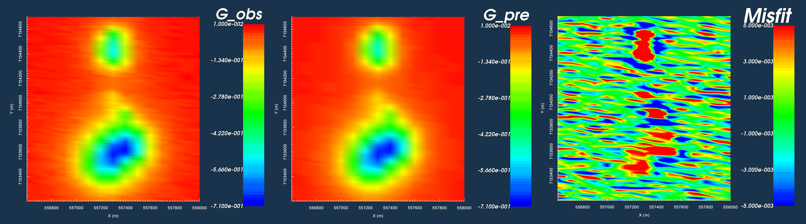
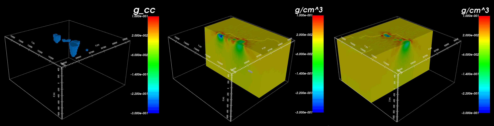
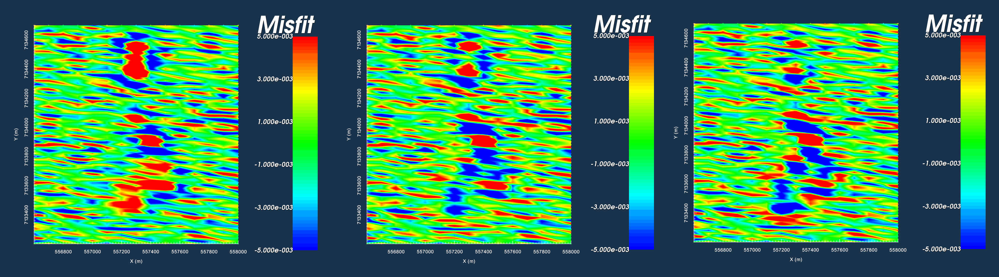
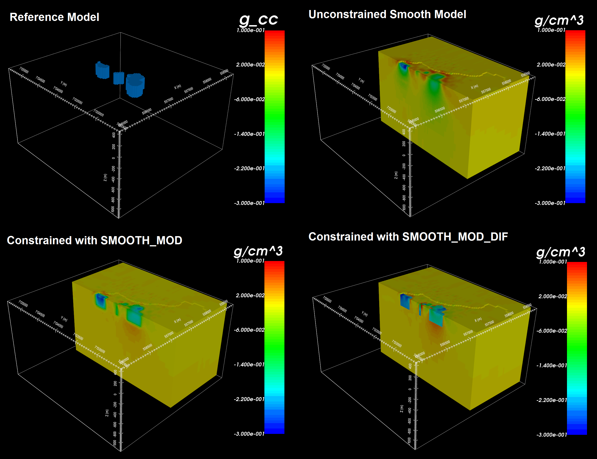

.. _AtoZGrav_Inversion:

.. include:: <isonum.txt>

Inverting Corrected Gravity Data
================================

Prelude
-------

Here, we show how GIFtools can be used to invert gravity anomaly data. We consider the case where we have a set of field observations and some a priori knowledge of the local geology; for this example, we know the anomaly is produced by the :ref:`TKC kimberlites <AtoZ_TKCbackground>`. We assume that all necessary corrections have been applied to the raw gravity data; see the :ref:`processing gravity data exercise <AtoZGrav_Corrections>`. The goal of this exercise is to invert the gravity anomaly data to recover the optimum density model. Several inversion will be run to show the impact of reference models and various penalty terms on the final inversion result.

.. tip:: The same workflow can be used to invert magnetic data for an arbitrary susceptibility or magnetic vector model.

Setup for the Inversion Exercise
--------------------------------

**If you have completed the tutorial** :ref:`"Forward Model Gravity Data and Compare Against Field Observations" <AtoZGrav_Forward>`:

    - Open your final GIFtools project
    - :ref:`Set the working directory <projSetWorkDir>` (if you want to change it)
    - :ref:`Import the true density model <importModel>`

**If you have NOT completed the previous tutorial, you must complete the following steps:**

    - `Download the demo <https://github.com/ubcgif/GIFtoolsCookbook/raw/master/assets/AtoZ_Gravity_4Download.zip>`_
    - Open GIFtools
    - :ref:`Set the working directory <projSetWorkDir>`
    - :ref:`Import the true density model <importModel>`
    - Carry out these steps from the forward modeling exercise:
        - :ref:`Import files into GIFtools <AtoZGrav_Forward_Import>`
        - :ref:`Create a mesh from the survey data <AtoZGrav_Forward_Mesh>`
        - :ref:`Create an active cells model and a synthetic geological model from topography and surface mapping <AtoZGrav_Forward_Model>`

.. tip:: - Steps (without links) are also included with the download
         - Requires at least ``GIFtools version 2.1.3 (Oct 2017)`` (login required)

Assign Uncertainties and Set I/O Headers
----------------------------------------

Assigning appropriate uncertainties to the data is necessary for running stable and successful inversions with GIFtools. Because the observed gravity data were generated synthetically, we will add random noise before assigning the uncertainties. Because the statistics of the noise are known, they can be used to assign the correct uncertainties. Complete the following steps:

    - :ref:`Add Gaussian random noise <objectAddNoise>` (Percent = 0, Floor = 0.005)
    - :ref:`Assign uncertainties to G_noisy <objectAssignUncert>` (Percent = 0, Floor = 0.005)
    - :ref:`Set I/O headers <objectSetioHeaders>` to ensure the elevation, observed data and uncertainty columns are set correctly

 .. figure:: images/DataUncertainties.png
    :align: center
    :width: 700

    Synthetic gravity anomaly data (left). Gravity anomaly data with noise (middle). Uncertainties on noisy data (right).

Unconstrained Smooth Inversion
------------------------------

Here, we perform the most basic type of gravity anomaly inversion. No a priori information is used in the inversion. Default inversion parameters use least-squares penalties on the model and its gradients. As a result, we expect the inversion to recover a smooth model. To run the inversion and view results:

    - :ref:`Create a gravity inversion object <createGravInv>`
    - :ref:`Edit the inversion parameters <invEditOptions_Grav3D>`
        - **Sensitivity Tab:** set mesh, observed data and topography
        - **Inversion Tab:**
            - Set the active cells

            .. note:: As a general *best practice*, in the absence of a priori
                      information, :math:`\alpha` values should be set such that all
                      :ref:`components of the regularization <Fundamentals_alphas>` have equal weight. Based
                      on the core mesh discretization used in this problem:
                      :math:`\alpha_s = \left[\frac{1}{dx}\right]^2 = 0.0016`,
                      :math:`\alpha_x=\alpha_y=\alpha_z = 1`

        - **Blocky model norms:** *leave all as default*
        - Apply and write files when finished
    - :ref:`Run the inversion <invRun>`
    - :ref:`Import inversion results <invLoadResults>`
    - :reF:`View the results <viewData>`.

    .. note:: **The user is encouraged to:**

              - Compare predicted and observed data and examine the misfit
              - Lay the observed data over the final model to see if observed anomalies match the distribution of recovered densities
              - Lay the geological image over the final model to see if the inversion results agree with geological surface mapping

    Observed data (left). Data predicted with final model (middle). Misfit with colour scale set to +/- 0.005 (right).

    True model with only non-zero density contrasts (left). NW slice of recovered model (middle). EW slice through southern anomaly (right).

Results
^^^^^^^

    - Generally, the data predicted using the recovered model matches the shape and character of the observed anomalies
    - However, large misfits are clustered around the locations of recovered structures
    - The general distribution of density contrasts is recovered through inversion
    - By using the default set of inversion parameters however, we recovered a very smooth density contrast model
    - Because the inversion was set to recover a smooth model, the inversion placed positive density contrast values (red) around the outside of the recovered structures

Inversion with *Hard* Constraints
---------------------------------

Here, we show the impact of reference models on the final inversion result.
Two inversion will be run - one using :ref:`SMOOTH_MOD <Fundamentals_SmoothInDiff>` and
one using :ref:`SMOOTH_MOD_DIFF <Fundamentals_SmoothInDiff>`. Both inversions are
constrained with the model that was made using the geological surface map (see
:ref:`here <AtoZGrav_Forward_Model_Geo>`). To complete this exercise:

    - :ref:`Create a new gravity inversion object <createGravInv>`
    - :ref:`Edit the inversion parameters <invEditOptions_Grav3D>`
        - **Sensitivity Tab:** set the mesh, observed data and topography
        - **Inversion Tab:**
            - set the active cells
            - set :math:`\alpha_s = \left[\frac{1}{dx}\right]^2 = 0.0016`, :math:`\alpha_x=\alpha_y=\alpha_z = 1`
            - set the reference and starting models using the model you created from the surface mapping
            - under the reference model option, choose either :ref:`*SMOOTH_MOD* or *SMOOTH_MOD_DIF* <Fundamentals_SmoothInDiff>`
        - :ref:`Blocky model norms <Fundamentals_Norms>`: *leave all as default*
        - Apply and write files when finished
    - :ref:`Run the inversion <invRun>`
    - :ref:`Import inversion results <invLoadResults>`
    - :reF:`View the results <viewData>`

    .. note:: **The user is encouraged to:**

              - Examine the differences in recovered models using *SMOOTH_MOD* and *SMOOTH_MOD_DIF*
              - Examine the differences in data misfit for data predicted using *SMOOTH_MOD* and *SMOOTH_MOD_DIF* inversions

    Data misfit thresholded at +/- 0.005 for the unconstrained smooth model (left), SMOOTH_MOD (middle) and SMOOTH_MOD_DIF (right).

    Reference model from geological unit image (top-left). Model recovered using unconstrained smooth inversion (top-right). Model recovered using *SMOOTH_MOD* (bottom-left). Model recovered using *SMOOTH_MOD_DIF* (bottom-right).

Results
^^^^^^^

    - All three inversion match the data fairly well but with some anomalously high misfits over the location of the kimberlites.
    - SMOOTH_MOD imposes the structures of the reference model but allows smooth gradients
    - SMOOTH_MOD_DIFF imposes the structures and gradients of the reference model

Inversion with *Soft* Constraints
---------------------------------

Here, we show how compact and blocky models can be recovered by changing certain inversion parameters. Smooth models are recovered when the compactness parameter (p) and the set of blockiness parameters (q) are set to a value of 2. By decreasing the compactness parameter value, we recover models that have a smaller number of non-zero values; that is, models which fit the observed data using more compact structures. By decreasing the blockiness parameter value, we recover models that have a smaller number of non-zero gradients; that is, models which fit the observed data using structures that have very sharp edges. To complete this exercise:

    - :ref:`Create a new gravity inversion object <createGravInv>`
    - :ref:`Edit the inversion parameters <invEditOptions_Grav3D>`
        - **Sensitivity Tab:** set the mesh, observed data and topography
        - **Inversion Tab:**
            - set the active cells
            - set :math:`\alpha_s = \left[\frac{1}{dx}\right]^2 = 0.0016`, :math:`\alpha_x=\alpha_y=\alpha_z = 1`
            - leave the reference and initial models as default values
        - :ref:`Blocky model norms <Fundamentals_Norms>`: set p-values and use default Lp/Lq scaling (try different combinations)
        - Apply and write files when finished
    - :ref:`Run the inversion <invRun>`
    - :ref:`Import inversion results <invLoadResults>`
    - :reF:`View the results <viewData>`.

    .. note:: **The user is encouraged to:**

              - see how changes in the compactness parameter (p) affect recovered models
              - see how changes in the blockiness parameters (q) affect recovered models

 .. figure:: images/LpLqInversion.png
    :align: center
    :width: 700

    Inversion results for various soft constraints.

