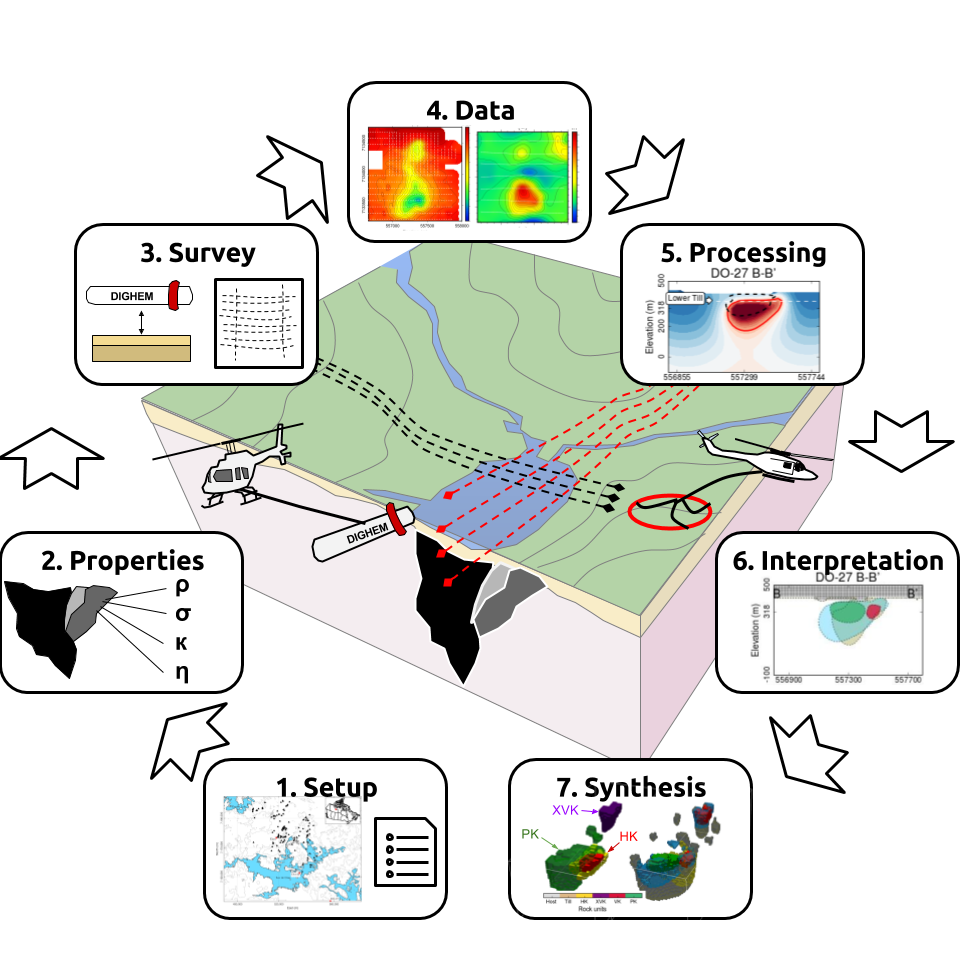

.. _AtoZGrav_index:

A to Z Examples for Gravity
===========================

Here, A to Z examples relevant to the processing, interpretation and inversion of gravity data are presented. These tutorials are:

.. toctree::
 	:maxdepth: 1

   	Processing Gravity Data <dataCorrections>
   	Forward Modeling Gravity Data <gravityForward>
   	Inverting Gravity Data <gravityInversion>

For each A to Z example, a brief overview of the tutorial is provided along with its relevance to practical problems.