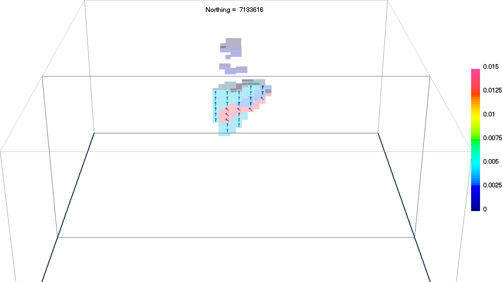
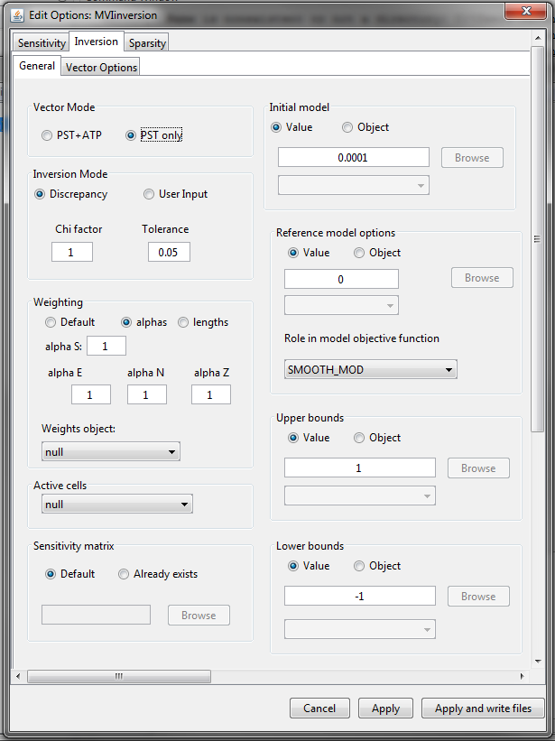
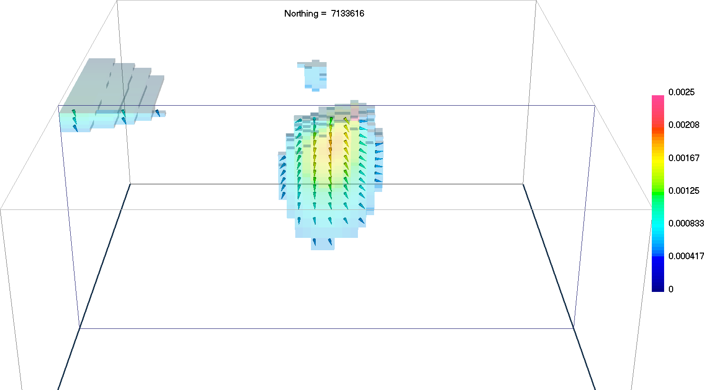
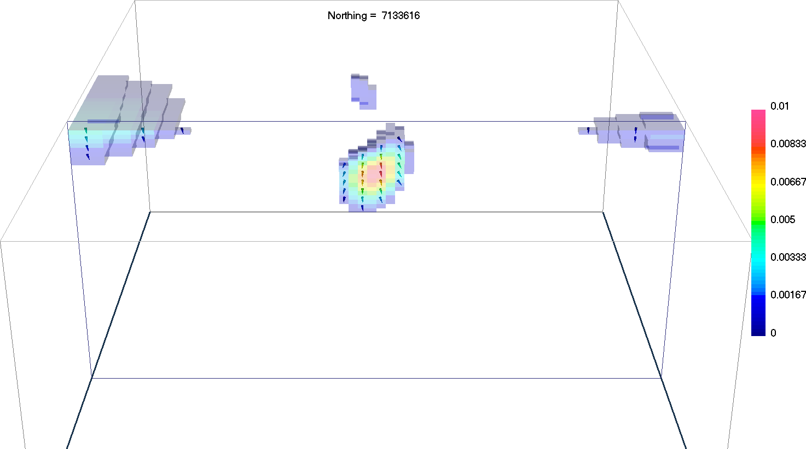
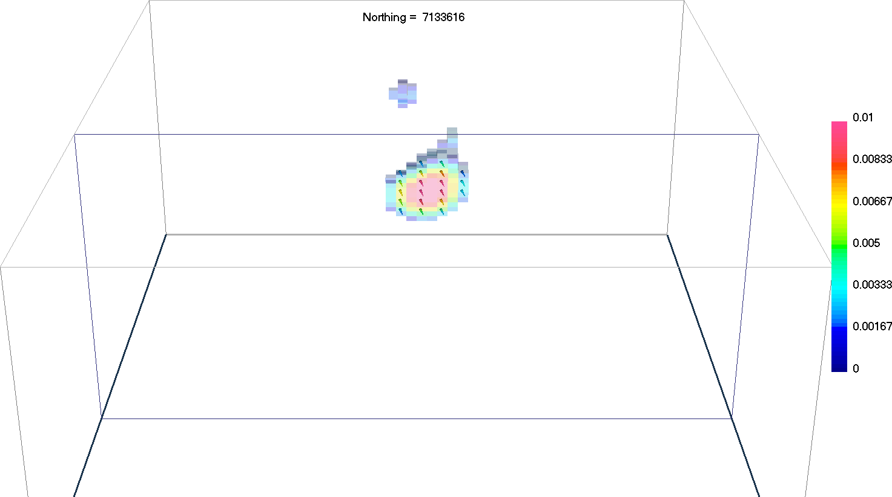

.. _AtoZMag_MVI:

Magnetic Vector Inversion (MVI)
===============================

Purpose
^^^^^^^

Here, we demonstrate the basic steps for the Magnetic Vector Inversion in both Cartesian (MVI-C) and Spherical (MVI-S) coordinates.
We then demonstrate how a cooperative inversion approach (amplitude + MVI-C) can be used to improve the MVI-C solution.
Finally we show the advantages of using a sparse MVI-S code.

            The true model we will attempt to recover.

.. note:: Link to `MVI documentation <http://mvi.readthedocs.io/en/latest/>`_

Downloads
^^^^^^^^^

.. example::    - `Download the demo <https://github.com/ubcgif/GIFtoolsCookbook/raw/master/assets/AtoZ_mag_4Download.zip>`_ **All files required for this example are located in the sub-folder "MVI"**.
                    - Requires at least ``GIFtools version 2.25 (July 2018)`` (login required)
                    - Requires `MVI v3.0 (13062018) <http://gif.eos.ubc.ca/GIFtools>`_

Step by step
^^^^^^^^^^^^

.. tip:: If you have already completed either the :ref:`Magnetic Susceptibility Inversion
         <AtoZMag_Susc>` or the :ref:`Magnetic Amplitude Inversion
         <AtoZMag_Amp>` demo, you may advance directly to :ref:`Step
         3<AtoZMagMVI_Step3>`

- **Step 1: Setup**
    - :ref:`Start a GIFtools project <basicFunctionality_index>`
    - :ref:`Set the working directory <projSetWorkDir>`
    - :ref:`Import the topography data <importTopo>` from file **TKCtopo.dat**
    - :ref:`Import the mesh <importMesh>` from file **TKC_magSynthetic.msh**

- **Step 2: Survey and Data**
    - :ref:`Import the processed TMI data in GIF format <magfile>` from the file **TKC_magSynthetic_Survey_noIGRF.mag**.

.. _AtoZMagMVI_Step3:

    Edit options panel 2 for MVI inversion

- **Step 3: Processing (NEED IMAGE OF PANELS FILLED OUT)**
    - :ref:`Create an inversion object (MVI v3.0)<createMagInv>`
    - :ref:`Edit the options <invEditOptions_MVI>`
        - Panel 1: Fill out Sensitivity Options (must use MVI data)
        - Panel 2: Fill out according to the figure on the right
        - Click *Apply and write files*

.. _AtoZMVI_C:

- **Step 4: Run the inversion: MVI-Cartesian**
    - :ref:`Run all the files <invStep5>`
    - :ref:`Import the inversion results <invStep6>`
    - :ref:`View the convergence curves <invStep7>`

            Recovered model from MVI inversion

.. note:: - The magnetic vectors with the highest amplitude are located on the eastern margin of the anomaly.
          - Although the direction of magnetization is smoothly changing, the average orientation appears to be pointing downward and towards east.
          - We can try to improve this result in two different ways

            1. Re-run cooperatively with the sparse magnetic :ref:`amplitude model<AtoZ_Mag_AmpSynthesis>`
            2. Run the :ref:`MVI-Spherical <AtoZ_Mag_MVIS>` code with sparsity constraints

ALTERNATE ENDING #1: Cooperative Magnetic Inversion (CMI)
^^^^^^^^^^^^^^^^^^^^^^^^^^^^^^^^^^^^^^^^^^^^^^^^^^^^^^^^^

In this inversion, we will use the compact model obtained in the
:ref:`Magnetic Amplitude Inversion <AtoZMag_Amp>` demo to constrain the smooth
MVI-C result.

    .. .. figure:: ./../../../images/AtoZ_Mag/AtoZ_Mag_InvOptions.png
    ..         :align: right
    ..         :scale: 20%

    - :ref:`Copy the inversion object from MVI-C <invCopyOptions>`
    - Create a cell weighting model :math:`\mathbf{w}`
        - :ref:`Load the final amplitude inversion model file<importModelCellCentered>`
        - :ref:`Normalize the amplitude model by its maximum value<objectFunctionalityMathSimple>`: :math:`\mathbf{w} = \mathbf{m}_{amp} / max(\mathbf{m}_{amp})`
        - :ref:`Add a small threshold value <objectFunctionalityMathSimple>`: :math:`\mathbf{w} = \mathbf{w}+1e-2`
        - :ref:`Apply an inverse power function <objectFunctionalityMathSimple>`: :math:`\mathbf{w} = \mathbf{w}^{-1}`
        - :ref:`Assign the cell weights <objectMeshCreateWeights>`

        .. figure:: ./../../../images/AtoZ_Mag/AtoZ_Mag_CMIweights.png
              :align: center

              Cell weights derived from the effective susceptibility model.

    - :ref:`Write all files <invWriteAll>`
    - :ref:`Run the inversion <invRun>`
    - :ref:`Import the last inversion result <invStep6>`

            Sparse CMI model

.. _AtoZ_Mag_MVIS:

ALTERNATE ENDING #2: Sparse MVI-Spherical
^^^^^^^^^^^^^^^^^^^^^^^^^^^^^^^^^^^^^^^^^

In this inversion, we will use the spherical transformation to apply sparsity
on the amplitude and angles independantly. The user is invited to try
different combination of norms to test the range of solutions.

    - .. figure:: ./../../../images/AtoZ_Mag/AtoZ_Mag_MVIOptions.png
              :align: right
              :scale: 20%

    - :ref:`Copy the previous inversion object <invCopyOptions>`
    - Change the inversion mode to Spherical
    - Change the sparsity parameters ->
    - :ref:`Write all files <invWriteAll>`
    - :ref:`Run the inversion <invRun>`
    - :ref:`Import the last inversion result <invStep6>`

            Sparse MVI-S model

Synthesis
^^^^^^^^^

We have recovered three magnetic vector models with the following features:

- The MVI-C model was successful  in locating the the magnetic kimberlite
  despite the presence of remanence. Due to the smoothness constraint, the
  magnetization direction changes throughout the anomaly, making difficult to
  distinguish a shape or overall trend.

- The Cooperative MVI-C and compact amplitude model dis a better job in
  imaging a compact body. The magnetization orientation resemble much closely
  the true model inside the pipe. The horizontal position of the maximum
  anomaly appears to be slightly shifted West of the true model. This is due
  assumptions made in the amplitude inversion.

- The sparse MVI-S inversion was arguably the most accurate in recovering both
  the position and magnetization orientation. Sparsity on the amplitude forced
  a compact anomaly, while blocky orientation angles allowed for rapid changes
  in the magnetization direction.

 .. raw:: html
    :file: ./AtoZ_Mag_Synthesis.html

