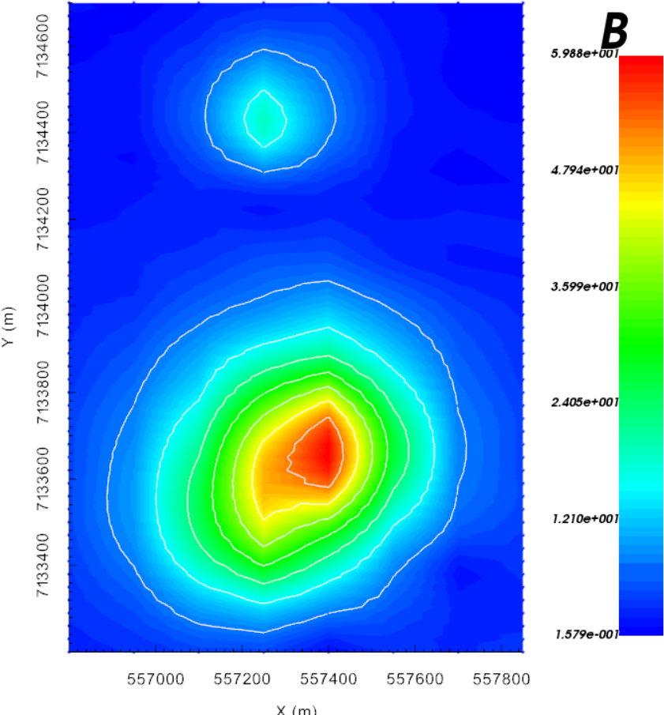
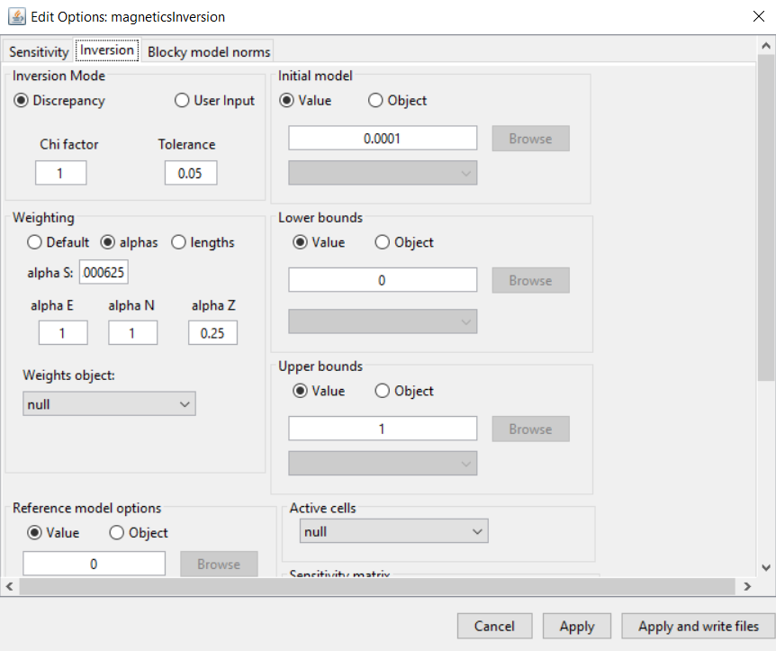
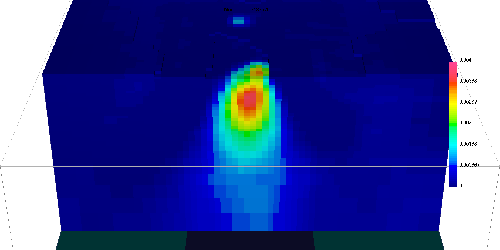
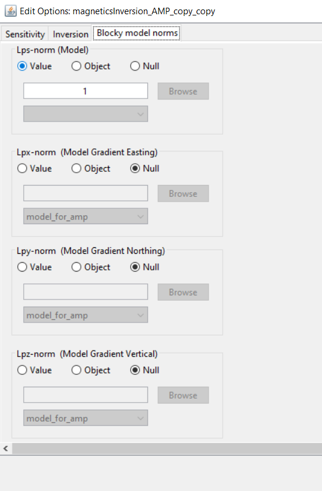
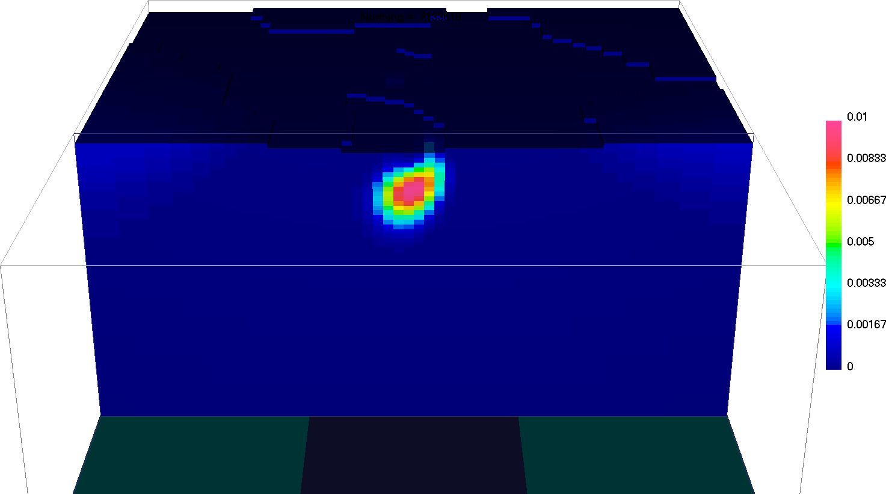

.. _AtoZMag_Amp:

Magnetic Amplitude Inversion
============================

Purpose
^^^^^^^

Amplitude data are weakly sensitive to the orientation of magnetization.
As a result, the interpretation of amplitude data can be added to the information gained by interpreting TMI data.

Here, we demonstrate the basic steps for forward modeling and inverting magnetic amplitude data.
We use GIFtools to create an amplitude data object.
Next, amplitude data are predicted using a synthetic model.
We then use inversion to recover the synthetic model.
Original work on amplitude inversion comes from our colleagues at `CSM <https://library.seg.org/doi/10.1190/1.3294766>`_ .

.. note::
    - Link to `MAG3D documentation <http://mag3d.readthedocs.io/en/v6/index.html>`_
    - Click any figure to enlarge

Downloads
^^^^^^^^^

.. example::    - `Download the demo <https://github.com/ubcgif/GIFtoolsCookbook/raw/master/assets/AtoZ_mag_4Download.zip>`_ . **All files required for this example are located in the sub-folder "MagAmp".**
                    - Requires at least ``GIFtools version 2.1.3 (Oct 2017)`` (login required)
                    - Requires `MAG3D v6.0 <http://gif.eos.ubc.ca/GIFtools>`_

Step by step
^^^^^^^^^^^^

.. tip:: If you have already completed the :ref:`Magnetic Susceptibility Inversion <AtoZMag_Susc>` demo, you may advance directly to :ref:`Step 3<AtoZMagAmp_Step3>`. Use the final de-trended data as your data column and use the final recovered model from :ref:`Step 5 of the previous exercise<AtoZMag_invObj_step5>` to predict amplitude data.

    Calculated amplitude data

- **Step 1: Setup**
    - :ref:`Start a GIFtools project <basicFunctionality_index>`
    - :ref:`Set the working directory <projSetWorkDir>`
    - :ref:`Import the topography data <importTopo>` from file **TKCtopo.dat**
    - :ref:`Import the mesh <importMesh>` from file **TKC_magSynthetic.msh**
    - :ref:`Import the model <importTopo>` from file **model_for_amp.mod**

|
|

- **Step 2: Survey and Data**
    - :ref:`Import the processed TMI data in GIF format <magfile>` from the file **TKC_magSynthetic_Survey_noIGRF.mag**.

|
|
|

    *Inversion options*

.. _AtoZMagAmp_Step3:

- **Step 3: Processing**
	- By default, magnetic data are interpreted as being TMI data. For GIFtools to work with amplitude data, we must create a magnetic amplitude data object using :ref:`change data type <objectMagDataChangeType>`
	- To create some amplitude data, we will :ref:`forward model data from an existing model <ampStep3>`
	- Once imported, remember to :ref:`assign uncertainties <objectAssignUncert>` (1nT floor) and :ref:`set I/O headers <objectSetioHeaders>`

	- :ref:`Create an inversion object (MAG3D 6.0)<createMagInv>`
	    - :ref:`Edit the options <invEditOptions_Mag3D>`
	        - Panel 1: Fill out Sensitivity Options
	        - Panel 2: Adjust :math:`\alpha` parameters
	        - Click *Apply and write files*

.. tip:: **Alternatively** if you have already completed the :ref:`Magnetic Susceptibility Inversion <AtoZMag_Susc>` demo, you can :ref:`copy the inversion<invCopyOptions>` object and
	 	 transfer the inversion parameter

- **Step 4: Run the inversion**
    - :ref:`Run all the files <invStep5>`
    - :ref:`Import the inversion results <invStep6>`
    - :ref:`View the convergence curves <invStep7>`

|
|
|
|
|
|

.. note:: The recovered effective susceptibility model shows a near-vertical anomaly, in good agreement with the conceptual idea of a vertical kimberlite pipe.

            Sparsity parameters

- **Step 5: Repeat the inversion with sparsity ([0, 2, 2, 2])**
    - :ref:`Copy the previous inversion object <invCopyOptions>`
    - Set the sparsity parameters ->
    - :ref:`Import the inversion results <invStep6>`
    - :ref:`View the convergence curves <invStep7>`

|
|
|
|

.. _AtoZ_Mag_AmpSynthesis:

Synthesis
^^^^^^^^^

- We have recovered a compact effective susceptibility model that honors the amplitude data and resembles the shape of vertical kimberlite pipe.
- Unlike in the :ref:`TMI inversion<AtoZ_MagSuscdiscuss>` results, secondary susceptible structures are not generated in the recovered model in order to fit the data.

