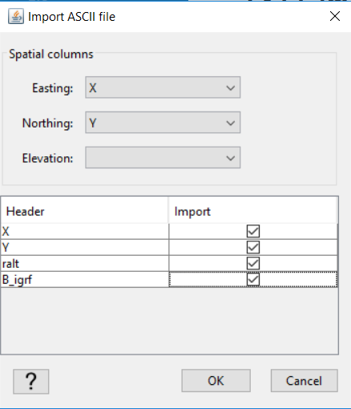
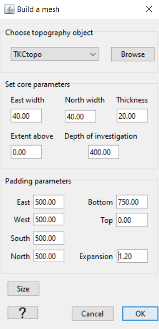
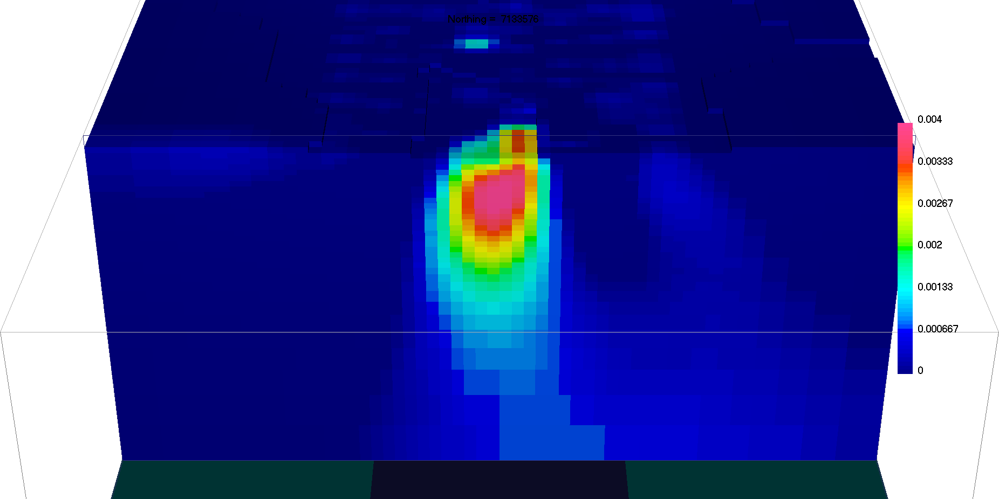
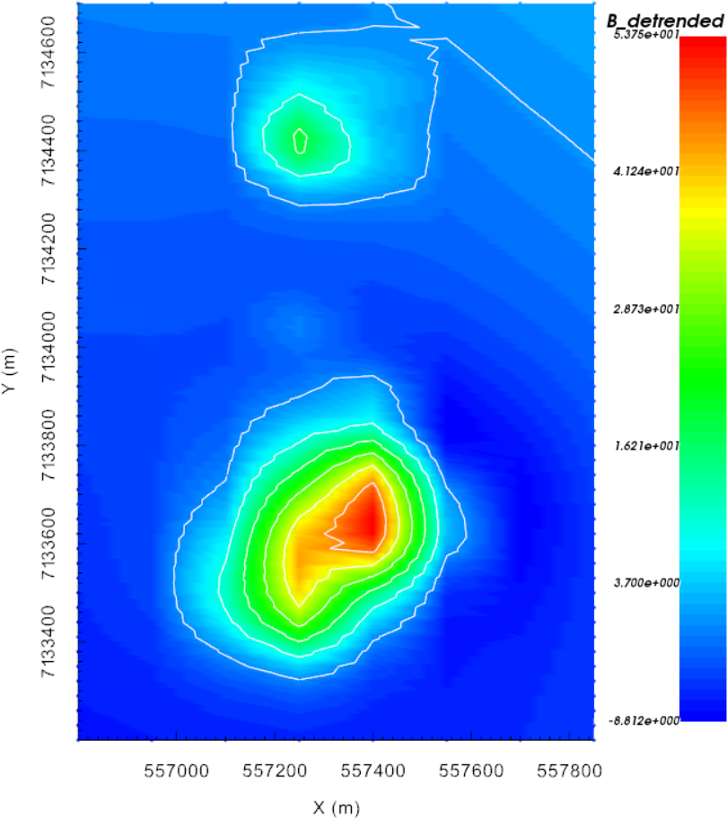
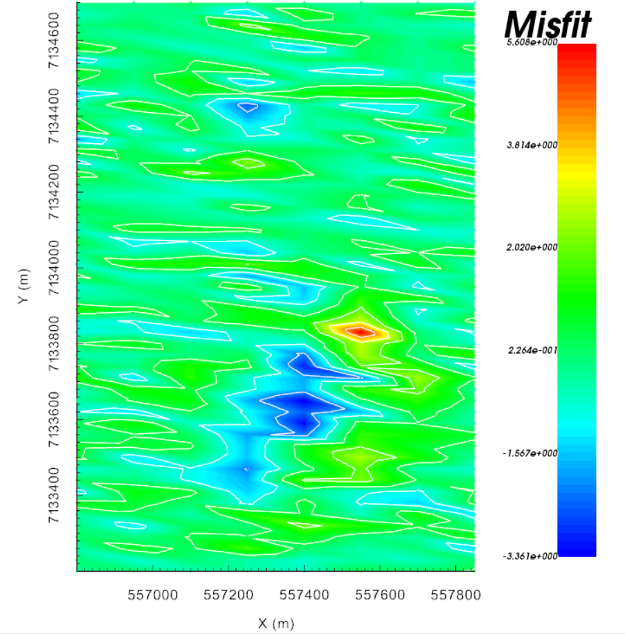
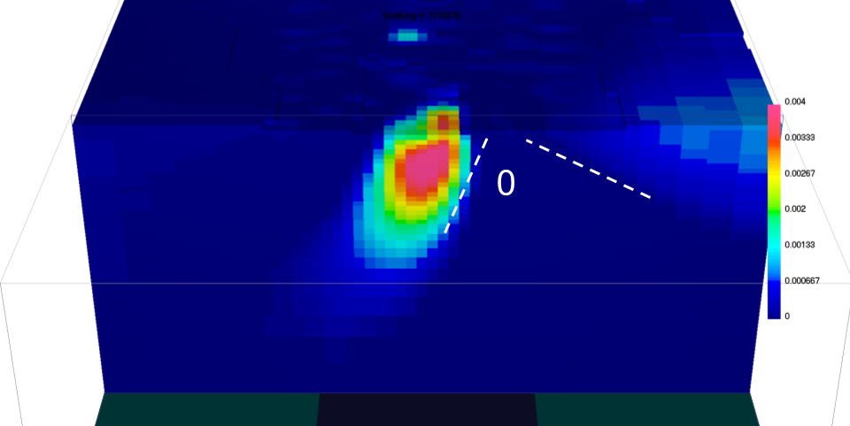

.. _AtoZMag_Susc:

.. include:: <isonum.txt>

Magnetic Susceptibility:
========================

Purpose
^^^^^^^

To demonstrate the basic steps for inverting TMI magnetic data using the induced magnetization assumption; i.e. no remanent magnetization. This exercise is meant to emulate a greenfield exploration project where topography and magnetic data are available.
Here, we start with topography and synthetic magnetic data from the current best TKC susceptibility model.

.. note::
    - Link to `MAG3D documentation <http://mag3d.readthedocs.io/en/v6/index.html>`_
    - Click on any figure to enlarge

Downloads
^^^^^^^^^

.. example::    - `Download the demo <https://github.com/ubcgif/GIFtoolsCookbook/raw/master/assets/AtoZ_mag_4Download.zip>`_ . **All files required for this example are located in the sub-folder "MagSusc".**
                    - Requires at least ``GIFtools version 2.1.3 (Oct 2017)`` (login required)
                    - Requires `MAG3D v6.0 <http://gif.eos.ubc.ca/GIFtools>`_

    *Import window*

Step by step
^^^^^^^^^^^^

- **Step 1: Setup**
    - :ref:`Start a GIFtools project <basicFunctionality_index>`
    - :ref:`Set the working directory <projSetWorkDir>`
    - :ref:`Import the topography data <importTopo>` from file **TKCtopo.dat**.

.. _AtoZ_mag_loadXYZ:

- **Step 2: Survey and Data**
    - :ref:`Import magnetic data in XYZ format <importMagData>`. The data being imported are TMI data from the file **TKC_magSynthetic_Survey.xyz**.

    .. tip:: Assign the Easting and Northing (X, Y), but leave elevation empty. Make sure you load in both the *ralt* and *B_igrf* variables

    .. figure:: ./../../../images/AtoZ_Mag/AtoZ_Mag_SyntheticData_trended.png
        :align: right
        :width: 175

        *Observed data*

    - :ref:`Set the inducing field parameters for the newly created magnetic survey <objectEditFieldParam>`:
        - Field strength (IGRF) = 59,850 nT
        - Inclination = 83.3 degrees
        - Declination = 19.5 degrees

    - :ref:`Set the IO headers for the observed data column "B_igrf" <objectSetioHeaders>`
    - :ref:`Remove the IGRF from the TMI data<objectRemoveIGRF>`; IGRF field strength is 59850 nT.
    - In the newly created data object, :ref:`create elevation column for Mag data<objectMagDataElevation>` using the topography and known flight height (40 m). Set the Z column to this new elevation using :ref:`Set the IO headers <objectSetioHeaders>`
    - :ref:`Assign floor uncertainty of 1 nT <objectAssignUncert>` to all TMI data

.. note:: - The observed magnetic data can now be exported in GIF format.
          - At least two anomalies are easily identified.
          - Note the large trend in the data coming from the NE.

    *Mesh parameters*

.. _AtoZMag_invObj:

- **Step 3: Processing**

|

    - :ref:`Create a mesh from the observed data <objectDataCreateMesh>`
        - To reproduce this example, use the parameters specified in the figure on the right

|
|
|
|
|

    - :ref:`Create an inversion object (MAG3D 6.0)<createMagInv>`

|
|
|
|
|

.. figure:: ./../../../images/AtoZ_Mag/AtoZ_Mag_InvOptions.png
    :align: right
    :width: 175

    *Inversion options*

.. _AtoZMag_alphaOpt:

    - :ref:`Edit the options <fwdEditOptions_Mag3D>`
        - Panel 1: Set mesh, observed data and topography. Leave sensitivity options as default.
        - Panel 2: Adjust :math:`\alpha` parameters (see figure)
        - Click *Apply and write files*

|
|
|

.. tip:: As a general *best practice*, in the absence of a priori
         information, :math:`\alpha` values should be set such that all components of
         the regularization have equal weight. Based on the core mesh discretization used in this problem:
         :math:`\alpha_s = \left[\frac{1}{dx}\right]^2` and :math:`\alpha_z = \left[\frac{1}{2}\right]^2`.

            Recovered susceptibility model

- **Step 4: Run the inversion**
    - :ref:`Run all the files <invStep5>`
    - :ref:`Import the inversion results <invStep6>`
    - :ref:`View the convergence curves <invStep7>`

|
|
|
|
|

.. note:: Note the linear anomalies recovered on the edges of the core
          mesh that extend beyond the region of interest. These features are due to the regional signal captured by our survey.
          We can improve our result with the instructions in **Step 5**.

            De-trended data

.. _AtoZMag_invObj_step5:

- **Step 5: De-trend and re-run**
    - Using the Mag data object, :ref:`compute the first-order polynomial trend<objectPolyTrend>`
    - Using the :ref:`Calculator <objectCalculator>`, remove the polynomial trend from your data
    - :ref:`Set the IO header <objectSetioHeaders>` for data column to be the detrended data
    - To create an inversion object with the same parameters as a previous one, use :ref:`create a new inversion copy <invCopyOptions>`
    - :ref:`Write all files <invWriteAll>` to inversion directory
    - **Repeat Step 4**

 .. note:: Note the large negative lobe along the NE edge of the southern mag anomaly.

.. _AtoZ_MagSuscdiscuss:

Synthesis
^^^^^^^^^

        Data residual

- We have recovered a susceptibility model that honors the data within the target misfit.
- Considering a near-vertical inducing field, at least two features should raise some serious flags regarding the presence of remanence.

    1. The kimberlite pipe appears to be plunging towards SW, and a secondary susceptible structure presents outside the region of interest and plunges to the East.
    2. The data residual map shows correlated signal near the main anomaly, indicating a poor fit for the large negative anomaly.

        Recovered susceptibility model

