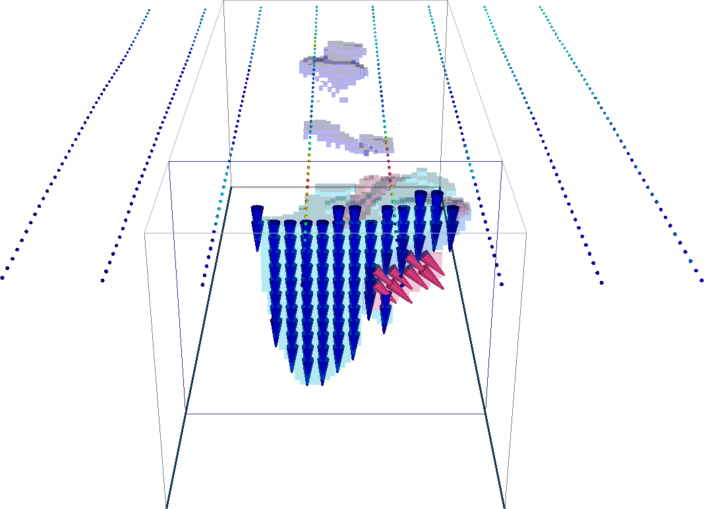

.. _AtoZMag_index:

A to Z Examples for Magnetics
=============================

Here, we provide A to Z examples relevant to the processing and inversion of magnetic
data in the presence of remanence. The effects of remanence has long been
recognized as an obstacle for the geological interpretation and modeling of
magnetic data. This is especially true in the case of TKC. Our tutorial covers
three inversion approaches and compares their respective solutions:

.. toctree::
 	:maxdepth: 1

   	Magnetic susceptibility inversion from TMI data <MagSusc>
   	Magnetic susceptibility inversion from amplitude data <MagAmp>
   	Magnetic Vector Inversion (MVI) <MVI>

