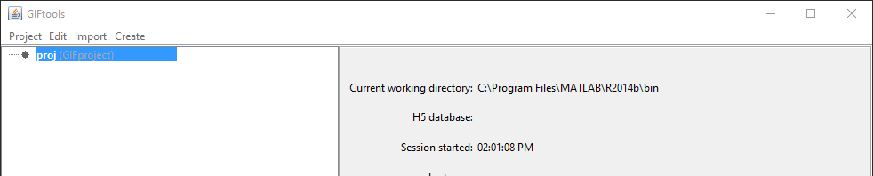

.. _basicFunctionality_index:

Basic Functionality
===================

The basic GIFtools functionality is always accessible through 4 drop-down menus (:ref:`Project <project>`, :ref:`Edit <edit>`, :ref:`Import <import>` and :ref:`Create <create>` ). This functionality allows the user to manage GIF projects, delete/copy/rename objects, import data files and create various GIF objects. Once created, a specific set of actions (or methods) can be carried out on each of these objects. Object-specific methods are described in the :ref:`object-dependent functionality <objectFunctionality_index>` section.

..    - :ref:`2.1. Project: <project>` load, save and manage GIF projects
..    - :ref:`2.2. Edit: <edit>` rename, copy and delete objects
..    - :ref:`2.2. Import: <import>` import data, meshes, models and other files into GIFtools
..    - :ref:`2.3. Create: <create>` create various GIF objects, including surveys, forward modelings and inversions

.. toctree::
    :maxdepth: 1

    Project <project/project_index>
    Edit <edit/edit_index>
    Import <import/import_index>
    Create <create/create_index>

