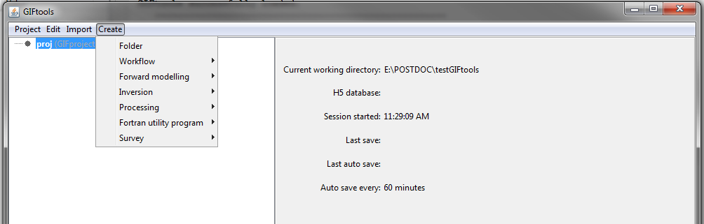

.. _create:

.. include:: <isonum.txt>

Create
======

Create allows the user to generate objects which are used to carry out a wide variety of tasks. These tasks include: forward modeling various types of geophysical data, inverting geophysical data, interpolating models onto different meshes and performing equivalent source processing for potential fields. By defining the desired task as an object, we can make sure the user only fills in fields and carries out actions which are relevant to the specified task. The actions (or methods) which can be applied to each object are found on the :ref:`object-dependent functionality <objectFunctionality_index>` page. Objects which can be generate through create are as follows:

    .. toctree::
        :maxdepth: 1

        Workflow <workflow/workflow_index>
        Forward Modeling <fwd/fwd_index>
        Inversion <inv/inv_index>
        Processing <processing/esProcessing>
        Fortran utility program <fortran/fortran_index>
        Creating a Tensor Mesh <create_mesh>
        Create Survey <survey/survey_index>
        Model Builder <ModelBuilder/ModelBuilder_index>

