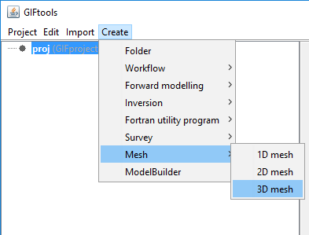
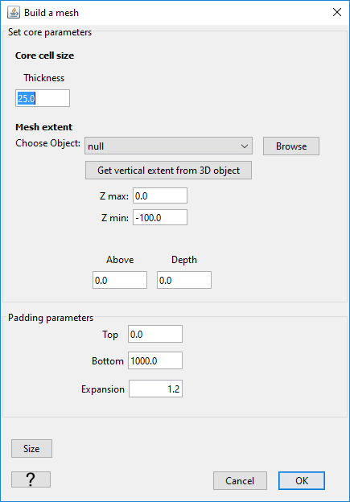
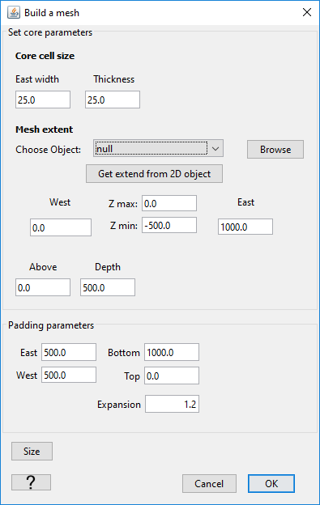

.. _create_mesh:

.. include:: <isonum.txt>

Create Tensor Mesh
==================

GIFtools allows you to rapidly create a tensor mesh based on the extent of any ``GIFdata`` or ``TOPOdata`` objects.

.. _create_mesh_1D:

Create 1D Mesh
--------------

The creation of a 1D mesh requires the following basic parameters:

	- Core cell thickness (:math:`dz`)
	- Core cell extent, either defined manually or extracted from a chosen ``GIFdata`` object:

		- Z max: Top elevation
		- Z min: Bottom elevation

	- Padding distance with core cells. The padding cells are converted to "core cells" after creation

		- Above
		- Below

	- Padding distance with expansion

		- Distance above
		- Distance below
		- Expansion factor (:math:`x^{n} * dz`)

.. _create_mesh_2D:

Create 2D Mesh
--------------

The creation of a 2D mesh follows the same principal as the :ref:`creation of a 1D Mesh <create_mesh_1D>` with the added parameters:

	- Core cell width (:math:`dx`)
	- Horizontal core extent, either defined manually or extracted from a chosen ``2Ddata`` object:

		- West: Left limit coordinate
		- East: Right limit coordinate

	- Padding distance with expansion

		- Distance West
		- Distance East

.. _create_mesh_3D:

Create 3D Mesh
--------------

.. figure:: ../../../images/createMesh3DMenu.png
    :align: center
    :width: 400

The creation of a 3D mesh follows the same principal as the :ref:`creation of a 2D Mesh <create_mesh_2D>` with the added parameters:

	- Core cell width (:math:`dy`)
	- Horizontal core extent, either defined manually or extracted from a chosen ``3Ddata`` object:

		- North limit coordinate
		- South limit coordinate

	- Padding distance with expansion

		- Distance North
		- Distance South
