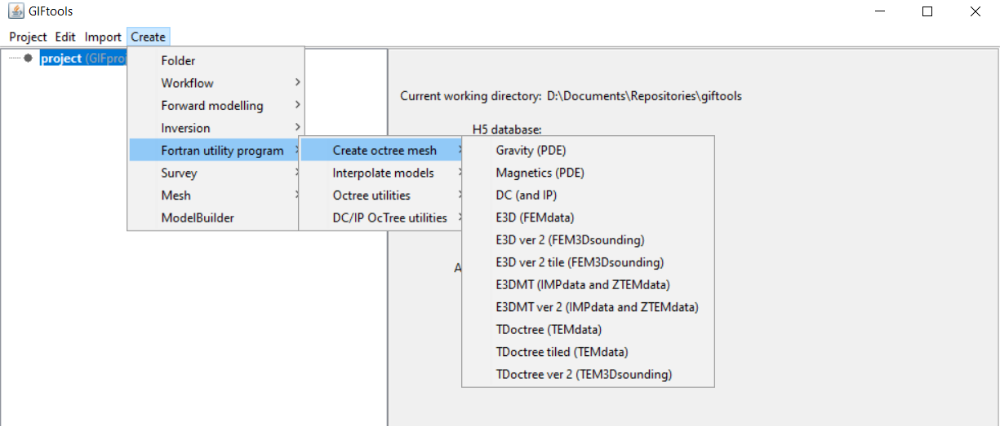

.. _createOctreeMesh:

.. include:: <isonum.txt>

Create octree mesh
==================

.. _createE3DoctreeMesh:

Create an ocTree mesh for FEM data
----------------------------------

Interaction with the Fortran utility program ``create_octree_mesh_e3d`` can be done by creating an *E3DcreateOctreeMesh* item. This item will interact with the utility program to create an ocTree mesh from an FEM data item for the inversion program ``E3D``. To create, use the menu structure:

**Create** |rarr| **Fortran utility program** |rarr| **Create ocTree mesh** |rarr| **E3D**

.. _createE3DMToctreeMesh:

Create an ocTree mesh for MT and ZTEM data
------------------------------------------

Interaction with the Fortran utility program ``MTcreate_octree_mesh_e3d`` can be done by creating an *MTcreateOctreeMesh* item. This item will interact with the utility program to create an ocTree mesh from an NSEM data item for the inversion program ``ED3MT``. To create, use the menu structure:

**Create** |rarr| **Fortran utility program** |rarr| **Create ocTree mesh** |rarr| **E3DMT (and ZTEM)**

.. _createTDoctreeMesh:

Create an ocTree mesh for TEM data
----------------------------------

Interaction with the Fortran utility program ``create_octree_1mesh_td`` can be done by creating a *TD1meshcreateOctreeMesh* item. This item will interact with the utility program to create an ocTree mesh from a TEM data item for the inversion program ``TDoctree_1mesh``. To create, use the menu structure:

**Create** |rarr| **Fortran utility program** |rarr| **Create ocTree mesh** |rarr| **TD (1 mesh)**

.. _createTDoctreeMeshTiled:

Create an ocTree mesh for TEM data (tiled)
------------------------------------------

Interaction with the Fortran utility program ``create_octree_mesh_td_main_parallel`` can be done by creating a *TDtiledmeshcreateOctreeMesh* item. This item will interact with the utility program to create an ocTree mesh from a TEM data item for the inversion program ``TDoctreeinv_GN``. To create, use the menu structure:

**Create** |rarr| **Fortran utility program** |rarr| **Create ocTree mesh** |rarr| **TD (tiled)**

.. _createDCoctreeMesh:

Create an ocTree mesh for DC data
---------------------------------

Interaction with the Fortran utility program ``create_octree_mesh`` can be done by creating a *DCIPcreateOctreeMesh* item. This item will interact with the utility program to create an ocTree mesh from an DC or IP data item for the inversion program ``DCoctree`` and ``IPoctree``. To create, use the menu structure:

**Create** |rarr| **Fortran utility program** |rarr| **Create ocTree mesh** |rarr| **DC (and IP)**

.. _createGravoctreeMesh:

Create an ocTree mesh for gravity
---------------------------------

Interaction with the Fortran utility program ``create_octree_mesh_mag`` can be done by creating an *GRAVcreateOctreeMesh* item. This item will interact with the utility program to create an ocTree mesh from a gravity data item for the inversion program ``octgravde``. To create, use the menu structure:

**Create** |rarr| **Fortran utility program** |rarr| **Create ocTree mesh** |rarr| **Gravity (PDE)**

.. _createMagoctreeMesh:

Create an ocTree mesh for magnetics
-----------------------------------

Interaction with the Fortran utility program ``create_octree_mesh_mag`` can be done by creating an *MAGcreateOctreeMesh* item. This item will interact with the utility program to create an ocTree mesh from a magnetics data item for the inversion program ``octmagde``. To create, use the menu structure:

**Create** |rarr| **Fortran utility program** |rarr| **Create ocTree mesh** |rarr| **Magnetics (PDE)**

