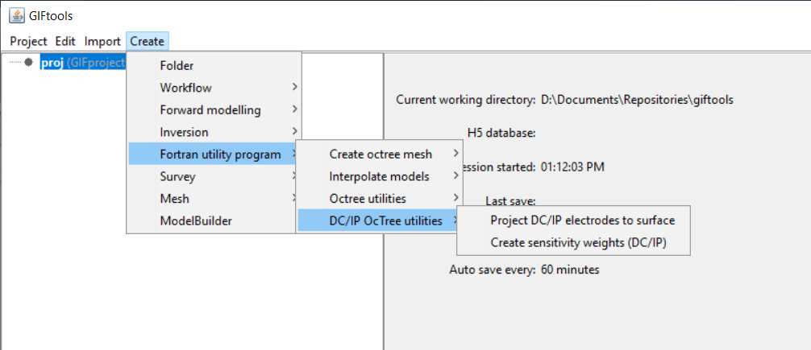

.. _createDCIPOctreeUtilities:

.. include:: <isonum.txt>

DCIP Octree Code Utilities
==========================

.. _createElectrodes:

Create surface electrodes (DC/IP)
---------------------------------

Interaction with the Fortran utility program ``surface_electrodes`` can be done by creating an *surfaceElectrodes* item. This item will interact with the utility program to place DC/IP electrodes on the discretized topography. To create, use the menu structure:

**Create** |rarr| **Fortran utility program** |rarr| **DCIP Octree utilities** |rarr| **Create surface electrodes (DC/IP)**

.. _createDCsensitivities:

Create sensitivity weights for DC/IP octree
-------------------------------------------

Interaction with the Fortran utility program ``dcsensitivity`` can be done by creating an *sensitivityWeightsDCIP* item. This item will interact with the utility program to generate a sensisitivity weights model for DC or IP octree inversions. To create, use the menu structure:

**Create** |rarr| **Fortran utility program** |rarr| **DCIP Octree utilities** |rarr| **Create sensitivity weights (DC/IP)**
