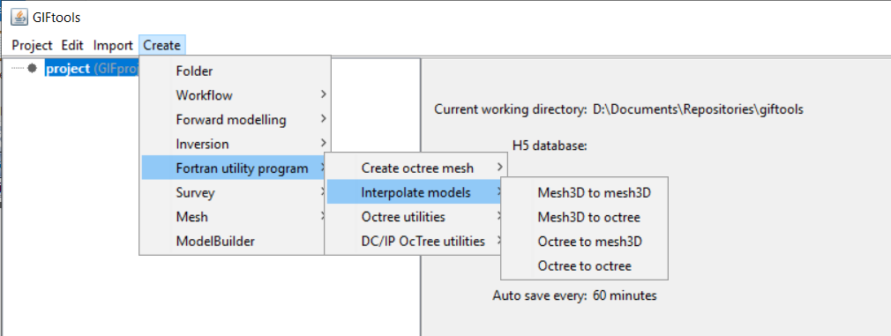

.. _createInterpolateModels:

.. include:: <isonum.txt>

Interpolate Models
==================

.. _interpolateMesh3DToMesh3D:

Interpolate a 3D model to another 3D mesh
-----------------------------------------

Interaction with the Fortran utility program ``interpolate_model`` can be done by creating an *interplate_model* item. This item will interact with the utility program to interpolate a model with a 3D mesh (*not* ocTree) to another 3D mesh. To create, use the menu structure:

**Create** |rarr| **Fortran utility program** |rarr| **Interpolate models** |rarr| **Mesh3D to mesh3D**

.. _interpolateMesh3DToOctree:

Interpolate a 3D model to an octree mesh
----------------------------------------

Interaction with the Fortran utility program ``3DModel2Octree`` can be done by creating an *mesh3DtoOctreeModel* item. This item will interact with the utility program to interpolate a model with a 3D mesh to an octree mesh. The utility gives the option to use the input octree mesh or generate a new refined octree mesh.

To create, use the menu structure:

**Create** |rarr| **Fortran utility program** |rarr| **Interpolate models** |rarr| **Mesh3D to octree**

.. _interpolateOctreeToMesh3D:

Interpolate an octree model to a 3D mesh
----------------------------------------

Interaction with the Fortran utility program ``octreeTo3D`` can be done by creating an *octreeToMesh3DModel* item. This item will interact with the utility program to interpolate a model with an octree mesh to a 3D mesh. To create, use the menu structure:

**Create** |rarr| **Fortran utility program** |rarr| **Interpolate models** |rarr| **Octree to mesh3D**

.. _interpolateOctreeToOctree:

Interpolate an octree model to another octree mesh
--------------------------------------------------

Interaction with the Fortran utility program ``remesh_octree_model`` can be done by creating an *octreeToOctreeModel* item. This item will interact with the utility program to interpolate a model with an octree mesh to another octree mesh. To create, use the menu structure:

**Create** |rarr| **Fortran utility program** |rarr| **Interpolate models** |rarr| **Octree to octree**

