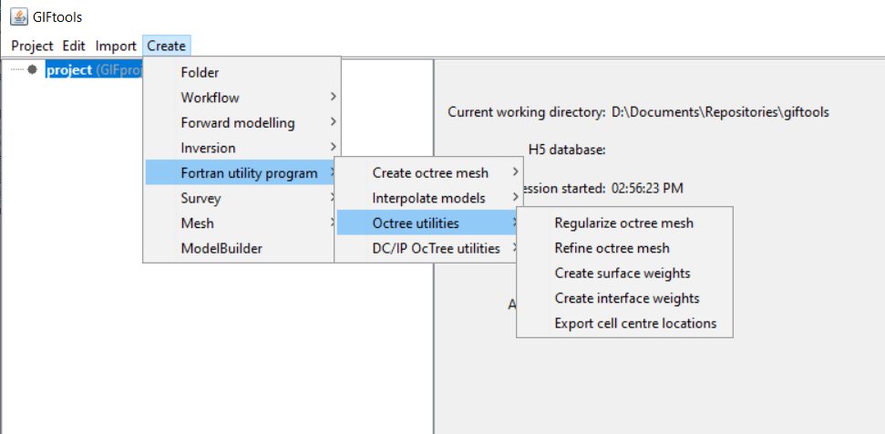

.. _createOctreeUtilities:

.. include:: <isonum.txt>

Octree Utilities
================

.. _regularizeOctreeMesh:

Regularize an octree mesh
-------------------------

Interaction with the Fortran utility program ``regularizeOctreeMesh`` can be done by creating an *regularizeOctreeMesh* item. This item will interact with the utility program to generate a regularized octree mesh from an existing octree mesh. To create, use the menu structure:

**Create** |rarr| **Fortran utility program** |rarr| **Octree utilities** |rarr| **Regularize octree mesh**

.. _refineOctreeMesh:

Refine an octree mesh
---------------------

Interaction with the Fortran utility program ``refine_octree`` can be done by creating an *refineOctree* item. This item will interact with the utility program to make an octree mesh finer based on the values of the input model. To create, use the menu structure:

**Create** |rarr| **Fortran utility program** |rarr| **Octree utilities** |rarr| **Refine octree mesh**

.. _createSurfWeights:

Create surface weights for an octree mesh
-----------------------------------------

Interaction with the Fortran utility program ``create_weight_file`` can be done by creating an *createSurfaceWeight* item. This item will interact with the utility program to create an octree surface weighting file. The input file specifies the number of surface layers and the weight assigned to each surface. To create, use the menu structure:

**Create** |rarr| **Fortran utility program** |rarr| **Octree utilities** |rarr| **Create surface weights**

.. _createinterfWeights:

Create interface weights for an octree mesh
-------------------------------------------

Interaction with the Fortran utility program ``interface_weights`` can be done by creating an *createInterfaceWeight* item. This item will interact with the utility program to create a weight file for the octree cell faces. The input file specifies a tolerance and the weight for the edges. The weights are set to the give edge weight value when the absolute value of the gradient of the model is larger than the tolerance. Weights should be less than 1 to have a sharp boundary and greater than 1 for a smooth boundary. The input file also specifies the number of surface layers and the surface weight value for the x and y faces for those layers. To create, use the menu structure:

**Create** |rarr| **Fortran utility program** |rarr| **Octree utilities** |rarr| **Create interface weights**

.. _exportCellCentres:

Export cell centre locations for an octree mesh
-----------------------------------------------

Interaction with the Fortran utility program ``octree_cell_centre`` can be done by creating an *exportCellCentreLocations* item. This item will interact with the utility program to export a 3-column file with the cell centre locations of the octree mesh cells. To create, use the menu structure:

**Create** |rarr| **Fortran utility program** |rarr| **Octree utilities** |rarr| **Export cell centre locations**

