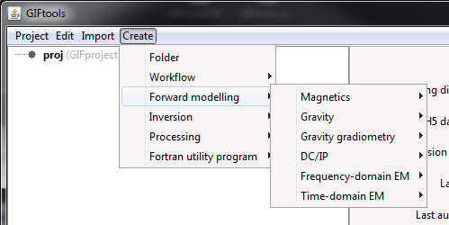

.. _createForward:

.. include:: <isonum.txt>

Create forward models
=====================

.. _createMag3D:

Create 3D magnetic forward model
--------------------------------

To create magnetic data from a susceptibility model using the tensor code ``MAGFOR3D`` (versions 5.0, 5.1, and 6.0) or the octree code ``OCTMAGDE``, use menu structure:

**Create** |rarr| **Forward** |rarr| **Magnetics** |rarr| **MAG3D (v5.0)**

**Create** |rarr| **Forward** |rarr| **Magnetics** |rarr| **MAG3D (v5.1)**

**Create** |rarr| **Forward** |rarr| **Magnetics** |rarr| **MAG3D (v6.0)**

**Create** |rarr| **Forward** |rarr| **Magnetics** |rarr| **PDE (octree; v1.1b)**

.. _createGravFwd:

Create a gravity forward model
------------------------------

To create gravity data from a density-contrast model using the tensor code ``GZFOR3D`` (versions 5.0, 5.1, and 6.0) or the octree code ``OCTGRVDE``, use the menu structure:

**Create** |rarr| **Forward modelling** |rarr| **Gravity** |rarr| **GRAV3D (v5.0; 5.1; 6.0)**

**Create** |rarr| **Forward modelling** |rarr| **Gravity** |rarr| **PDE (octree; v1.1b)**

.. _createGGfwd:

Create a gravity gradiometry forward model
------------------------------------------

To create gravity gradiometry data from a density-contrast model using the tensor code ``GG3D`` (versions 5.1 and 6.0), use the menu structure:

**Create** |rarr| **Forward modelling** |rarr| **Gravity gradiometry** |rarr| **GG3D (5.1; 6.0)**

.. _createDCIPFwd:

Create a DC/IP forward model
----------------------------

To create a DC or IP forward model using the tensor code (``DCIP2D`` or ``DCIP3D``) or the octree code (``DCIPoctree``), use the following menu structure:

2D Tensor code
^^^^^^^^^^^^^^

To create a DC or IP forward model which uses the software ``DCIP2D``, the menu structure is:

- DC: **Create** |rarr| **Forward modelling** |rarr| **DC/IP** |rarr| **2D DC**

- IP: **Create** |rarr| **Forward modelling** |rarr| **DC/IP** |rarr| **2D IP**

The inputs to the forward model can be specified though :ref:`edit options <fwdEditOptions_dcip2d>`

3D Tensor code
^^^^^^^^^^^^^^

To create a DC or IP forward model which uses the software ``DCIPF3D``, the menu structure is:

- DC: **Create** |rarr| **Forward modelling** |rarr| **DC/IP** |rarr| **3D DC**

- IP: **Create** |rarr| **Forward modelling** |rarr| **DC/IP** |rarr| **3D IP**

The inputs to the forward model can be specified though :ref:`edit options <fwdEditOptions_dcip3d>`

Octree code
^^^^^^^^^^^

To create a DC or IP forward model which uses the software ``DCIPoctree``, the menu structure is:

- DC: **Create** |rarr| **Forward modelling** |rarr| **DC/IP** |rarr| **Octree DC**

- IP: **Create** |rarr| **Forward modelling** |rarr| **DC/IP** |rarr| **Octree IP**

The inputs to the forward model can be specified though :ref:`edit options <fwdEditOptions_dcipoctree>`

.. _createFEMfwd:

Create a frequency-domain EM forward model
------------------------------------------

To create frequency-domain EM data from a conductivity model using the octree code ``E3D``, use the menu structure:

**Create** |rarr| **Forward modelling** |rarr| **Frequency-domain EM** |rarr| **E3D**

.. _createTEMfwd:

Create a time-domain EM forward model
-------------------------------------

To create time-domain EM data from a conductivity model using the octree code ``TDoctree (1 mesh)`` or ``TDoctree (tiled)``, use the menu structure:

**Create** |rarr| **Forward modelling** |rarr| **Time-domain EM** |rarr| **TDoctree (1 mesh)**

**Create** |rarr| **Forward modelling** |rarr| **Time-domain EM** |rarr| **TDoctree (tiled)**

