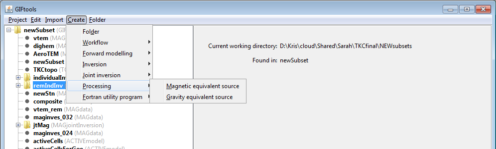

.. _createESProcessing:

.. include:: <isonum.txt>

Create equivalent source processing
===================================

.. _createMagEsrc:

Create magnetic equivalent sources
----------------------------------

The equivalent-source problem is solved via inversion and so the menus are quite similar to those of the inversion class. The menus needed to create a magnetic equivalent source item are:

**Create** |rarr| **Processing** |rarr| **Magnetics equivalent source**

**NOTE**: GIFtools equivalent-source items will take care of the prerequisite sensitivity programs prior to equivalent source processing for the user.

.. _createGravEsrc:

Create gravity equivalent sources
---------------------------------

The equivalent-source problem is solved via inversion and so the menus are quite similar to those of the inversion class. The menus needed to create a gravity equivalent source item are:

**Create** |rarr| **Processing** |rarr| **Gravity equivalent source**

**NOTE**: GIFtools equivalent-source items will take care of the prerequisite sensitivity programs prior to equivalent source processing for the user.

.. _createGravGGEsrc:

Create gravity gradiometry equivalent sources
---------------------------------------------

The equivalent-source problem is solved via inversion and so the menus are quite similar to those of the inversion class. The menus needed to create a gravity equivalent source item are:

**Create** |rarr| **Processing** |rarr| **Gravity gradiometry equivalent source**

**NOTE**: GIFtools equivalent-source items will take care of the prerequisite sensitivity programs prior to equivalent source processing for the user.

