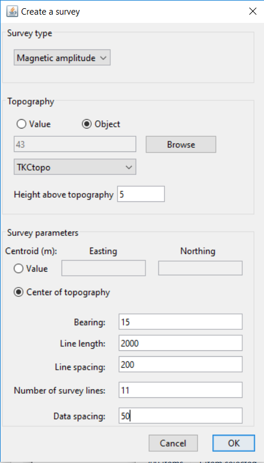
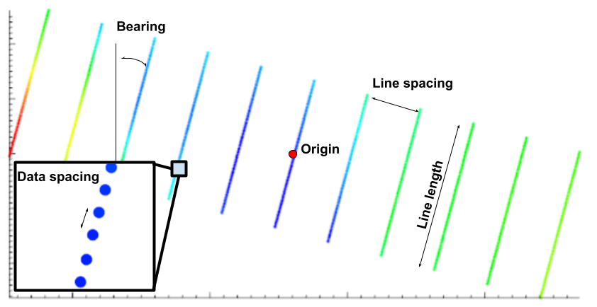

.. _createSurveySimple:

.. include:: <isonum.txt>

Create a simple ground or airborne survey
=========================================

To create a simple ground or airborne survey for potential field data, use the menu structure below:

**Create** |rarr| **Survey** |rarr| **Simple surface/airborne survey**

The following dialog will pop up:

The dialog requires the following parameters to be input by the user. The figure at the bottom also shows what the parameters indicate.

- **Survey type**: Select the desired survey type from the drop-down menu. The options include total-field magnetics, magnetic amplitude, gravity, gravity gradiometry, gravity gradiometry (VK1), and gravity gradiometry (FALCON).

- **Topography**: Use either a constant topography value or a TOPOdata object by selecting the desired radio button. For a value, provide the value in the text box. For a TOPOdata object, use the drop-down menu to select available objects from the project or use the browse button to import a topography file.

- **Height above topography**: The value to drape the receivers at. If a constant topography value was given, then the receivers will all be at a constant height above that value. If a TOPOdata object was selected, the receivers will be draped at the height given above the topography. To place the receivers at a constant height even if there is topography, select "Value" and enter 0. Then simply give the desired elevation for the receivers in the box for height above topography.

- **Easting origin**: The easting coordinate for center of survey

- **Northing origin**: The northing coordinate for center of survey

- **Bearing**: The bearing of the survey lines, using a compass (i.e., north is 0 degrees, east is 90 degrees, etc). Rotation angle about the origin.

- **Line length**: The length of the survey lines.

- **Number of survey lines**: The total number of survey lines.

- **Data spacing**: The distance between receivers along a survey line.

- **Line spacing**: The distance between individual survey lines.

Click OK to create the new data item. It will have the easting, northing, and elevation columns set in the I/O headers.

Once we click OK, we'll see the MAGdata item in the GIFtools project tree as "NewSurvey (MAGdata)". The survey can be viewed using VTK. The diagram below also explains what most parameters mean.

.. _createSurveyDCIP:

Create a simple DCIP survey
===========================

To create a simple DCIP survey, use the menu structure below:

**Create** |rarr| **Survey** |rarr| **Simple DCIP survey**

.. figure:: ../../../../images/createDCSurvey_filled.png
    :align: right
    :figwidth: 50%

- **Survey type**: Type of data object

- **Dimension**: Choice of 2D or 3D ``DCIPdata`` object.

- **Transmitter Type**: Choice between ``pole`` or ``dipole`` transmitters

- **Receiver Type**: Choice between ``pole`` or ``dipole`` receiver

- **Centroid**

	- **Value**: The easting and northinf coordinate for center of survey
	- **Topography**: Center of topography objects
		- [OPTIONAL] **Apply topography**: Drape survey onto topography.

- **Bearing**: The bearing of the survey lines, using a compass (i.e., north is 0 degrees, east is 90 degrees, etc). Rotation angle about the origin.

- **Line length**: The length of the survey lines.

- **Line spacing**: The distance between individual survey lines.

- **Number of survey lines**: The total number of survey lines.

- **Electrode Spacing**: Dipole seperation

- **Number of receivers per transmitter**: Maximum number of layers on pseudo-section

