.. _importData:

.. include:: <isonum.txt>

Import Data
===========

Under **Import** |rarr| **Data**, the user can import various types of geophysical, geological and geographical data from a multitude of file formats. In GIFtools, this results in the creation of a 'data object'. Once created, GIFtools will allow the user to carry out a set of object-dependent actions (or methods) involving the data object. The methods applicable to each data object are presented on the :ref:`object-dependent functionality <objectFunctionalityData>` page. The following data types can be imported into GIFtools:

    - :ref:`Magnetics Data <importMagData>`
    - :ref:`Gravity Data <importGravData>`
    - :ref:`Gravity Gradiometry Data <importGGData>`
    - :ref:`Topography <importTopo>`
    - :ref:`Surface <importSurface>`
    - :ref:`Borehole Data <importBoreholeData>`
    - :ref:`Miscellaneous Property data <importDCIP2Ddata>`
    - :ref:`2D DCIP Data <importDCIP2Ddata>`
    - :ref:`3D DCIP Data <importDCIP3Ddata>`
    - :ref:`Frequency-Domain EM Data <importFemData>`
    - :ref:`Time-Domain EM Data <importTemData>`
    - :ref:`Natural Source EM Data (MT and ZTEM) <importNSEMData>`

.. _importMagData:

Import magnetic data
--------------------

Use the main project menu: **Import** |rarr| **Data** |rarr| **Magnetics**

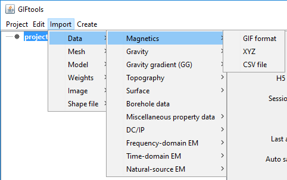

**File formats:**

Magnetic data can be loaded from three main file types:

    - :ref:`GIF format <magfile>`
    - :ref:`XYZ format <XYZfile>`
    - :ref:`CSV format <CSVfile>`

.. _importGravData:

Import gravity data
-------------------

Use the main project menu: **Import** |rarr| **Data** |rarr| **Gravity**

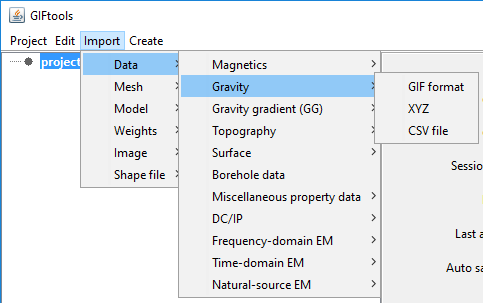

**File formats:**

Gravity data can be imported in from three main file types:

    - :ref:`GIF format <gravfile>`
    - :ref:`XYZ format <XYZfile>`
    - :ref:`CSV format <CSVfile>`

.. _importGGData:

Import gravity gradiometry data
-------------------------------

Use the main project menu: **Import** |rarr| **Data** |rarr| **Gravity gradient (GG)**

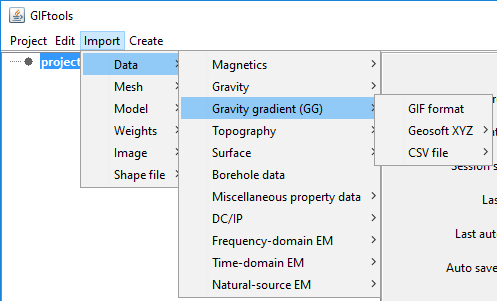

**File formats:**

Gravity gradiometry data can be imported in from three main file types:

    - :ref:`GIF format <ggfile>`
    - :ref:`XYZ format <XYZfile>`
    - :ref:`CSV format <CSVfile>`

.. _importTopo:

Import topography
-----------------

Use the main project menu: **Import** |rarr| **Topo**

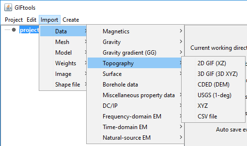

**File formats:**

Topography can be imported through six different file formats:

    - :ref:`3D GIF format <topoGIF3Dfile>`
    - :ref:`2D GIF format <topoGIF2Dfile>`
    - :ref:`XYZ format <XYZfile>`
    - :ref:`CSV format <CSVfile>`
    - Canadian Digital Elevation Data (CDED)
    - USGS 1-degree

.. _importSurface:

Import a surface
----------------

Use the main project menu: **Import** |rarr| **Surface**

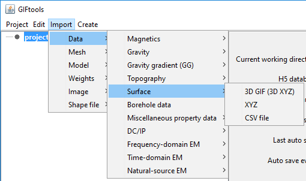

**File formats:**

Topography from surface can be imported through three different file formats:

    - :ref:`GIF format <topoGIF3Dfile>` (Same as topography)
    - :ref:`XYZ format <XYZfile>`
    - :ref:`CSV format <CSVfile>`

.. _importBoreholeData:

Import borehole data
--------------------

Importing borehole data requires two or three files (survey optional and assumes vertical boreholes if not given) that will be asked for in a separate dialog. To get to the import dialog, use the main project menu: **Import** |rarr| **Borehole Data**

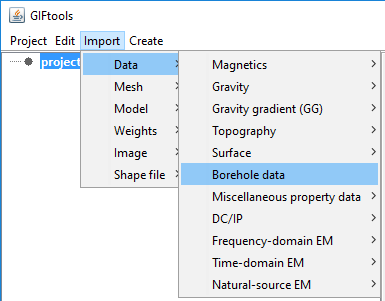

This brings up the following import dialog:

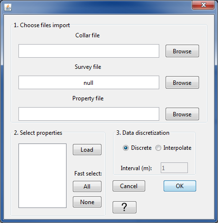

From the browse buttons in Step 1, select the :ref:`collar file <bhCollarfile>`, :ref:`survey file <bhSurveyfile>` (optional; if not provided, GIFtools assumes the borehole extend vertically downwards), and the :ref:`property file <bhPropfile>`. Once all the files are selected in Step 1, click on the "Load" button in Step 2.

For the example files we are using, our import dialog now looks like the following:

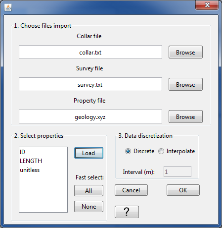

Our example has three properties: ID, LENGTH, and unitless. These are the headers provided in the :ref:`property file <bhPropfile>`. We select all three properties in this case. Once the desired properties are selected, we can move onto Step 3.

Step provides two options on how the borehole data are discretized: either the files contain data points at discrete xyz locations or the files provide a "to" and "from" value for each measurement or observation. Below, we will show how to import each type of borehole data.

.. note:: The datasets used for "discrete" and "interpolate" are different so the property headers will differ as well.

**Discrete**

For discrete data, select the "Discrete" radio button. The import dialog will look like:

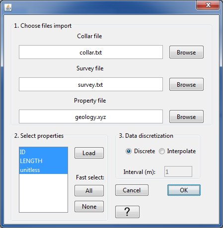

Click OK to import the borehole data. You will notice that a grayed-out BOREdata item has been added to the GIFtools project tree. And the following dialog appears:

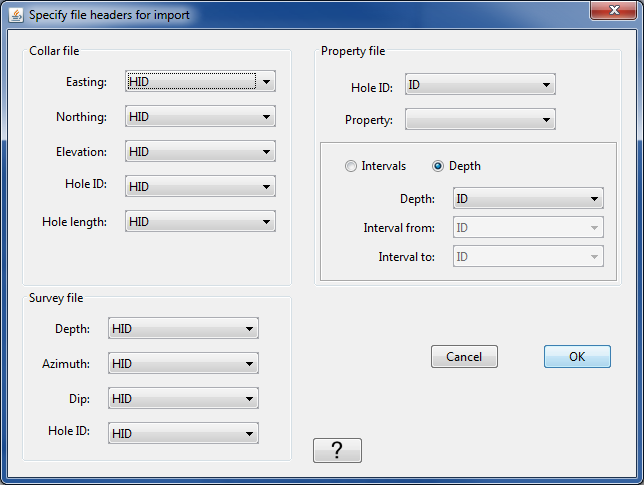

For the collar, survey, and property files, select the appropriate headers from the drop-down menus for each item. The options will match the headers given in the respective files. Once done, the dialog looks like the following:

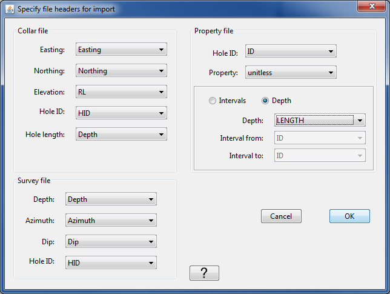

Again, because the borehole data in this case are data points are discrete locations, we use the "Depth" radio button instead of "Intervals". Once all the headers are assigned, click OK. The data are now being imported into GIFtools. Once done, the BOREdata item in the project tree will have a name. The name will be the same as the property file name (in our case, "geology").

The info panel will show the origin of the property data, a data summary, the set i/o headers, and the borehole IDs that were imported:

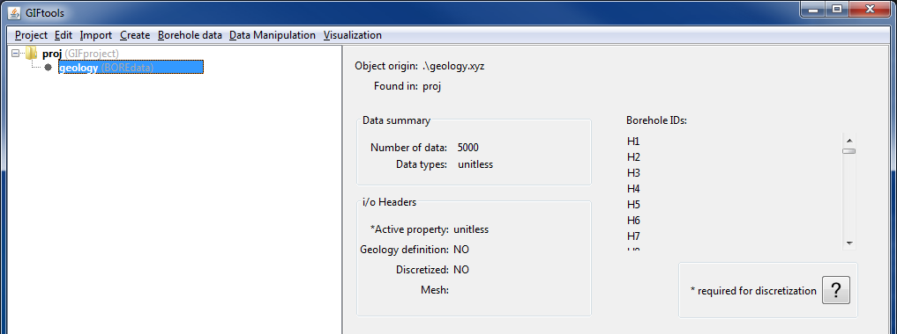

Now the borehole data can be visualized, discretized onto a mesh, and used within Model Builder to create models and weighting functions.

.. example:: Collar, survey, and property file along with a GIFtools project to repeat the above steps to import discrete borehole data: `download <https://www.eoas.ubc.ca/~sdevries/GIFtoolsExamples/ImportDiscreteBoreholeData_Example.zip>`__

**Interpolate**

Now, let's import borehole data that has measurement between two elevations (i.e., to and from). Repeat the steps above to import borehole data in GIFtools, up to Step 3. Because this borehole data has "To" and "From" columns, we now select the "Interpolate" radio button in Step 3 for the data discretization.

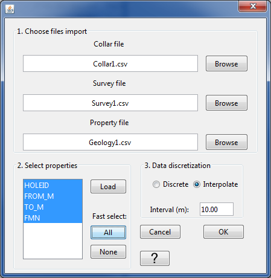

We have decided to interpolate these data every 10 m.

Click OK to import the files and move onto the header dialog. The header dialog will appear just as before, except now the "Intervals" option is selected instead of "Depth". Select the appropriate headers for each item. Once done, our dialog looks like the following:

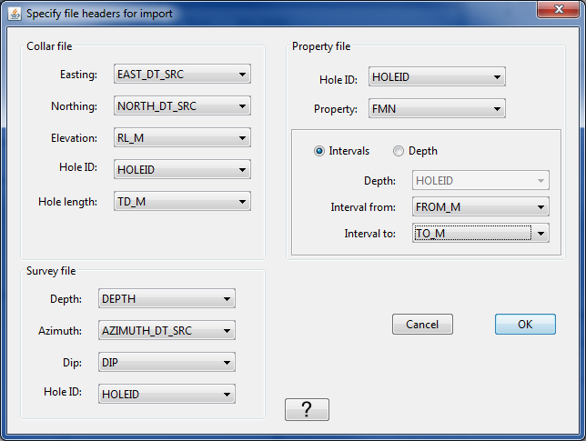

Click OK to import and set the headers. Once imported, a BOREdata item has been added to the GIFtools project tree and the name of it is the same as the property file name. In this case, that is "Geology1". When the item is highlighted in the tree, the info panel will provide the same type of information as we saw earlier for the discrete example:

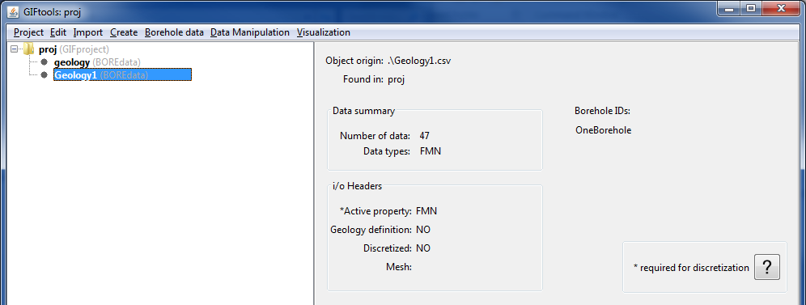

Now the borehole data can be visualized, discretized onto a mesh, and used within Model Builder to create models and weighting functions.

.. example:: Collar, survey, and property file along with a GIFtools project to repeat the above steps to import interpolated borehole data: `download <https://www.eoas.ubc.ca/~sdevries/GIFtoolsExamples/ImportDiscreteBoreholeData_Example2.zip>`__

.. note:: GIFtools needs all location data to be in meters! Check your borehole data in case it may be in feet.

**File formats:**

See below links for specifics on the files associated with borehole data:

    - :ref:`Collar file <bhCollarfile>`
    - :ref:`Survey file <bhSurveyfile>`
    - :ref:`Property file <bhPropfile>`      

.. _importProp:

Import miscellaneous property data
----------------------------------

This type of data covers the range of anything someone would want to bring in that has a position and value (numeric or character).

Use the main project menu: **Import** |rarr|  **Miscellaneous property data**

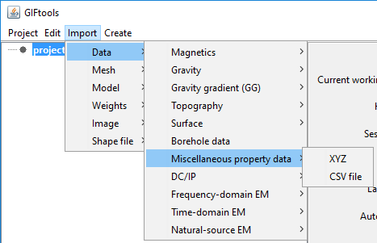

**File formats:**

Property data is imported via the following file formats:

    - :ref:`XYZ <XYZfile>`
    - :ref:`CSV <XYZfile>`

Import DC/IP data
-----------------

.. _importDCIP2Ddata:

Import DC/IP 2D data
^^^^^^^^^^^^^^^^^^^^

Use the main project menu: **Import** |rarr| **DC/IP** |rarr| **2D**

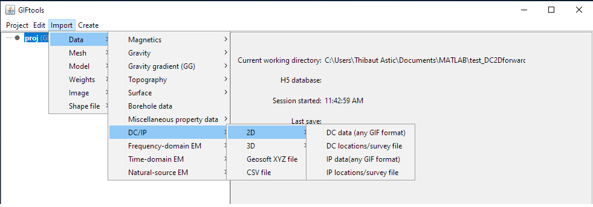

**Note**: Importation from a CSV/XYZ file is found under **Import** |rarr| **DC/IP** and is independent of dimension in the menu
 
**File formats:**

DC/IP 2D data can be imported via:

    - :ref:`2D GIF file <dcip2dObsfile>`
    - :ref:`XYZ file <XYZfile>`
    - :ref:`CSV file <CSVfile>`

.. _importDCIP3Ddata:

Import DC/IP 3D data
--------------------

Use the main project menu: **Import** |rarr| **DC/IP** |rarr| **3D**

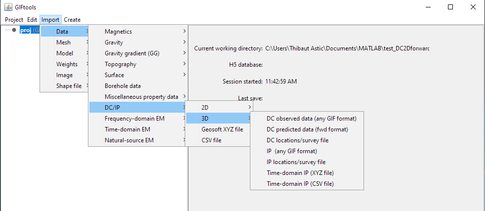

**Note**: Importation from a CSV/XYZ file is found under **Import** |rarr| **DC/IP** and is independent of dimension in the menu

**File formats:**

DC/IP 3D data can be imported via:

    - :ref:`3D GIF <dcip3dfile>`
    - :ref:`DCIPF3D <dcip3dfile>`      
    - :ref:`XYZ file <XYZfile>`
    - :ref:`CSV file <CSVfile>`

.. _importFemData:

Import FEM data
---------------

To import Frequency-domain ElectroMagnetic (FEM) data, use the main project menu: **Import** |rarr| **Data** |rarr| **Frequency-domain EM**

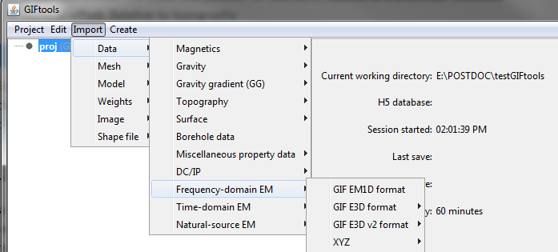

**File formats:**

FEM data can be imported in from three main file types:

    - :ref:`GIF format <femfile>`
    - :ref:`XYZ format <XYZfile>`
    - :ref:`CSV format <CSVfile>`

**NOTE**: XYZ and CSV file formats do not include transmitters, which will need to be imported separately.

.. _importTemData:

Import TEM data
---------------

To import Time-domain ElectroMagnetic (FEM) data, use the main project menu: **Import** |rarr| **Data** |rarr| **Time-domain EM**

.. figure:: ../../../images/importTEMdata.png
    :align: center
    :width: 400

**File formats:**

FEM data can be imported in from three main file types:

    - :ref:`GIF format <temfile>`
    - :ref:`XYZ format <XYZfile>`
    - :ref:`CSV format <CSVfile>`

**NOTE**: For detailed instructions on how to import TEM data from a csv or xyz file, follow the instructions in :ref:`this recipe <importVTEMdata>`.

**NOTE**: XYZ and CSV file formats do not include transmitters, which will need to be imported separately.

.. _importNSEMData:

Import natural-source EM data
-----------------------------

There are a few file options to import magnetotelluric (MT: impedance or apparent resistivity and phase) or Z-axis Tipper EM (ZTEM) data:

MT or ZTEM data: GIF format
^^^^^^^^^^^^^^^^^^^^^^^^^^^

To load MT data that are in a GIF-formatted structure, the menu structure is:

- MTZ3D format: **Import** |rarr| **Data** |rarr| **Natural-source EM** |rarr| **MT / ZTEM: GIF format** |rarr| **MTZ3Dinv format**
- E3DMT format: **Import** |rarr| **Data** |rarr| **Natural-source EM** |rarr| **MT / ZTEM: GIF format** |rarr| **E3DMT format**

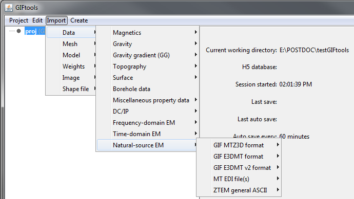

*NOTE:* This is the same structure to import predicted data, which will require an existing data item because of the output from the inversion programs.

MT data: EDI format
^^^^^^^^^^^^^^^^^^^

To load MT data that are in an EDI file or files (GIFtools will prompt and allow for multiple files), the menu structure is:

- Impedances: **Import** |rarr| **Data** |rarr| **Natural-source EM** |rarr| **MT EDI file(s)** |rarr| **Impedance**
- Apparent resitivity and phase: **Import** |rarr| **Data** |rarr| **Natural-source EM** |rarr| **MT EDI file(s)** |rarr| **Apparent resitivity and phase:**

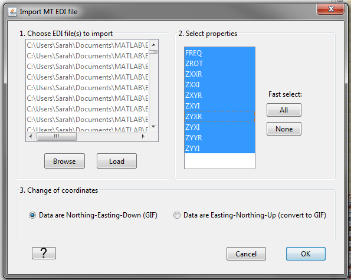

**NOTE:** EDI is defined by The Society of Exploration Geophysicists MT / EMAP Data Interchange Standard. GIFtools will convert the (LONG, LAT) to WGS84 UTM when importing. It is assumed that the EDI file units are in mV/km/nT and will be converted to V/A as required in GIF inversion programs.

ZTEM data: ASCII format
^^^^^^^^^^^^^^^^^^^^^^^
To load ZTEM data that are in a CSV or XYZ ASCII format, the menu structure is:

- XYZ format: **Import** |rarr| **Data** |rarr| **Natural-source EM** |rarr| **ZTEM general ASCII** |rarr| **Geosoft XYZ**
- CSV format: **Import** |rarr| **Data** |rarr| **Natural-source EM** |rarr| **ZTEM general ASCII** |rarr| **CSV file**

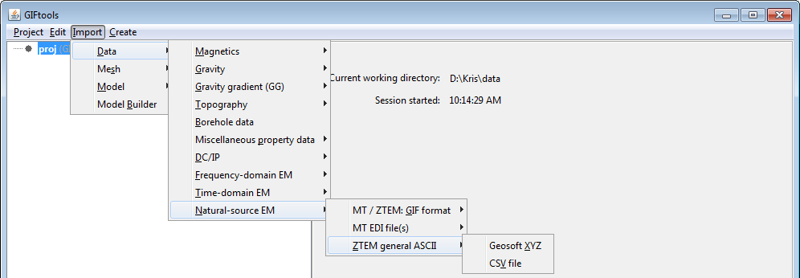

**NOTE:** XYZ and CSV file formats do not include base stations for ZTEM data, which will need to be imported or set separately.

**File formats:**

Natural source EM data can be imported from three main file types:

    - :ref:`MTZ3D GIF format <mtz3dfile>`
    - :ref:`E3DMT GIF format <e3dmtfile>`
    - EDI format
    - :ref:`XYZ format <XYZfile>`
    - :ref:`CSV format <CSVfile>`

