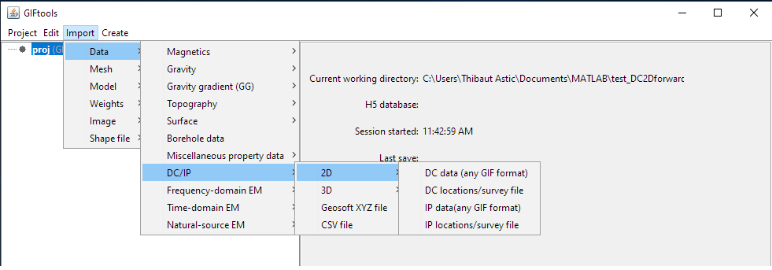
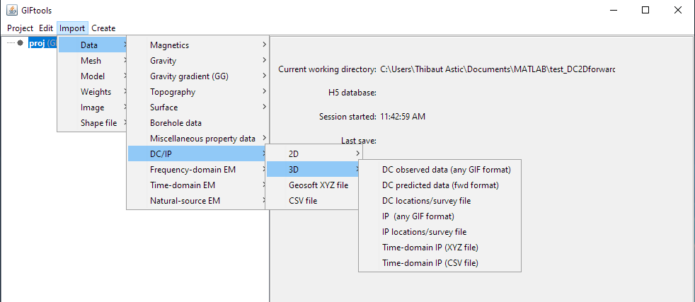

.. _importDCIPdata:

.. include:: <isonum.txt>

Import DC/IP data
-----------------

DC and IP data can be imported in from three main file types:
Use the main project menu: **Import** |rarr| **Data** |rarr| **DC/IP**

.. _importDCIP2Ddata:

Import 2D DC/IP data
^^^^^^^^^^^^^^^^^^^^

DC and IP data used by the `DCIP2D inversion <https://dcip2d.readthedocs.io/en/latest/#dcip2d-package>`_ routine can be imported
through six different file formats: Use the main project menu: **Import**
|rarr| **DC/IP** |rarr| **2D**

**Note**: Importation from a CSV/XYZ file is found under **Import** |rarr| **DC/IP** and is independent of dimension in the menu

**File formats:**

    - :ref:`2D GIF location file <dcip2dLocsfile>`
    - :ref:`2D GIF data file <dcip2dObsfile>`
    - :ref:`XYZ file <XYZfile>`
    - :ref:`CSV file <CSVfile>`

.. _importDCIP3Ddata:

Import 3D DC/IP data
^^^^^^^^^^^^^^^^^^^^

DC and IP data used by the `DCIP3D inversion <https://dcip3d.readthedocs.io/en/latest/#dcip3d-package>`_ routine can be imported using the main project menu: **Import** |rarr| **DC/IP** |rarr| **3D**

**Note**: Importation from a CSV/XYZ file is found under **Import** |rarr| **DC/IP** and is independent of dimension in the menu

**File formats:**

    - :ref:`3D GIF location file <dcip3dLocsfile>`
    - :ref:`3D GIF observed data file <dcip3dfile>`
    - :ref:`DCIPF3D predicted data file <dcip3dfile>`
    - :ref:`XYZ file <XYZfile>`
    - :ref:`CSV file <CSVfile>`

import 3D TDIP data
^^^^^^^^^^^^^^^^^^^

It is possible to import IP data with several times windows from a CSV or XYZ file (this is not supported by any DCIP GIF format).

**Step 1: assign spatial data and time windows**

Click this button to specify the Easting, Northing and Elevation columns.

In the window that pops up, set the time of each time windows (can also be loaded from a text file with one time per line)

**step 2: select the data type and data columns**

Add and select a data type. Clic on specify type and assign the header for each corresponding column (can also be loaded from a text file with one header per line)

**Step 3: add miscellaneous data**

This step is used to define any remaining data columns. This might include intensity of the sources etc.
