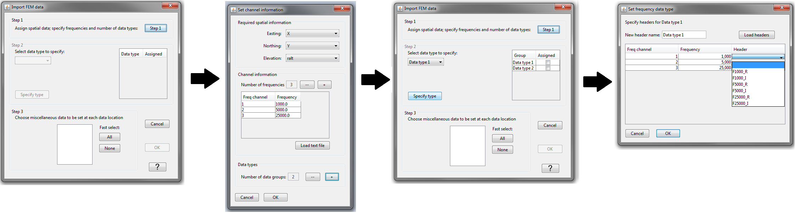

.. _importEMdata:

.. include:: <isonum.txt>

Import EM data
^^^^^^^^^^^^^^

Frequency-domain (FEM), Time-domain (TEM) and Natural Source (NSEM) electromagnetic data can be imported in from three main file types:

**Import** |rarr| **Data** |rarr| **F|T|NS EM**

.. toctree::
    :maxdepth: 1

    importFEMdata
    importTEMdata
    importNSEMdata

.. _importXYZemData:

Import XYZ or CSV EM data
^^^^^^^^^^^^^^^^^^^^^^^^^

Common to FEM, TEM and ZTEM, data be can loaded from a general column file that contains position and multiple data channels.

**Step 1: assign spatial data, specify frequencies/times and number of data type**

Click this button to specify the Easting, Northing and Elevation columns. The user will also specify the frequencies/times contained within the data and the number of data groups. If the data contain both real and imaginary components of the response at three different frequencies, then there are 3 frequencies and 2 data groups resulting in 6 total data columns.

**Step 2: specify data types**

Select which data type you would like to specify from the drop-down menu and click **specify type**. In the window that pops up, set the header name for the data type and assign the data to each frequency.

**Step 3: add miscellaneous data**

This step is used to define any remaining data columns. This might include orientation information for the transmitters and receivers, etc...

