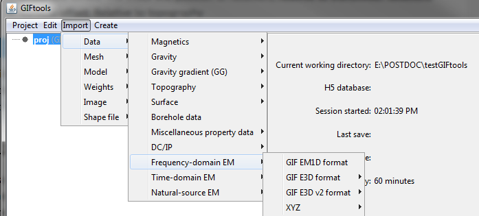

.. _importFemData:

.. include:: <isonum.txt>

Import FEM data
---------------

To import frequency-domain electromagnetic (FEM) data, use the main project
menu:

**Import** |rarr| **Data** |rarr| **Frequency-domain EM**

There are four types of FEM data that can be loaded from files:

**File formats:**

    - :ref:`GIF EM1DFM format <importEM1DFMdata>`
    - :ref:`GIF E3D format <importE3Dv1data>`
    - :ref:`GIF E3D v2 format <importE3Dv1data>`
    - :ref:`XYZ format <importXYZemData>`

|
|

.. _importEM1DFMdata:

EM1DFM format
^^^^^^^^^^^^^

Loads a data file for the :ref:`EM1DFM inversion
<invEditOptions_em1dfm>` and forward modeling codes. The data position is set
relative to the transmitter as specified by the `EM1DFM file format`_.
The function returns a :ref:`FEM1Dsounding <objectEMDataIndex_EM1Dsounding>` object.

**Import** |rarr| **Data** |rarr| **Frequency-domain EM** |rarr| **GIF EM1D format**

The following parameters are set for the user:

**Properties:**

    - **Transmitters:**
        - **Dipole moment:** `mom_t <https://em1dfm.readthedocs.io/en/latest/content/files/supporting.html#obsg>`_
        - **Orientation** `ot_a <https://em1dfm.readthedocs.io/en/latest/content/files/supporting.html#obsi>`_
        - **Along-line offset (m) =** 0
        - **Cross-line offset (m) =** 0
        - **Vertical offset (m):** Relative to topography

    - **Receiver:**
        - **Dipole moment:** `mom_r <https://em1dfm.readthedocs.io/en/latest/content/files/supporting.html#obsk>`_
        - **Along-line offset:** The along-line position of receivers, **relative to transmitter locations**
        - **Cross-line offset:** The cross-line position of receivers, **relative to transmitter locations**
        - **Vertical offset:** Relative to topography

.. note:: The position of the data is set by the "sounding" location. Only the relative offsets between the transmitters and receivers are available in the `EM1DFM file format`_. Data locations have been assigned to the transmitter locations upon import for consistency.

.. _importE3Dv1data:

E3D format
^^^^^^^^^^

Loads data files formated for the original `E3D data file format <https://e3d.readthedocs.io/en/e3d/content/files/obsFile.html>`_ .
The function returns an :ref:`FEMdata <objectEMDataIndex_FEMdata>` object where only the transmitter geometry is defined. The receivers are defined as point measurements that samples the fields (E, H) along the Cartesian axes.

**Import** |rarr| **Data** |rarr| **Frequency-domain EM** |rarr| **GIF E3D format**

.. note:: The :ref:`FEMdata <objectEMDataIndex_FEMdata>` object assumes that the
    provided field data have been measured along the Cartesian axes or that the
    user has rotated the fields in pre-processing. For more general cases with
    arbitrary receivers orientation (in-line), consider making use of the
    :ref:`FEM3Dsounding <objectEMDataIndex_FEM3Dsounding>` class.

.. _importE3Dv2data:

E3D v2 format
^^^^^^^^^^^^^

Loads data specifically formatted for the `E3D v2 <https://e3d.readthedocs.io/en/e3d_v2/content/files/obsFile.html>`_
and `E3D v2 tiled <https://e3d.readthedocs.io/en/e3d_v2_tiled/content/files/obsFile.html>`_ codes.
The function returns an :ref:`FEM3Dsounding <objectEMDataIndex_FEM3Dsounding>` object.

**Import** |rarr| **Data** |rarr| **Frequency-domain EM** |rarr| **GIF E3D v2 format**

The receivers and transmitters are defined by their respective input files. As a result, you will need 4 files when importing E3D v2 data:

    - `Data file <https://e3d.readthedocs.io/en/e3dinv_ver2_tiled/content/files/obsFile.html#observations-file>`_
    - `Frequency file <https://e3d.readthedocs.io/en/e3dinv_ver2_tiled/content/files/freqFile.html#frequencies-file>`_
    - `Receiver file <https://e3d.readthedocs.io/en/e3dinv_ver2_tiled/content/files/receiverFile.html#transmitter-and-receiver-files>`_
    - `Transmitter file <https://e3d.readthedocs.io/en/e3dinv_ver2_tiled/content/files/receiverFile.html#transmitter-and-receiver-files>`_

.. note:: Both the transmitters and receivers geometry are defined in 3D. The relative offsets can be calculated using the :ref:`Calculate Transmitter/Receiver separation <calculateTxRxSeperation>` function.

.. _EM1DFM file format: https://em1dfm.readthedocs.io/en/latest/content/files/supporting.html#observation-file
.. _EM1DTM file format: https://em1dtm.readthedocs.io/en/latest/content/files/supporting.html#observation-file
