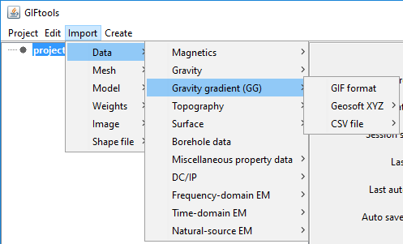

.. _importGGData:

.. include:: <isonum.txt>

Import gravity gradiometry data
-------------------------------

Gravity gradiometry data can be imported in from three main file types:
Use the main project menu: **Import** |rarr| **Data** |rarr| **Gravity gradient (GG)**

**File formats:**

    - :ref:`GIF format <ggfile>`
    - :ref:`XYZ format <XYZfile>`
    - :ref:`CSV format <CSVfile>`
