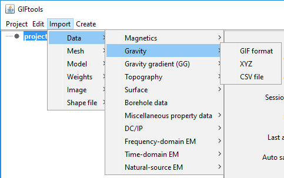

.. _importGravData:

.. include:: <isonum.txt>

Import gravity data
-------------------

Gravity data can be imported in from three main file types:
Use the main project menu: **Import** |rarr| **Data** |rarr| **Gravity**

**File formats:**

    - :ref:`GIF format <gravfile>`
    - :ref:`XYZ format <XYZfile>`
    - :ref:`CSV format <CSVfile>`
