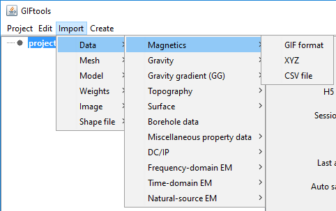

.. _importMagData:

.. include:: <isonum.txt>

Import magnetic data
--------------------

Magnetic data can be loaded from three main file types:
Use the main project menu: **Import** |rarr| **Data** |rarr| **Magnetics**

**File formats:**

    - :ref:`GIF format <magfile>`
    - :ref:`XYZ format <XYZfile>`
    - :ref:`CSV format <CSVfile>`
