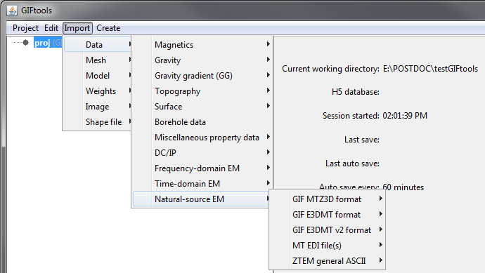
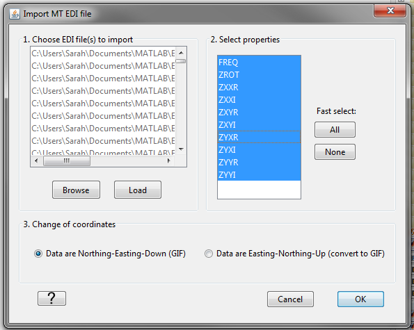
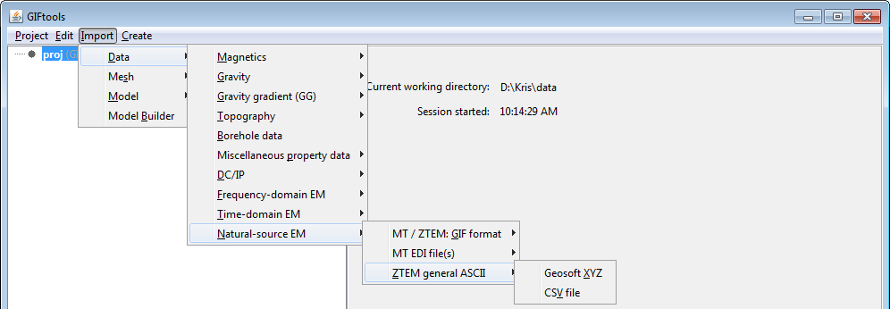

.. _importNSEMData:

.. include:: <isonum.txt>

Import MT and/or ZTEM data
--------------------------

There are a few file options to import magnetotelluric (MT: impedance or apparent resistivity and phase) or Z-axis Tipper EM (ZTEM) data:

**Import** |rarr| **Data** |rarr| **Natural-source EM**

**File formats:**

    - :ref:`MTZ3D <importNSEMData_mtz3d>` formatted data
    - :ref:`E3DMT <importNSEMData_e3dmt1>` formatted data
    - :ref:`E3DMT v2 <importNSEMData_e3dmt2>` formatted data
    - :ref:`EDI <importNSEMData_edi>` formatted MT data
    - :ref:`ASCII <importNSEMData_ascii>` formatted ZTEM data

|
|

.. _importNSEMData_mtz3d:

MTZ3D format
^^^^^^^^^^^^

To load impedance tensor MT, apparent resistivity MT **or** ZTEM data that are formatted for the `MTZ3D <https://mtz3d.readthedocs.io/en/latest/content/files/obsFile.html>`_ code, the menu structure is:

**Import** |rarr| **Data** |rarr| **Natural-source EM** |rarr| **GIF MTZ3D format**

.. _importNSEMData_e3dmt1:

E3DMT format
~~~~~~~~~~~~

To load impedance tensor MT **and/or** ZTEM data that are formatted for the `E3DMT <https://e3dmt.readthedocs.io/en/e3dmt/content/files/obsFile.html>`_ code, the menu structure is:

**Import** |rarr| **Data** |rarr| **Natural-source EM** |rarr| **GIF E3DMT format**

Some things to note about loading E3DMT observed/locations data:

    - If MT and ZTEM are contained within the same file, GIFtools will parse into an IMPdata object and a ZTEMdata object
    - Although it is good practice, the locations for each frequency do not need to be the same. Frequency-location pairs without data are given a value of NaN.

Some things to note about loading E3DMT predicted data:

    - The user must specify the ZTEM and or IMP data object(s) associated with the predicted data in the screen shown below. E3DMT version 1 does not support apparent resistiviy and phase data.
    - Let us assume multiple data objects were used to create the observations/locations file for the forward modeling/inversion. When loading the predicted data, the user must select the data objects in the same order they used to create the observations/locations file.

.. _importNSEMData_e3dmt2:

E3DMT version 2 data
~~~~~~~~~~~~~~~~~~~~

To load impedance tensor MT **and/or** ZTEM data that are formatted for the `E3DMT v2 <https://e3dmt.readthedocs.io/en/e3dmt_v2/content/files/obsFile.html>`_ code, the menu structure is:

**Import** |rarr| **Data** |rarr| **Natural-source EM** |rarr| **GIF E3DMT v2 format**

The receivers frequencies are defined by their respective input files. As a result, you will need 3 files when importing TDoctree v2 data:

    - `Data file <https://e3dmt.readthedocs.io/en/e3dmt_v2/content/files/obsFile.html>`_
    - `Frequencies file <https://e3dmt.readthedocs.io/en/e3dmt_v2/content/files/freqFile.html>`_
    - `Receivers file <https://e3dmt.readthedocs.io/en/e3dmt_v2/content/files/receiverFile.html>`_

.. note:: **About loading E3DMT version 2 observed/locations data**

    - Although it is good practice, the locations for each frequency do not need to match. Frequency-location pairs without data are given a value of NaN.
    - The IDs for the receivers do not need to be in any particular order but they do need to be unique.
    - If the respective IDs for Hx and Hy receivers are all the same (e.g. a base station for ZTEM data), the resulting ZTEM data object will still have a datatype of *MTH*.

.. note:: **About loading E3DMT version 2 predicted data**

    - The user must select the associated ZTEM or IMP data object when loading predicted data. E3DMT version 2 does not support apparent resistivity and phase data.

.. _importNSEMData_edi:

MT data: EDI format
^^^^^^^^^^^^^^^^^^^

To load MT data that are in one or more EDI files (GIFtools will prompt and allow for multiple files), the menu structure is:

    - Make impedance data object: **Import** |rarr| **Data** |rarr| **Natural-source EM** |rarr| **MT EDI file(s)** |rarr| **Impedance**
    - Make apparent resistivity data object: **Import** |rarr| **Data** |rarr| **Natural-source EM** |rarr| **MT EDI file(s)** |rarr| **Apparent resistivity and phase:**

Once selected, the user must do the following:

    1) Use *Browse* to find the EDI file(s) which they would like to important data from
    2) Select *Load* to temporarily load all the data
    3) Select the properties (data columns) which they would like in their final data object (IMPdata or APPdata)
    4) Choose whether or not the data must be transferred from X = Easting and Y = Northing to X = Northing and Y = Easting. The latter is used by GIF with Z defined as +ve downward.
    5) Select *OK*

.. important::

    - We assume the EDI file data are defined by `The Society of Exploration Geophysicists MT / EMAP Data Interchange Standard <https://seg.org/Portals/0/SEG/News%20and%20Resources/Technical%20Standards/seg_mt_emap_1987.pdf>`__ . That is, the EDI data uses a :math:`+i\omega t` :ref:`time-dependency <sign_mt_conv>`. Also, the data are Northing-Easting-Down.
    - GIFtools will convert the (LONG, LAT) to WGS84 UTM when importing.
    - GIFtools converts impedance data from a :math:`+i\omega t` (EDI standard) convention to a :math:`-i\omega t` (GIF standard) convention automatically.
    - GIFtools assumes that impedance tensor data have column names *ZXXR, ZXXI, ZXYR, ZXYI, ZYXR, ZYXI, ZYYR* and *ZYYI* and the apparent resistivities have column names *RHOXX, PHSXX, RHOXY, RHOXY, RHOYX, RHOYX, RHOYY* and *RHOYY*.
    - GIFtools assumes the impedance data are in units mV/km/nT and will converted these data to V/A as required by GIF inversion programs.
    - If impedance data are being imported, GIFtools will import all other data columns but will *NOT* modify them in any way. Thus if ZTEM or other data exist in the EDI files, it is up to the user to apply the appropriate corrections upon loading.

.. _importNSEMData_ascii:

ZTEM data: ASCII format
^^^^^^^^^^^^^^^^^^^^^^^
To load ZTEM data that are in a CSV or XYZ ASCII format, the menu structure is:

- XYZ format: **Import** |rarr| **Data** |rarr| **Natural-source EM** |rarr| **ZTEM general ASCII** |rarr| **XYZ**
- CSV format: **Import** |rarr| **Data** |rarr| **Natural-source EM** |rarr| **ZTEM general ASCII** |rarr| **CSV file**

**NOTE:** XYZ and CSV file formats do not include base stations for ZTEM data, which will need to be imported or set separately.

