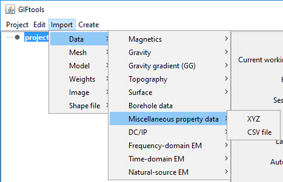

.. _importProp:

.. include:: <isonum.txt>

Import miscellaneous property data
----------------------------------

This type of data covers the range of anything someone would want to bring in that has a position and value (numeric or character).

Use the main project menu: **Import** |rarr|  **Miscellaneous property data**

**File formats:**

Property data is imported via the following file formats:

    - :ref:`XYZ <XYZfile>`
    - :ref:`CSV <XYZfile>`

