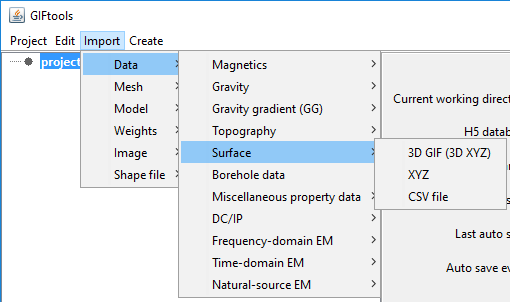

.. _importSurface:

.. include:: <isonum.txt>

Import a surface
----------------

General surface object can be imported through three different file formats:
Use the main project menu: **Import** |rarr| **Surface**

**File formats:**

    - :ref:`GIF format <topoGIF3Dfile>` (Same as topography)
    - :ref:`XYZ format <XYZfile>`
    - :ref:`CSV format <CSVfile>`
