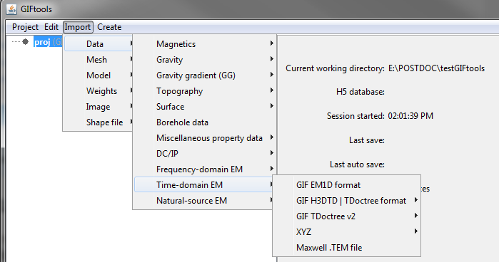

.. _importTemData:

.. include:: <isonum.txt>

Import TEM data
---------------

To import time-domain electromagnetic (TEM) data, use the main project menu:
There are four types of TEM data that can be loaded from files:

**Import** |rarr| **Data** |rarr| **Time-domain EM**

**File formats:**

    - :ref:`GIF EM1DTM format <importEM1DTMdata>`
    - :ref:`GIF H3DTD | TDoctree format <importTDoctreeV1data>`
    - :ref:`GIF TDoctree v2 format <importTDoctreeV2data>`
    - :ref:`XYZ format <importXYZemData>`
    - :ref:`AMIRA TEM file <importAMIRATEM>`

|
|

.. _importEM1DTMdata:

EM1DTM format
^^^^^^^^^^^^^

Loads a data file for the :ref:`EM1DTM inversion
<invEditOptions_em1dtm>` and forward modeling codes. The data position is set
relative to the transmitter as specified by the `EM1DTM file format`_.
The function returns a :ref:`TEM1Dsounding <objectEMDataIndex_EM1Dsounding>` object.

**Import** |rarr| **Data** |rarr| **Frequency-domain EM** |rarr| **GIF EM1D format**

The following parameters are set for the user:

**Properties:**

    - **Transmitters:**
        - **Dipole moment:** Set by argument
        - **Orientation** Set by argument
        - **Along-line offset (m) =** 0
        - **Cross-line offset (m) =** 0
        - **Vertical offset (m):** Relative to topography

    - **Receiver:**
        - **Dipole moment:** Set by argument
        - **Along-line offset:** The along-line position of receivers, **relative to transmitter locations**
        - **Cross-line offset:** The cross-line position of receivers, **relative to transmitter locations**
        - **Vertical offset:** Relative to topography

.. note:: The position of the data is set by the "sounding" location. Only the relative offsets between the transmitters and receivers are available in the `EM1DTM file format`_. Data locations have been assigned to the transmitter locations upon import for consistency.

.. _importTDoctreeV1data:

H3DTD | TDoctree format
^^^^^^^^^^^^^^^^^^^^^^^

Loads data files formated for the H3DTD, `TDoctree <https://tdoctree.readthedocs.io/en/tdoctree/content/files/obsFile.html>`_ and `TDoctree tiled <https://tdoctree.readthedocs.io/en/tdoctree_tiled/content/files/obsFile.html>`_ codes.
The function returns a :ref:`TEMdata <objectEMDataIndex_TEMdata>` object where only the transmitter geometry is defined. The receivers are defined as point measurements that samples the fields (E, H) along the Cartesian axes.

**Import** |rarr| **Data** |rarr| **Time-domain EM** |rarr| **GIF H3DTD | TDoctree format**

.. note:: The :ref:`TEMdata <objectEMDataIndex_TEMdata>` object assumes that the provided field data have been measured along the Cartesian axes or that the user has rotated the fields in pre-processing. For more general cases with arbitrary receivers orientation (in-line), consider making use of the :ref:`TEM3Dsounding <objectEMDataIndex_TEM3Dsounding>` class.

.. _importTDoctreeV2data:

TDoctree v2 format
^^^^^^^^^^^^^^^^^^

Loads data specifically formatted for the `TDoctree v2 <https://tdoctree.readthedocs.io/en/tdoctree_v2/content/files/obsFile.html>`_ code.
The function returns a :ref:`TEM3Dsounding <objectEMDataIndex_TEM3Dsounding>` object.

**Import** |rarr| **Data** |rarr| **Time-domain EM** |rarr| **GIF TDoctree v2 format**

The receivers and transmitters are defined by their respective input files. As a result, you will need 4 files when importing TDoctree v2 data:

    - `Data file <https://tdoctree.readthedocs.io/en/tdoctree_v2/content/files/obsFile.html>`_
    - `Time channels file <https://tdoctree.readthedocs.io/en/tdoctree_v2/content/files/timeFile.html>`_
    - `Receiver file <https://tdoctree.readthedocs.io/en/tdoctree_v2/content/files/receiverFile.html>`_
    - `Transmitter file <https://tdoctree.readthedocs.io/en/tdoctree_v2/content/files/receiverFile.html>`_

.. note:: Both the transmitters and receivers geometry are defined in 3D. The relative offsets can be calculated using the :ref:`Calculate Transmitter/Receiver separation <calculateTxRxSeperation>` function.

.. _EM1DFM file format: https://em1dfm.readthedocs.io/en/latest/content/files/supporting.html#observation-file
.. _EM1DTM file format: https://em1dtm.readthedocs.io/en/latest/content/files/supporting.html#observation-file

.. _importAMIRATEM:

AMIRA TEM File
^^^^^^^^^^^^^^

Loads data from AMIRA TEM formatted file; `see reference <https://www.aseg.org.au/sites/default/files/pdf/FORMAT_FOR_EXCHANGE_OF_ELECTRICAL_SURVEY_DATA_Ver001.pdf>`_ .
The the user may choose to import the data to a *TEMdata* or *TEM3Dsounding* object. To import:

**Import** |rarr| **Data** |rarr| **Time-domain EM** |rarr| **AMIRA .TEM file**

The TEM file contains one or more directional components of the measured field. If the data are imported to a *TEMdata* object, any missing field component will be assigned a flag value of NaN. If the data are imported to *TEM3Dsounding* , than an individual *TEM3Dsounding* object is created for each component; allowing for easier assignment of receivers.