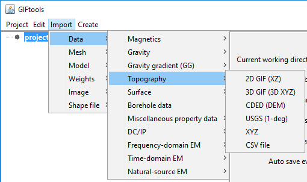

.. _importTopo:

.. include:: <isonum.txt>

Import topography
-----------------

Topography can be imported through six different file formats:
Use the main project menu: **Import** |rarr| **Topo**

**File formats:**

    - :ref:`3D GIF format <topoGIF3Dfile>`
    - :ref:`2D GIF format <topoGIF2Dfile>`
    - :ref:`XYZ format <XYZfile>`
    - :ref:`CSV format <CSVfile>`
    - Canadian Digital Elevation Data (CDED)
    - USGS 1-degree
