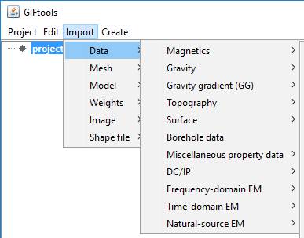

.. _importData:

.. include:: <isonum.txt>

Import Data
===========

GIFtools allows the user to import various types of
geophysical, geological and geographical data from a multitude of file
formats. The following data types can be imported into
GIFtools under: **Import** |rarr| **Data**

.. toctree::
    :maxdepth: 1

    data/importMagData
    data/importGravData
    data/importGGData
    data/importTopo
    data/importSurface
    data/importBoreholeData
    data/importProp
    data/importDCIPdata
    data/importEMdata

:ref:`Object-dependent functionalities <objectFunctionality_index>` (or
methods) can be accessed by clicking on the object after the import process is
complete.
