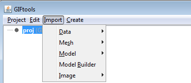
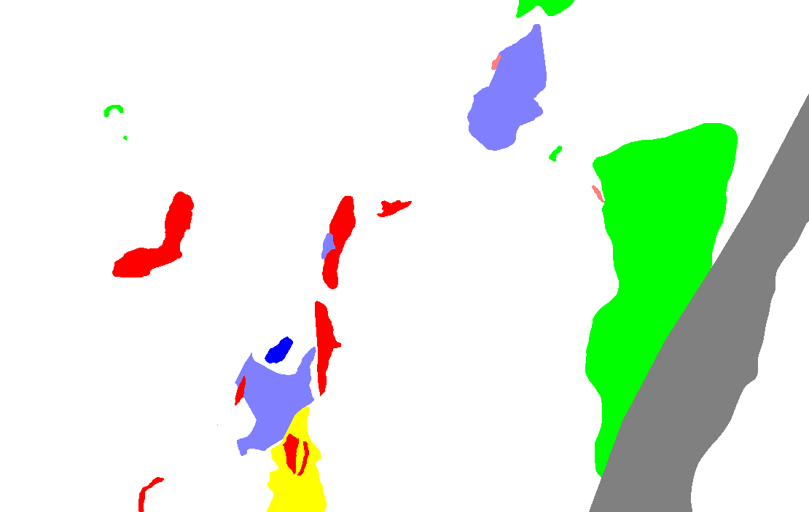
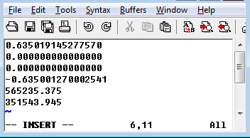
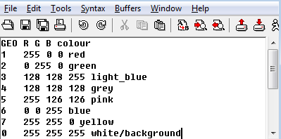

.. _importImage:

.. include:: <isonum.txt>

Import Images
=============

**TODO:** Introduction and image

.. _importGeoImage:

Import geologic images
----------------------

GIFtools allows one to import geologic maps in order to populate models and ultimately constrain inversions. Plan-view images can be imported in current versions. In the near future, cross-section images will be accessed through the same menu pipeline.

Use the main project menu: **Import** |rarr|  **Image** |rarr| **Plan-view**

Along with the image file, a :ref:`world file <importWorldFile>` is required to georectify the image. A :ref:`legend file <importLegendFile>` to specify the RGB values for each geology unit can be imported when importing the image or either imported or created after image importation.

**NOTE:** Images with distinct colour combinations and no text will perform much better when discretizing models. Below is an example:

.. _importWorldFile:

World file format
^^^^^^^^^^^^^^^^^

The world file has been specified by Esri (.tfw file). It is a plain text file with the following lines. GIFtools will recognize rotations given in this file.

- Line 1: pixel size in the Easting direction in pixels
- Line 2: rotation about Northing axis
- Line 3: rotation about Easting axis
- Line 4: pixel size in the Northing direction in pixels, (almost always negative)
- Line 5: Easting coordinate of the center of the *upper left* pixel
- Line 6: Northing coordinate of the center of the *upper left* pixel

Below is an example:

.. _importLegendFile:

Legend file format
^^^^^^^^^^^^^^^^^^

The legend file will be an :ref:`XYZ <XYZfile>` or :ref:`CSV <CSVfile>` with a header. The important headers are the **geology unit** (integer), **Red**, **Green**, and **Blue** values (0-255) contained within image. Comments are denoted by "!" or "//". Below is an example of 8 units (0 being background white) for the image above.

To create a legend file, load the image and use the menu:

**Plan-view image** |rarr|  **Legend** |rarr| **Create** |rarr| **Table view**

