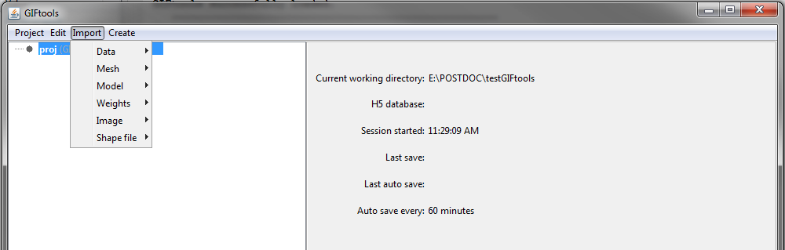

.. _import:

.. include:: <isonum.txt>

Import
======

GIFtools is capable of importing data, meshes, physical property models, cell weights, geological maps and other raster-based images, as well as shape files (RGIS vector). This information can be imported from a variety of file formats, including: GIF format, XYZ format and CSV format. Once imported, the information/data will be represented in GIFtools as an "object". To see what you can do with each object, visit the :ref:`object-dependent functionality <objectFunctionality_index>` page. The types of information which may be imported to GIFtools is organized as follows:

    .. toctree::
        :maxdepth: 1

        Import Data <data_index>
        Import Mesh <mesh>
        Import Model <model>
        Import Weights <weights>
        Import Images (Raster) <importImage>
        Import Shape Files (RBIS vector) <shape>

