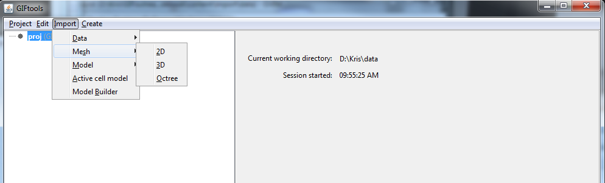

.. _importMesh:

.. include:: <isonum.txt>

Import Mesh
===========

Under **Import** |rarr| **Mesh**, the user can import various types of 1D, 2D or 3D meshes. These include both tensor meshes (link to example) and OcTree meshes (link to example). In GIFtools, this results in the creation of a 'mesh object'. Once created, GIFtools will allow the user to carry out a set of object-dependent actions (or methods) involving the mesh object. The methods applicable to each mesh object are presented on the :ref:`object-dependent functionality <objectFunctionalityMesh>` page. The following mesh types can be imported into GIFtools:

    - :ref:`1D Tensor Mesh <importMesh1D>`
    - :ref:`2D Tensor Mesh <importMesh2D>`
    - :ref:`3D Tensor Mesh <importMesh3D>`
    - :ref:`OcTree Mesh <importMeshOctree>`

.. _importMesh1D:

Import a 1D Tensor Mesh
-----------------------

Use the main project menu: **Import** |rarr| **Mesh** |rarr| **1D**

Refer to :ref:`mesh1Dfile` for file format.

.. _importMesh2D:

Import a 2D Tensor Mesh
-----------------------

Use the main project menu: **Import** |rarr| **Mesh** |rarr| **2D**

**File format:**

Refer to :ref:`mesh2Dfile` for file format.

.. _importMesh3D:

Import a 3D Tensor Mesh
-----------------------

Use the main project menu: **Import** |rarr| **Mesh** |rarr| **3D**

**File format:**

Refer to :ref:`mesh3Dfile` for file format.

.. _importMeshOctree:

Import an OcTree mesh
---------------------

Use the main project menu: **Import** |rarr| **Mesh** |rarr| **Octree**

**File format:**

Refer to :ref:`meshOctreefile` for file format.

