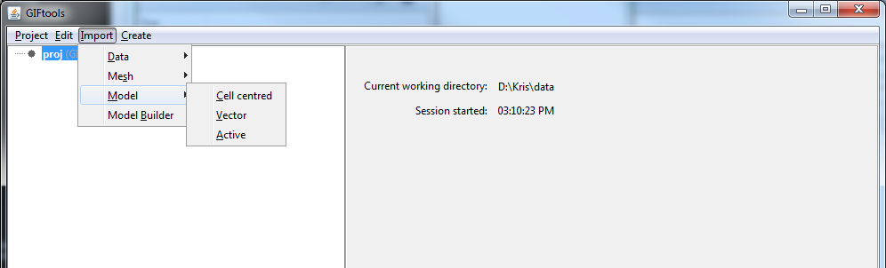

.. _importModel:

.. include:: <isonum.txt>

Importing a model
=================

Under **Import** |rarr| **Model**, the user can import physical property models and active cell models. In order to import a model, the user must first have a *mesh* within their GIFtools project; see :ref:`import mesh <importMesh>` or *generate mesh*. In GIFtools, importing a model results in the creation of a 'model object'. Once created, GIFtools will allow the user to carry out a set of object-dependent actions (or methods) involving the model object. The methods applicable to each model object are presented on the :ref:`object-dependent functionality <objectFunctionalityModel>` page. The following model types can be imported into GIFtools:

    - :ref:`Import a Cell-Centered Model <importModelCellCentered>`
    - :ref:`Import a Vector Model <importVectorModel>`
    - :ref:`Import an Active Model <importActiveModel>`

**Prerequisites:** 

    - A mesh object (link)

.. _importModelCellCentered:

Import a cell centered model
----------------------------

Importing a model first requires a mesh. The import dialog will prompt the user to either choose an existing mesh in the project or browse to load another.

Use the main project menu: **Import** |rarr| **Model** |rarr| **Cell centred**

**Prerequisites:**

Import a mesh:

- :ref:`1D mesh <importMesh1D>`
- :ref:`2D mesh <importMesh2D>`
- :ref:`3D mesh <importMesh3D>`
- :ref:`OcTree mesh <importMeshOctree>`

**File formats:**

Models can only be imported via :ref:`GIF-formatted <modelfile>` files

.. _importVectorModel:

Import a vector model
---------------------

Importing a model first requires a mesh. The import dialog will have the user either choose a mesh or browse.

Use the main project menu: **Import** |rarr| **Model** |rarr| **Vector**

**Prerequisites:**

Import a mesh:

- :ref:`2D mesh <importMesh2D>`

- :ref:`3D mesh <importMesh3D>`

- :ref:`OcTree mesh <importMeshOctree>`

**File formats:**

Models can only be imported via :ref:`GIF-formatted vector <modelVectorfile>` files

.. _importActiveModel:

Import an active-cell model
---------------------------

Importing a model first requires a mesh. The import dialog will prompt the user to either choose an existing mesh in the project or browse to load another. **Active cells will contain only values of -1, 0, or 1.**

Use the main project menu: **Import** |rarr| **Model** |rarr| **Active**

**Prerequisites:**

Import a mesh:

- :ref:`2D mesh <importMesh2D>`

- :ref:`3D mesh <importMesh3D>`

- :ref:`OcTree mesh <importMeshOctree>`

**File formats:**

Active models can only be imported via :ref:`GIF-formatted <modelfile>` files

